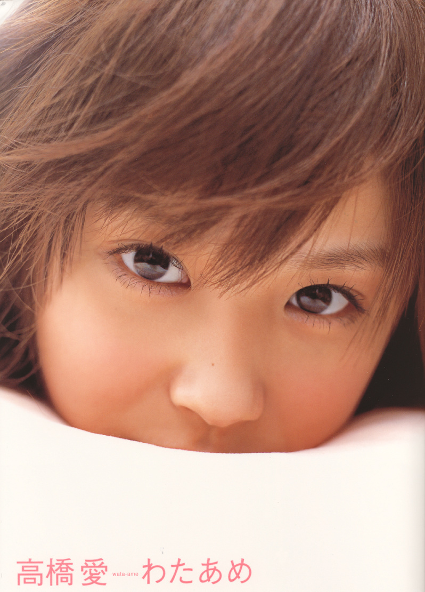
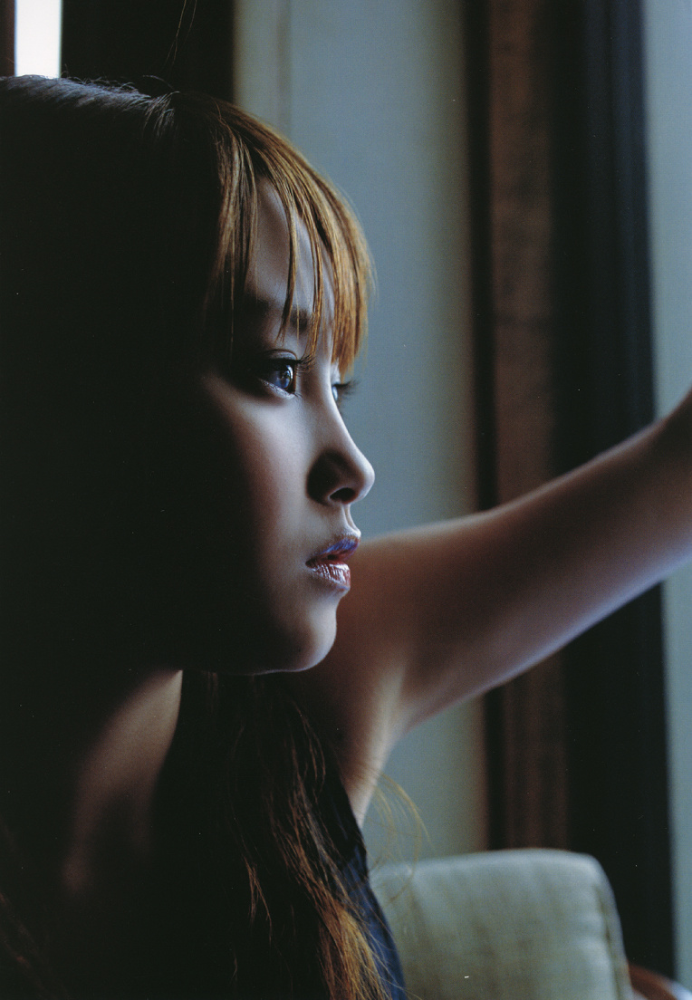
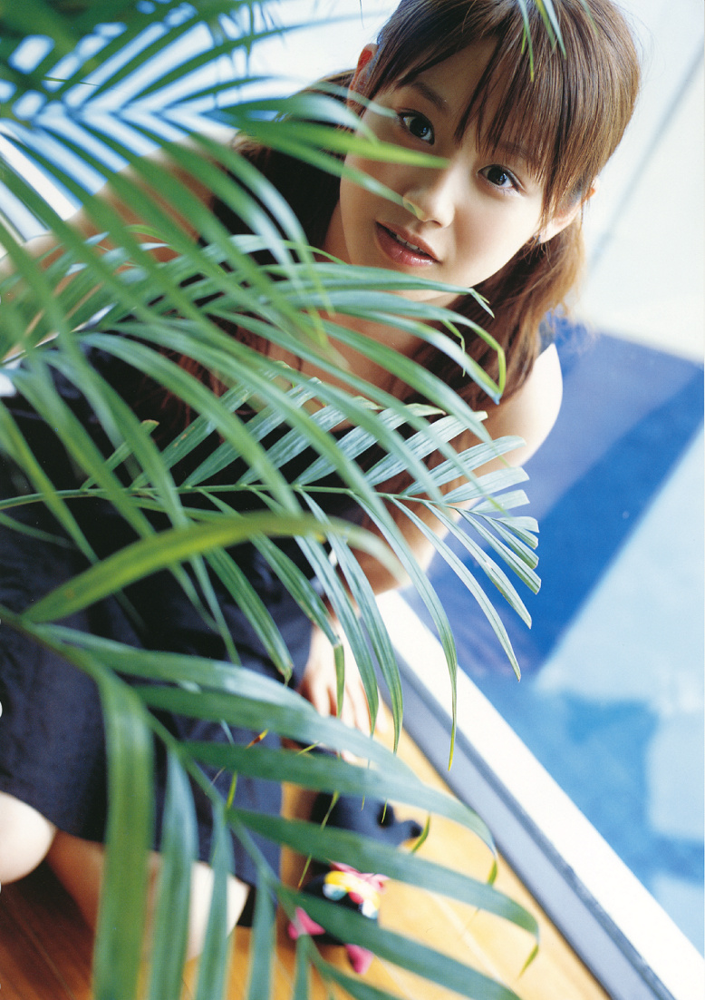
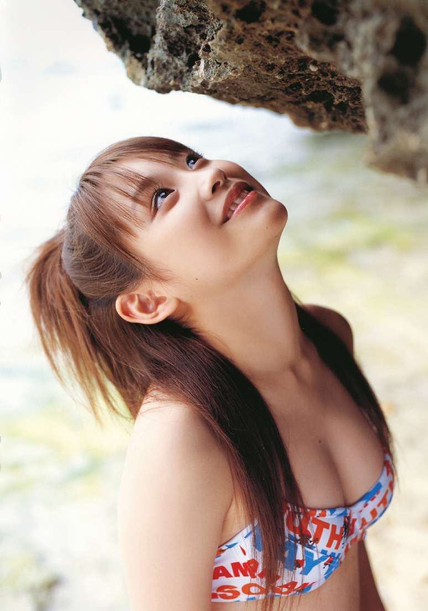
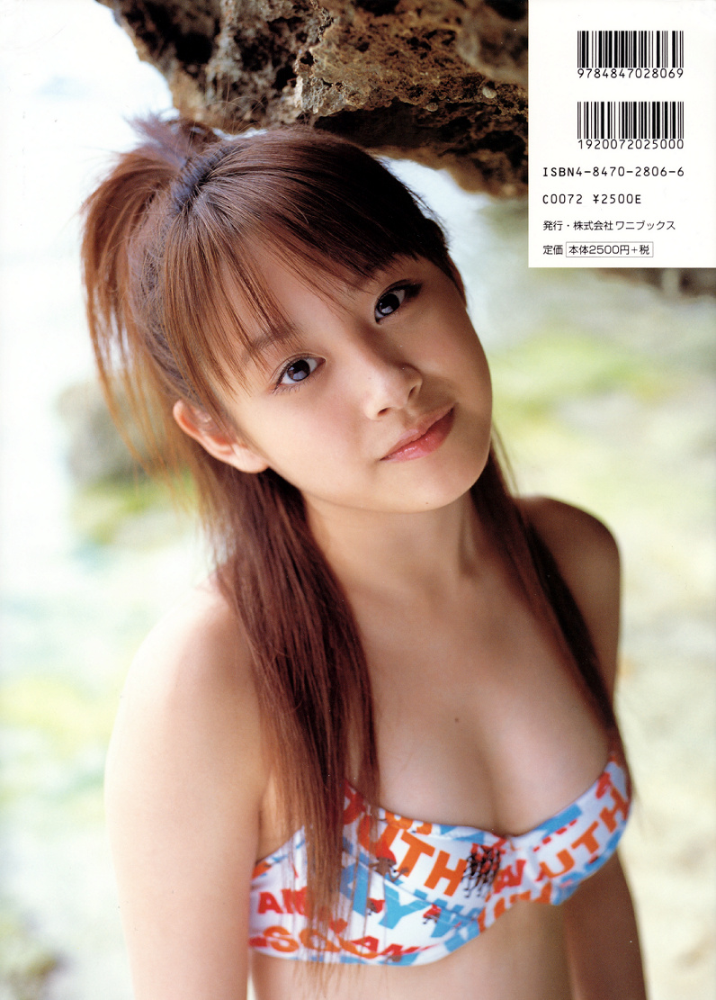

# Wataame *(Barbe à papa)*

## わたあめ

**高橋愛 (Takahashi Ai)**

Wani Books • 2004

## Aperçu

## Informations

- **Année :** 2004
- **Type :** Photobook
- **Date de sortie :** 27 mai 2004
- **Éditeur :** Wani Books
- **Photographe :** Yutaka Kondo (近藤幸)
- **ISBN :** 978-4-8470-2805-0
- **Pages :** 96
- **Langue :** Japonais

## Contexte

Publié en mai 2004, *Wataame* est le troisième photobook solo d'Ai
Takahashi, alors membre de cinquième génération des Morning Musume.

L'ouvrage paraît durant une période importante pour le groupe, marquée
par le succès de *Ai Araba IT'S ALL RIGHT* et l'arrivée de la sixième
génération quelques mois plus tôt. Ai s'impose progressivement comme
l'une des personnalités les plus populaires et les plus prometteuses du
Hello! Project.

Le titre *Wataame* (« barbe à papa ») évoque la douceur, la légèreté et
une certaine innocence. Cette idée sert de fil conducteur à l'ensemble
du livre, qui cherche davantage à mettre en valeur son naturel que son
statut d'idole.

## Style

Le photobook alterne portraits en intérieur, promenades en extérieur et
instants de vie capturés avec beaucoup de spontanéité.

La photographie privilégie une lumière douce, des couleurs chaudes et
des expressions naturelles, créant une atmosphère intime et apaisante.

Les tenues restent variées, entre vêtements du quotidien, robes légères
et quelques scènes en maillot de bain, toujours présentées avec retenue
et élégance.

L'ensemble reflète parfaitement l'image d'Ai Takahashi au début des
années 2000 : souriante, discrète et pleine de fraîcheur.

## Intérêt

*Wataame* est souvent considéré comme le photobook qui marque la montée
en puissance d'Ai Takahashi au sein des Morning Musume, avant qu'elle ne
devienne quelques années plus tard la leader du groupe.

Il constitue également un excellent témoignage de l'esthétique des
photobooks Hello! Project du début des années 2000, privilégiant la
simplicité, la proximité avec l'artiste et une photographie naturelle.
