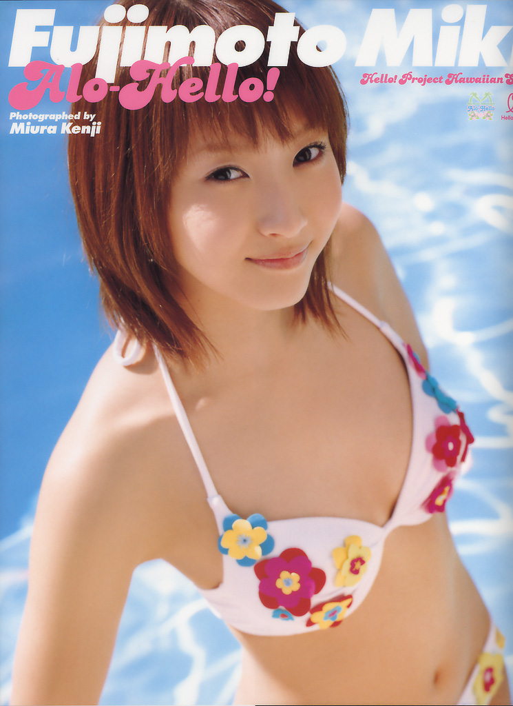

# Miki Fujimoto Alo-Hello! photobook

Wanibooks Co. Ltd. (2003)

## Photo 1

## Photo 2

## Photo 3

## Photo 4

## Informations

- Année : 2003
- Magazine : Photobook
- Thème : Son premier livre de photos solo, Alo-Hello! Fujimoto Miki ,
publié le 22 avril 2003 par Kadokawa Kids Net, comprend des images de ses vacances à Hawaï ,
marquant ses débuts dans la photographie en maillot de bain , en accord avec son image d'idole sexy naissante .
