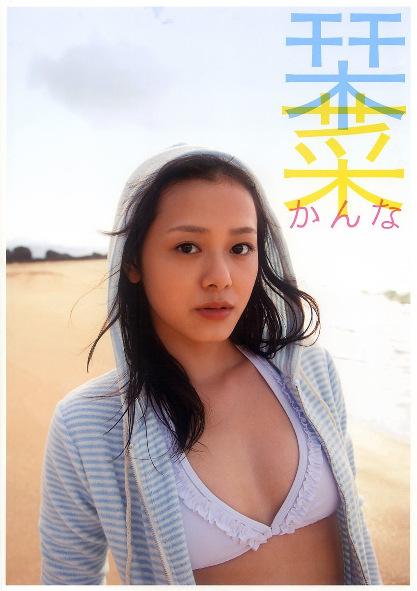
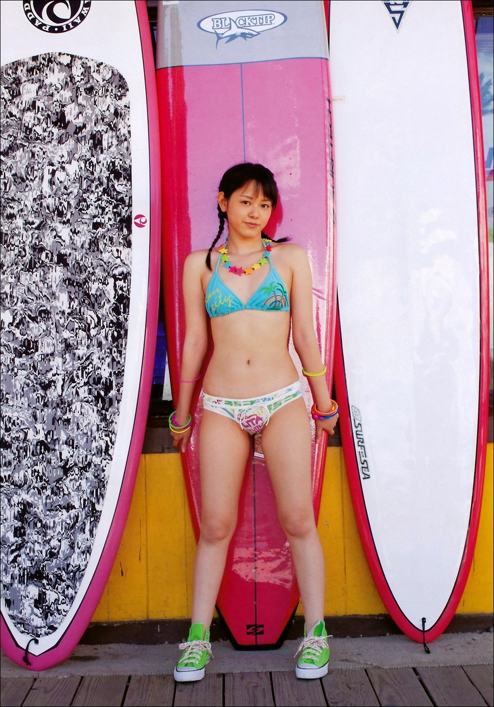
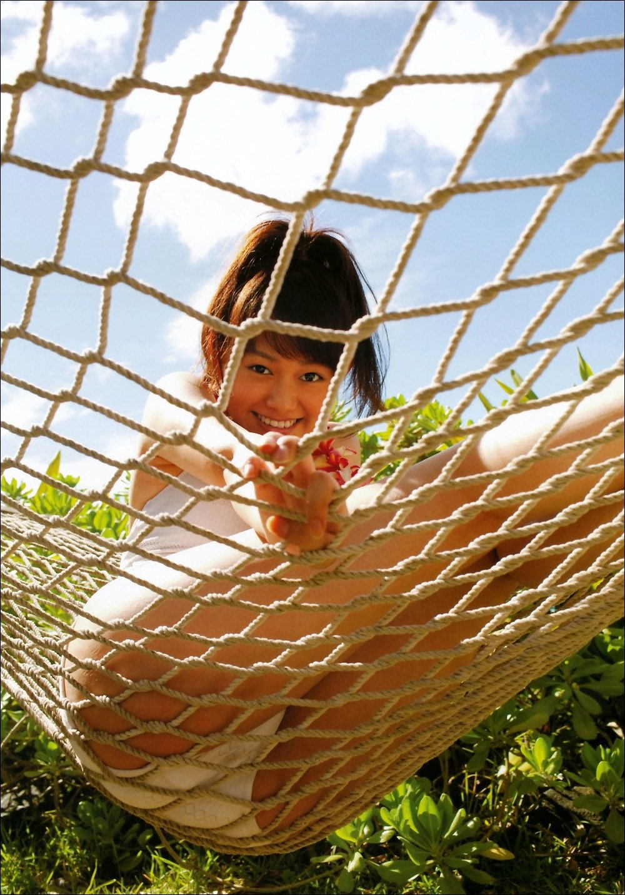
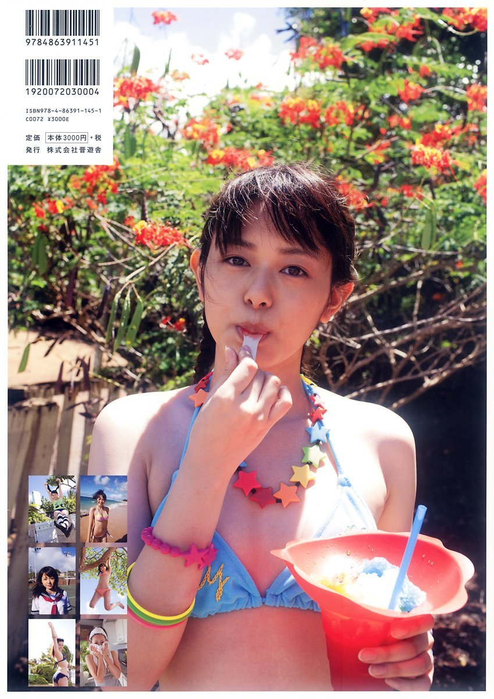

# Kanna *(Kanna)*

## 栞菜

**有原栞菜 (Arihara Kanna)**

Shinyusha • 2010

## Aperçu

## Informations

- **Année :** 2010
- **Type :** Photobook
- **Date de sortie :** 30 décembre 2010
- **Éditeur :** Shinyusha (晋遊舎)
- **Photographe :** Hiroyuki Satō (佐藤裕之)
- **ISBN :** 978-4-86391-177-2
- **Format :** A4
- **Pages :** 96
- **Langue :** Japonais

## Contexte

Publié le 30 décembre 2010, *Kanna* est le premier et unique photobook
solo d'Arihara Kanna. Il paraît plus d'un an après son départ des ℃-ute
et du Hello! Project, conséquence de problèmes de santé qui avaient mis
un terme prématuré à sa carrière au sein du groupe.

Pour de nombreux admirateurs, ce livre représente surtout les
retrouvailles avec une artiste qu'ils pensaient ne plus revoir. Cet
aspect explique en grande partie l'accueil chaleureux qu'il reçoit à sa
sortie.

## Style

Le photobook adopte une approche volontairement sobre et naturelle. Les
photographies privilégient les paysages, les promenades, les intérieurs
lumineux et les portraits rapprochés, sans rechercher une mise en scène
spectaculaire.

La lumière naturelle occupe une place importante et donne à l'ensemble
une atmosphère calme et intimiste. Les expressions spontanées prennent
souvent le pas sur les poses, laissant apparaître une Kanna plus mature
et plus sereine que durant sa période chez ℃-ute.

Les tenues alternent vêtements du quotidien, robes légères et
séances en maillot de bain.

Plusieurs collectionneurs japonais soulignent que cette simplicité fait
justement la force de l'ouvrage. Beaucoup estiment que le résultat
« ressemble à Kanna » : discret, sincère et naturel, sans chercher à
transformer son image.

## Intérêt

Les réactions des fans montrent que l'émotion liée à cette publication
dépasse souvent les qualités purement esthétiques du livre. Les billets
de blogs publiés lors de sa sortie évoquent fréquemment le plaisir de la
revoir, certains rappelant qu'ils espéraient déjà un photobook lorsqu'elle
était encore membre des ℃-ute. Pour beaucoup, ce livre apparaît comme
celui qu'elle n'avait jamais eu l'occasion de publier durant sa carrière
dans le groupe.

Les quelques critiques portent principalement sur une mise en scène
jugée assez simple et des décors relativement peu variés. Toutefois,
même les avis les plus nuancés concluent généralement que ces défauts
passent au second plan, aprés celui de la retrouvaille.

