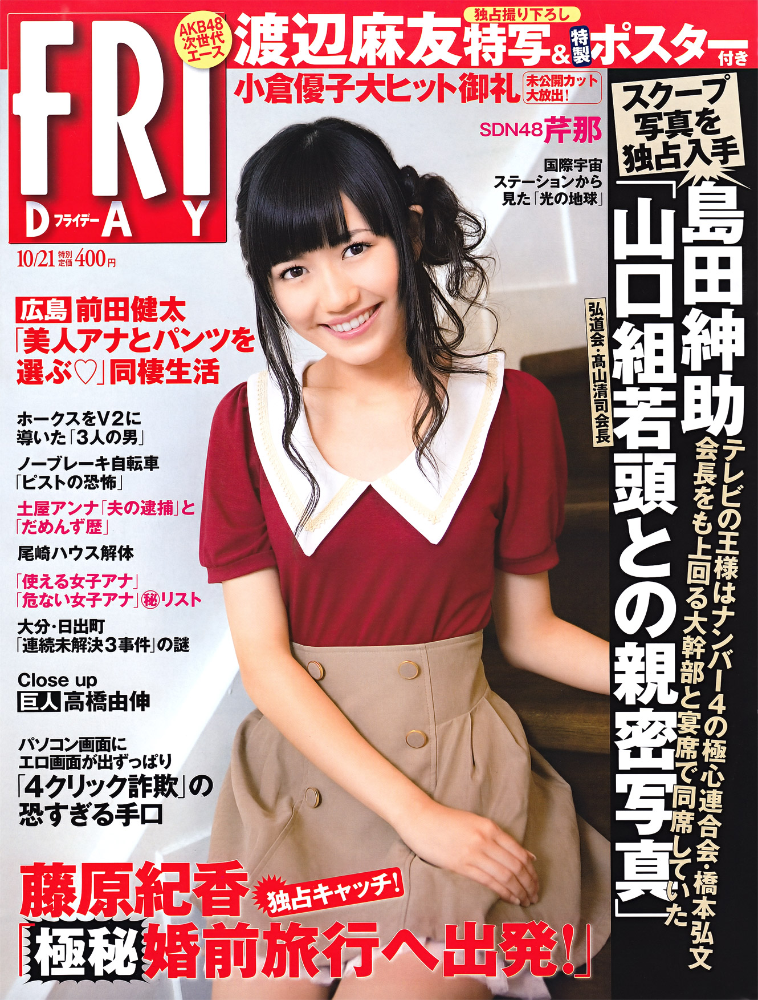
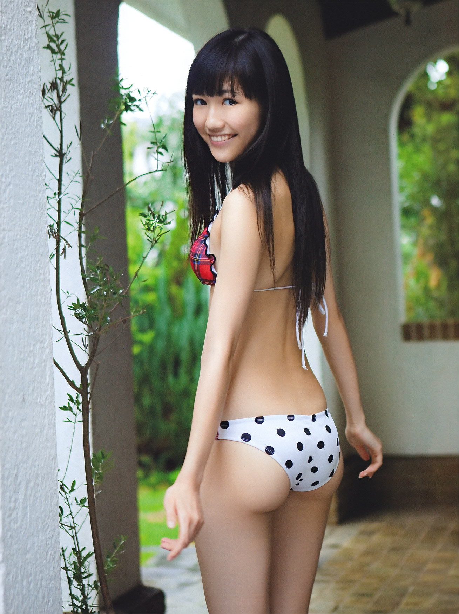
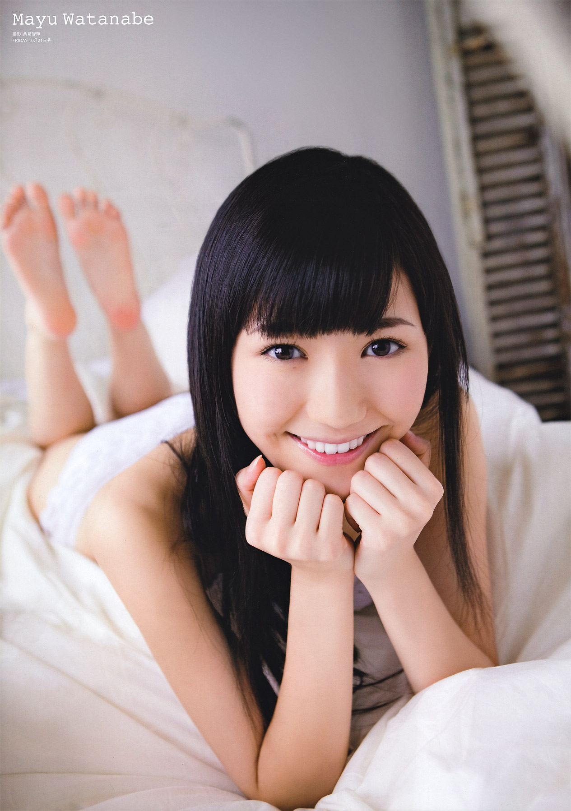
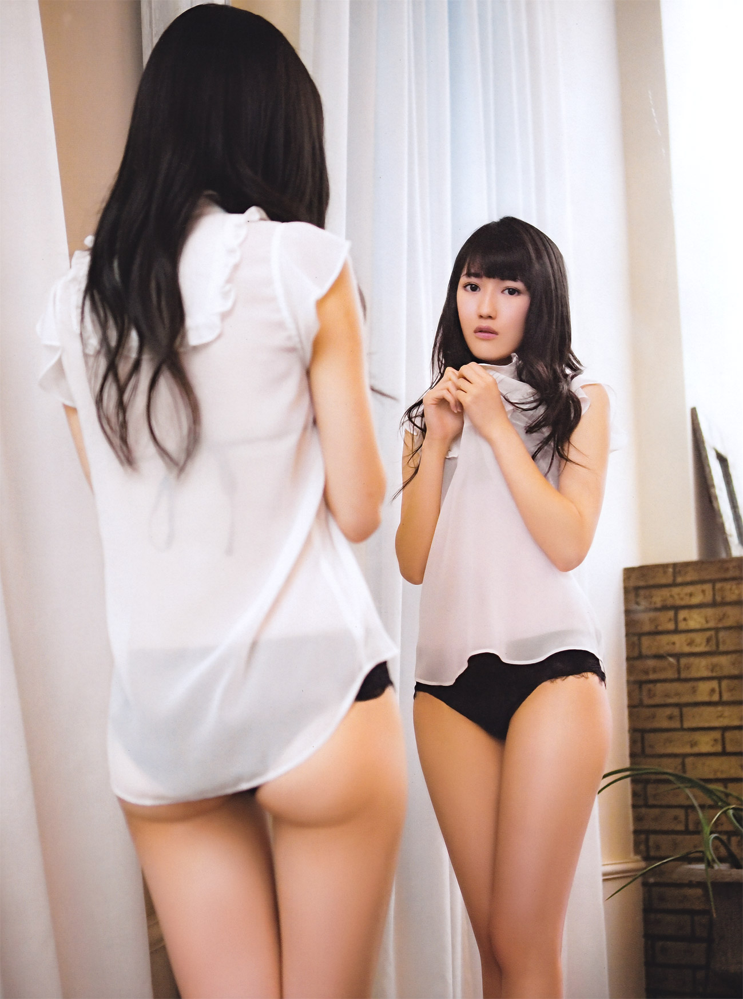
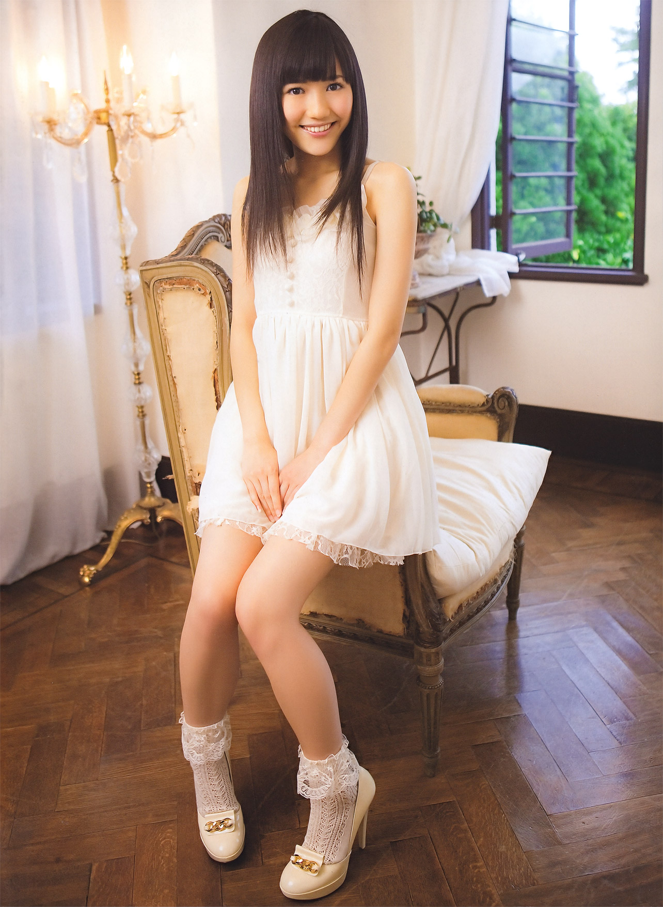
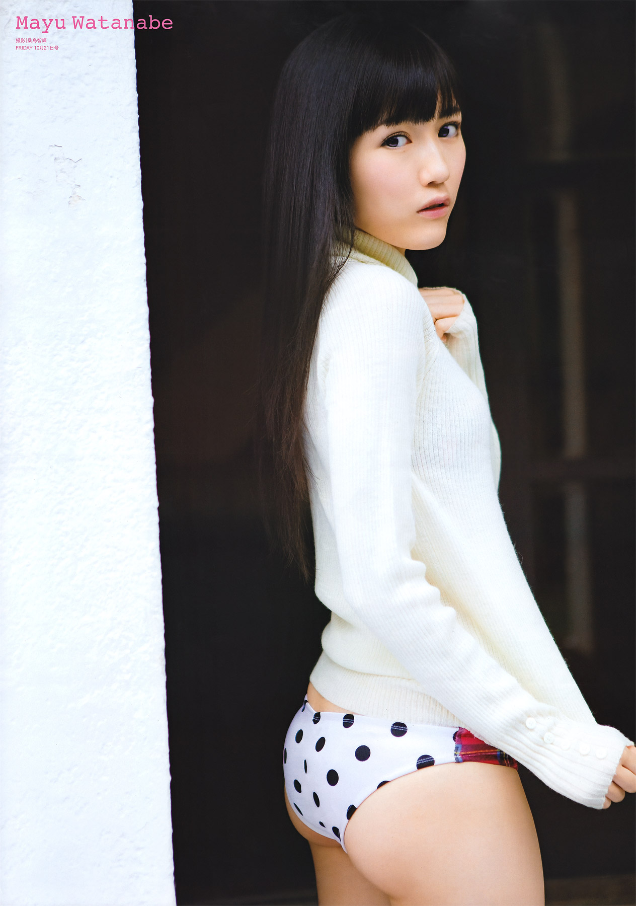

# FRIDAY *(21 octobre 2011)*

## フライデー 2011年10月21日号

**Watanabe Mayu**

Kodansha • 2011

---

## Aperçu

---

## Informations

- **Année :** 2011
- **Type :** Magazine hebdomadaire
- **Titre :** FRIDAY
- **Numéro :** 21 octobre 2011
- **Date de sortie :** 7 octobre 2011
- **Éditeur :** Kodansha
- **Prix d'origine :** 400 ¥
- **Format :** A4
- **Langue :** Japonais
- **Bonus :** Poster A2 double face de Watanabe Mayu

---

## Contexte

Publié à l'automne 2011, ce numéro paraît durant une année
charnière pour Watanabe Mayu. Après plusieurs années de
progression au sein d'AKB48, elle s'impose progressivement
comme l'une des figures majeures de la nouvelle génération.

La couverture annonce un reportage inédit accompagné d'un
poster exclusif, un format régulièrement utilisé par FRIDAY
pour mettre en valeur les personnalités les plus populaires du
moment.

---

## Dossier principal

Le dossier est consacré à Watanabe Mayu et propose une séance
photo exclusive accompagnée d'une interview.

Les photographies alternent portraits en intérieur, poses
naturelles et clichés en maillot de bain, suivant les codes
des magazines hebdomadaires japonais spécialisés dans les
gravures.

Le numéro est complété par un poster A2 inédit reprenant une
sélection d'images différentes de celles publiées dans le
magazine.

---

## Style

La séance privilégie une photographie lumineuse et naturelle,
mettant en avant l'image douce et accessible de Watanabe Mayu.

Les tenues et les décors restent sobres, dans un style
caractéristique des shootings réalisés pour FRIDAY durant
cette période.

---

## Autres contenus

Comme la plupart des numéros de FRIDAY, cette édition mêle
actualité et divertissement.

On y retrouve notamment des articles consacrés à :

- Yuko Ogura
- Serina (SDN48)
- l'actualité politique
- les faits divers
- le sport
- la télévision japonaise

---

## Réception

Les premières réactions retrouvées sur les blogs et forums
japonais sont essentiellement enthousiastes mais très
spontanées. Les commentaires saluent surtout la beauté de
Mayuyu, remercient les auteurs des scans et annoncent
l'achat du magazine.

Les discussions portent peu sur la direction artistique du
shooting. L'attention se concentre davantage sur la découverte
des nouvelles photographies et sur le poster exclusif, souvent
mentionné parmi les principaux attraits du numéro.

Avec le temps, les collectionneurs se sont davantage intéressés
aux exemplaires conservant leur poster d'origine, celui-ci
étant fréquemment absent des magazines proposés sur le marché
de l'occasion.

---

## Intérêt

Ce numéro illustre la période où Watanabe Mayu s'impose comme
l'une des principales représentantes de la nouvelle génération
d'AKB48.

Il constitue également un bon témoignage de la place occupée
par les idoles dans la presse hebdomadaire japonaise au début
des années 2010. Pour les collectionneurs, son principal
attrait réside dans son reportage exclusif et la présence de
son poster promotionnel.
