    # ℃-ute — *Cutest*

## ℃-ute写真集『Cutest』

**℃-ute — Yajima Maimi • Nakajima Saki • Suzuki Airi • Okai Chisato • Hagiwara Mai**

Hello! Project • Photobook collectif

Kids Net / KADOKAWA • 2011

---

## Aperçu

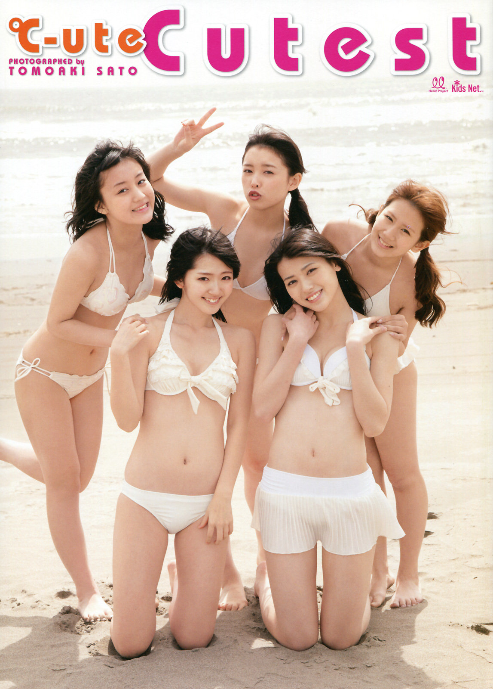

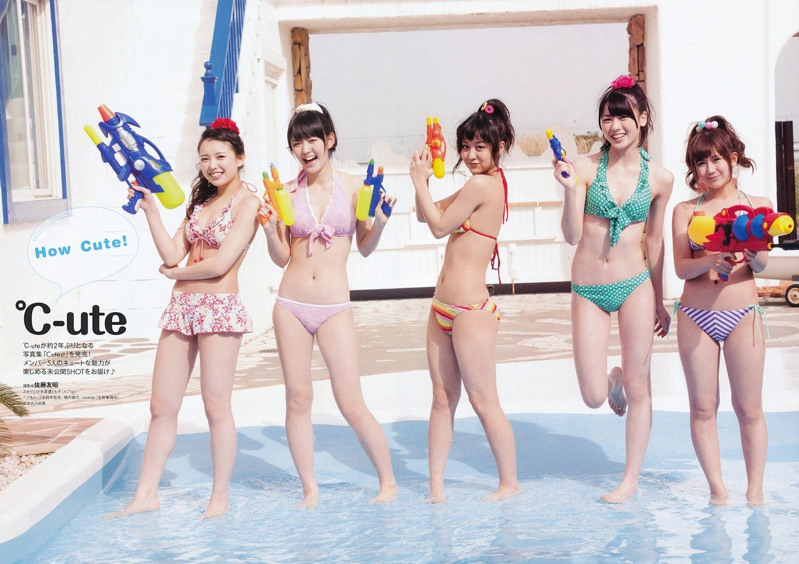

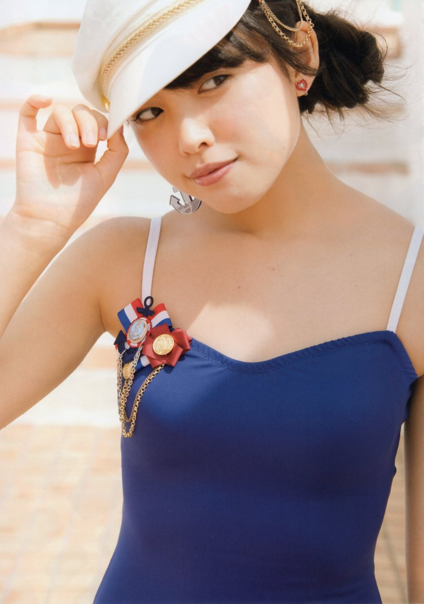

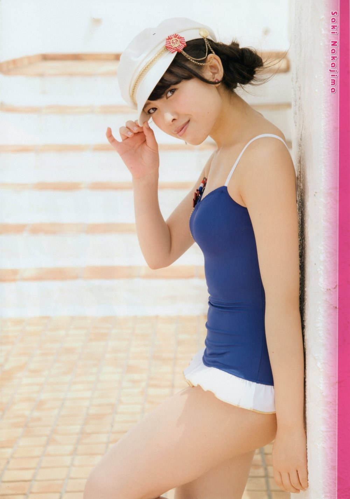

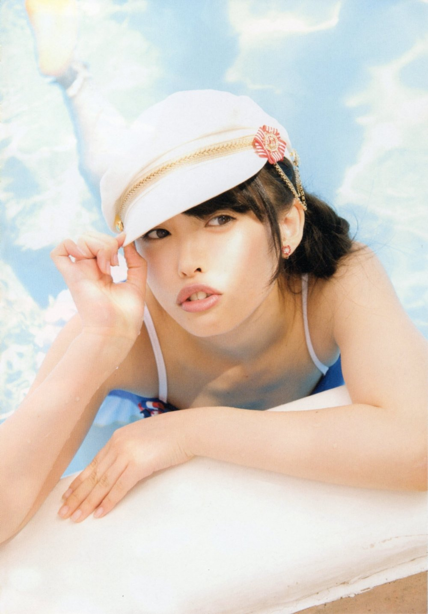

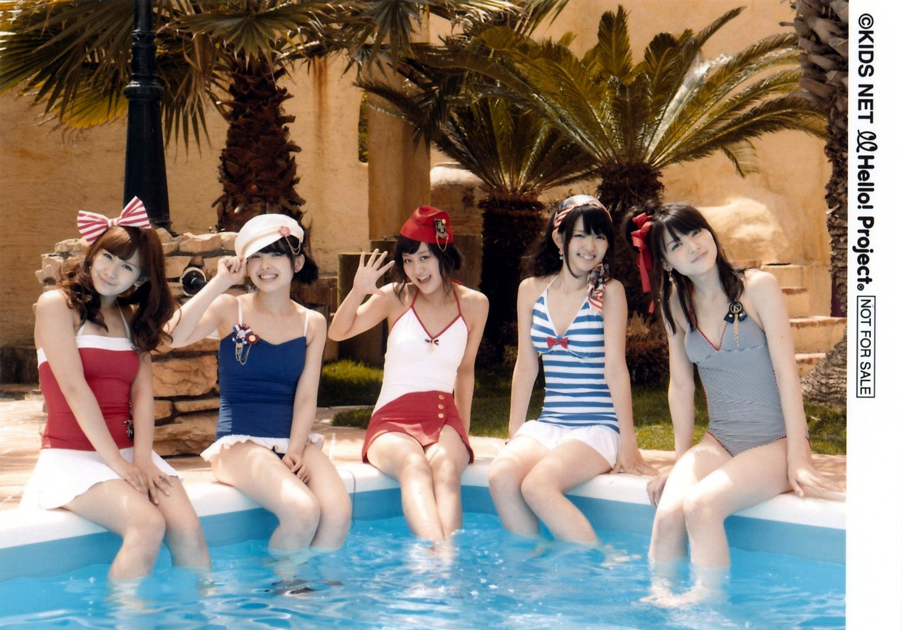

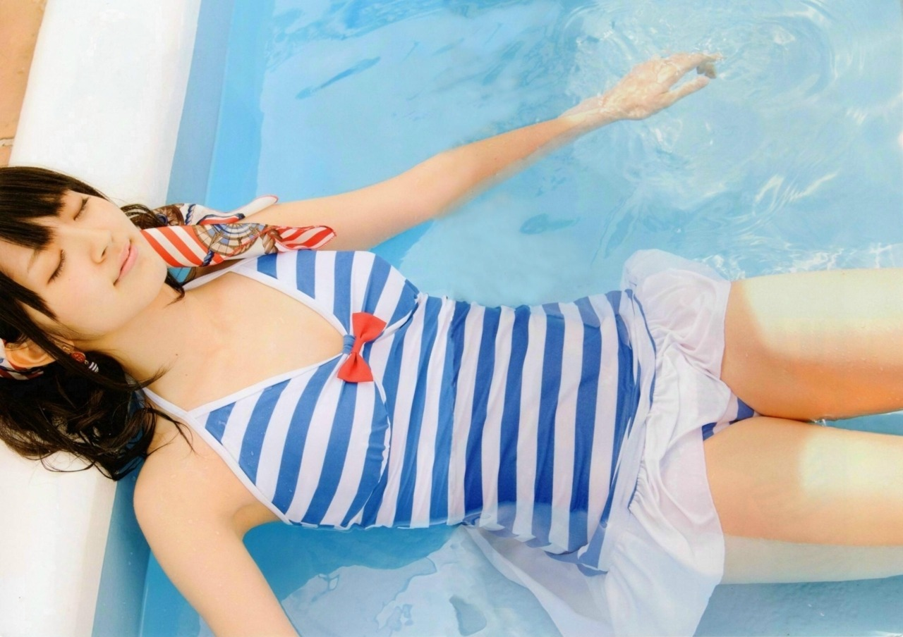

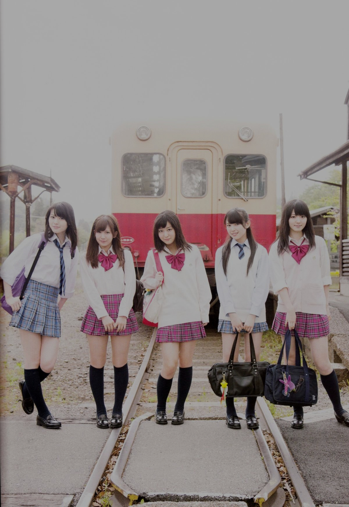

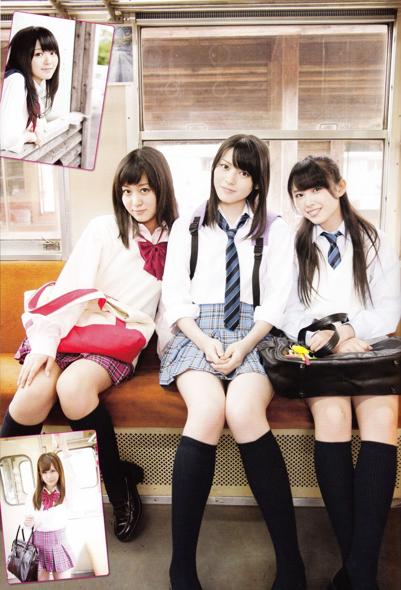

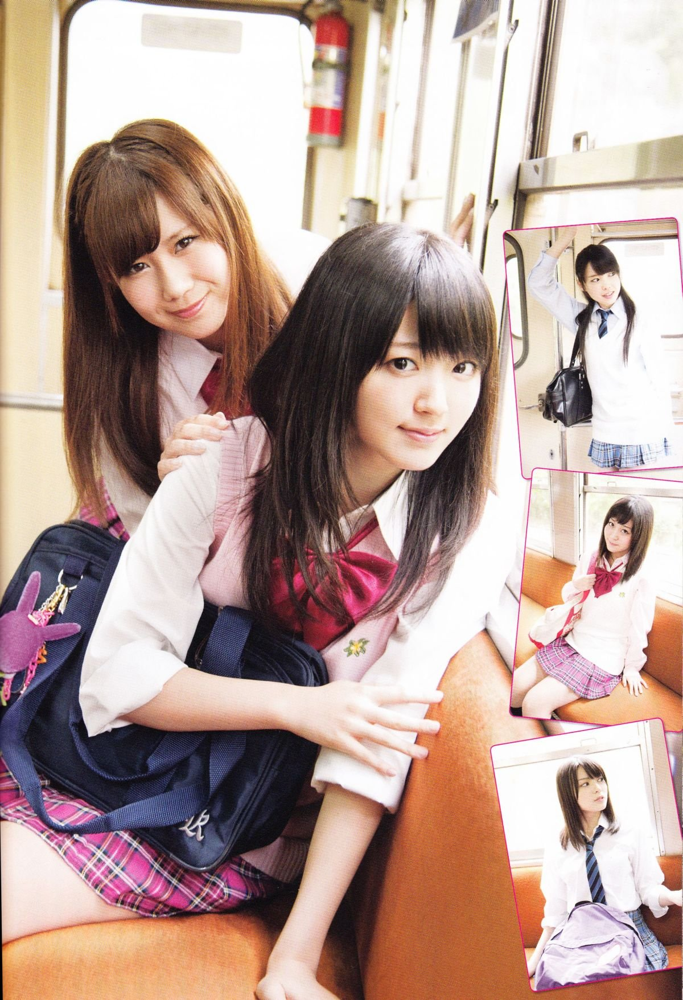

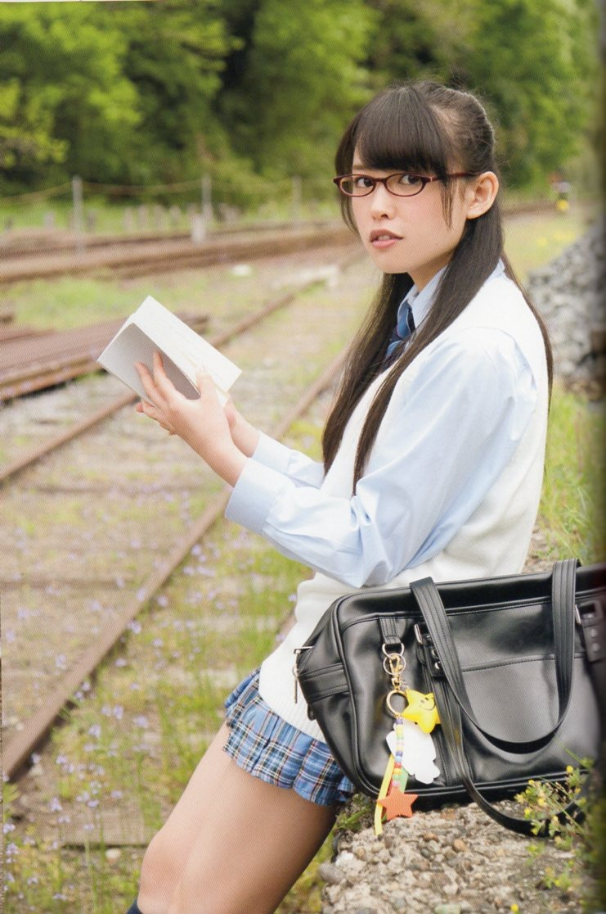

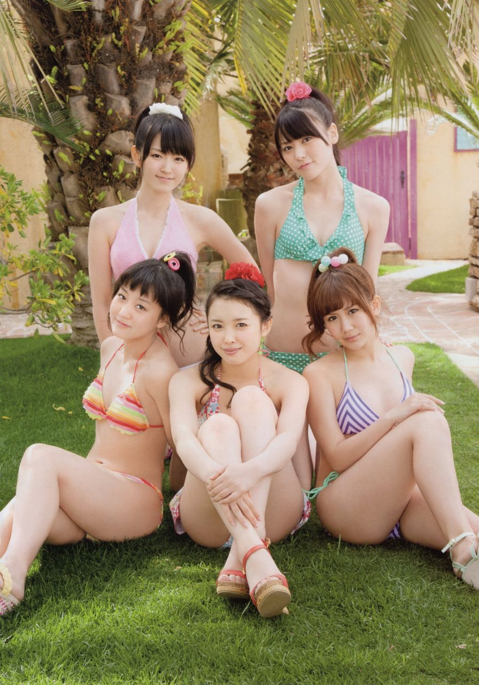

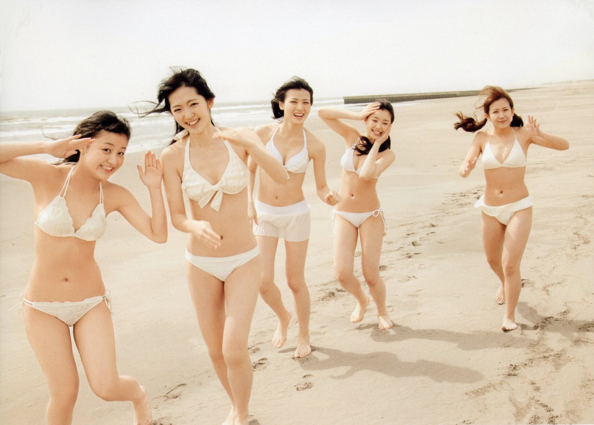

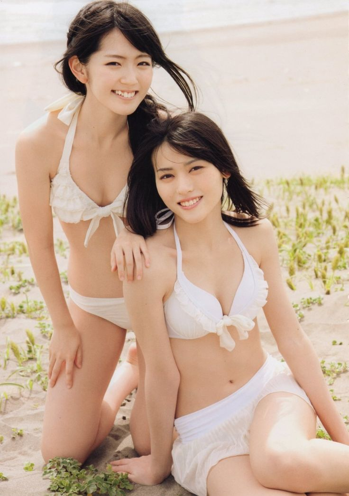

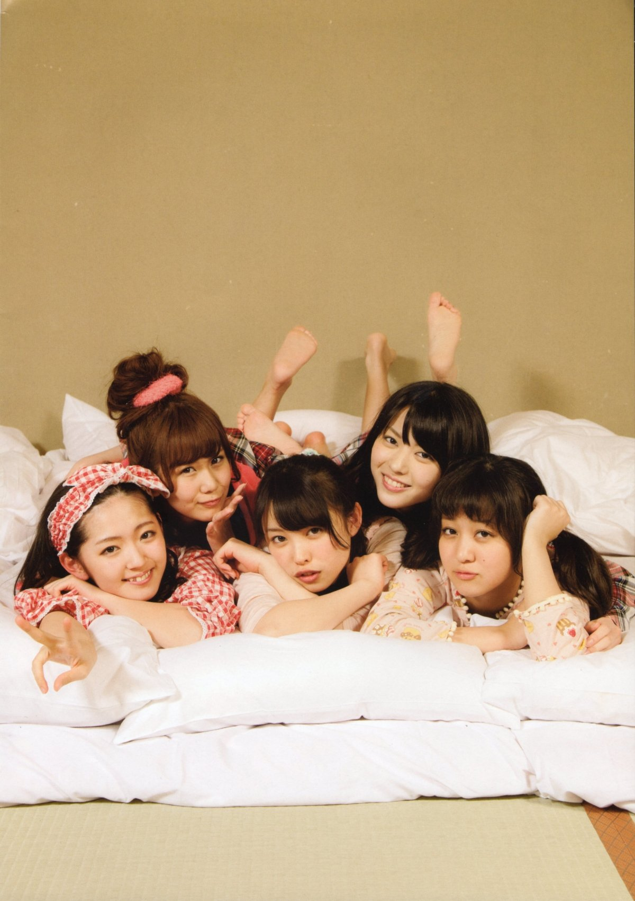
---

## Informations

- **Titre original :** ℃-ute写真集『Cutest』
- **Titre usuel :** *Cutest*
- **Artistes :** Yajima Maimi, Nakajima Saki, Suzuki Airi, Okai Chisato, Hagiwara Mai
- **Groupe :** ℃-ute
- **Type :** photobook collectif
- **Éditeur :** Kids Net / KADOKAWA
- **Date de sortie officielle :** 7 décembre 2011
- **Mise en vente en librairie :** 6 décembre 2011
- **Prix d'origine :** 2 857 ¥ hors taxe
- **Pagination :** 96 pages
- **Format :** A4
- **Dimensions :** environ 21 × 30 cm
- **Impression :** couleur
- **Photographe :** Sato Tomoaki (佐藤友昭)
- **ISBN-10 :** 4-04-895430-X
- **ISBN-13 :** 978-4-04-895430-3
- **Bonus :** DVD de making-of joint au photobook
- **Chronologie :** quatrième photobook collectif de ℃-ute dans les chronologies spécialisées, après *So Cute!*, *Alo-Hello! ℃-ute* et *℃ompact ℃ream*, avant *Alo-Hello! ℃-ute 2012*

Les catalogues de l'éditeur et de la profession concordent sur le format A4, les **96 pages**, l'ISBN et l'attribution photographique à **Sato Tomoaki**. Une petite différence de datation s'explique par la distinction entre la mise en vente en librairie, enregistrée au **6 décembre**, et la date d'édition / date officielle Hello! Project, fixée au **7 décembre 2011**.

Le DVD inclus fait partie de l'édition normale. Un **second making-of**, beaucoup plus développé et composé d'images inédites différentes de celles du disque joint, fut parallèlement proposé en commande limitée par e-LineUP! sous la référence **UFBW-2038**.

---

## Artistes suivies dans cette collection

> Les étoiles indiquent l'importance de l'artiste dans cette publication, et non une appréciation de l'artiste.

★★★★★ Dossier majeur

★★★★☆ Présence importante

★★★☆☆ Bon dossier secondaire

★★☆☆☆ Présence limitée

★☆☆☆☆ Apparition

| Artiste | Présence | Solo | Autres apparitions |
|---------|:--------:|:----:|--------------------|
| **Nakajima Saki** | ★★★★★ | nombreuses séquences individuelles | Couverture • nombreuses pages collectives • séquences piscine, extérieur et tenues thématiques |
| **Suzuki Airi** | ★★★★★ | nombreuses séquences individuelles | Couverture • nombreuses pages collectives • plage, piscine, nature et séquences de groupe |

La publication est conçue comme un **véritable photobook des cinq membres**, sans vedette unique annoncée par l'éditeur. Nakajima Saki et Suzuki Airi disposent donc d'une présence importante pour cette collection, mais à l'intérieur d'un ensemble où les cinq membres sont volontairement traitées comme un groupe. Les images disponibles confirment cette forte alternance entre portraits individuels, duos et compositions à cinq.

---

## Contexte

*Cutest* paraît à la fin de **2011**, environ deux ans après *Alo-Hello! ℃-ute Shashinshū*, publié en octobre 2009. Ce précédent ouvrage était important puisqu'il constituait le premier photobook hawaïen des cinq membres et leur première séance collective en maillot. Pour *Cutest*, Kids Net conserve le même line-up stabilisé à cinq mais abandonne le concept unique du voyage hawaïen au profit d'une succession beaucoup plus large de situations.

Cette différence correspond directement au discours promotionnel de l'éditeur : le nouveau volume doit montrer simultanément leur **« mignonne » spontanéité** et une image devenue plus adulte. Les séances de mer et de piscine sont associées à des maillots blancs, marins ou colorés et à une attitude très vive, tandis que les paysages de montagne, de rivière et de forêt servent à introduire un registre plus posé et plus mature.

La formule répond aussi à l'évolution réelle du groupe. Entre *Alo-Hello!* et *Cutest*, le changement de line-up cesse d'être un sujet : les cinq membres présentes ici sont déjà celles qui resteront ensemble jusqu'à la fin de ℃-ute. Le livre peut donc se concentrer sur leur **identité collective**, ce que les pages fournies rendent particulièrement visible : une part importante des photographies repose sur les interactions, les duos, les jeux et les compositions à cinq plutôt que sur une juxtaposition de mini-photobooks solo.

L'année **2011** est par ailleurs particulièrement dense pour ℃-ute. Le groupe publie *Kiss me Aishiteru*, *Momoiro Sparkling* puis *Sekaiichi HAPPY na Onna no Ko*, ainsi que l'album *Chou WONDERFUL! ⑥* ; le photobook arrive après la tournée *Chou! Chou Wonderful Tour* et le *Cutie Circuit 2011*, alors que commence également la collaboration scénique et discographique avec Berryz Kobo.

Cette actualité aide à comprendre la tonalité de *Cutest*. Il ne s'agit plus de présenter un jeune groupe en formation comme dans *So Cute!* en 2007 : quatre années plus tard, le photobook travaille explicitement sur le passage entre **jeunesse familière et image plus adulte**, tout en préservant la complicité collective qui constitue alors l'un des principaux marqueurs publics de ℃-ute.

Lors de la promotion, les membres insistent précisément sur les expressions naturelles obtenues lorsqu'elles sont photographiées ensemble. Suzuki Airi explique notamment qu'une séance avec les autres membres lui permet de se montrer plus détendue qu'un travail solo.

Le lancement se poursuit après Noël : un événement avec les cinq membres est organisé à **Fukuya Shoten Shinjuku Subnade le 10 janvier 2012**, puis Nakajima Saki et Hagiwara Mai participent à un autre rendez-vous promotionnel à Osaka le 23 janvier.

---

## Sommaire

*Cutest* ne suit pas un voyage unique à la manière d'un *Alo-Hello!* : son unité repose plutôt sur une série de **situations collectives contrastées**. La documentation éditoriale et les pages disponibles permettent d'en distinguer plusieurs grands ensembles.

- **Piscine et univers marin** — maillots coordonnés rouge, blanc et bleu, accessoires nautiques et portraits individuels ; la couverture appartient à cette séquence.
- **Plage en blanc** — compositions collectives très lumineuses, duos et images de mouvement où les cinq membres courent ou jouent ensemble.
- **Maillots colorés** — traitement plus pop, avec une forte différenciation des couleurs et des silhouettes.
- **Rivière et pleine nature** — ambiance estivale mais moins balnéaire, utilisant les rochers, l'eau et la végétation.
- **Forêt** — rupture visuelle importante : vêtements noirs, silhouettes plus travaillées et expressions davantage composées.
- **Uniformes et environnement ferroviaire** — petite narration autour du trajet et du quotidien scolaire ; cette séquence sera également reprise dans les contenus numériques dérivés de *Cutest*.
- **Pyjamas** — séquence collective beaucoup plus légère, construite autour d'un lit et de jeux entre les membres.
- **DVD making-of** — prolongement vidéo des prises de vue du livre.

Cette organisation produit moins une histoire continue qu'une série de **variations sur les cinq membres**. Les changements de décor servent surtout à faire alterner les deux registres explicitement revendiqués lors de la sortie : l'énergie et la proximité du groupe d'un côté, une représentation progressivement plus adulte de l'autre.

---

## Dossier principal

### Le groupe avant les individualités

Le trait le plus net de *Cutest* est la place accordée aux **photographies collectives**. Même lorsqu'une séquence comporte des portraits individuels, ceux-ci restent rattachés à une tenue ou à un décor partagé par les cinq membres.

La couverture donne immédiatement cette clé de lecture : ℃-ute est réuni autour d'une piscine dans des tenues coordonnées d'inspiration marine. Cette logique se retrouve sur la plage, dans la rivière et en forêt. Le livre cherche donc moins à juxtaposer cinq mini-photobooks solo qu'à représenter **℃-ute comme formation stabilisée**.

Les propos tenus pendant la promotion vont dans le même sens : Yajima Maimi souligne les expressions naturelles conservées dans le livre, tandis que Suzuki Airi explique être plus détendue lors d'une séance collective que dans un travail solo.

### Piscine : l'identité graphique du volume

La série associée à la couverture est la plus construite visuellement. Les cinq tenues déclinent le même vocabulaire : **bleu, blanc, rouge, rayures, nœuds et accessoires marins**, sans pour autant devenir identiques.

Les portraits réalisés dans l'eau prolongent cette cohérence avec des arrière-plans très lumineux où dominent le bleu de la piscine et les couleurs franches des vêtements. L'ensemble donne au début du livre une identité estivale immédiatement reconnaissable.

### Plage : mouvement et proximité

La plage simplifie fortement la palette : maillots blancs, sable clair et horizon ouvert. Une grande photographie des cinq membres courant vers l'objectif privilégie volontairement le mouvement et le désordre des positions plutôt qu'un portrait de groupe symétrique.

D'autres pages resserrent ensuite la scène en duos plus calmes. Cette alternance entre énergie collective et proximité constitue l'un des rythmes essentiels du photobook.

### De la rivière à la forêt

La rivière conserve une tonalité estivale mais donne davantage de place au paysage : rochers, eau et végétation entourent les membres.

La forêt inverse ensuite presque entièrement l'ambiance. Les couleurs vives disparaissent au profit du **noir**, les poses deviennent plus retenues et les vêtements plus structurés. *Cutest* construit ainsi deux images complémentaires du groupe : **légèreté dans les décors ouverts et lumineux ; présence plus posée dans les paysages boisés**.

### Petites scènes de vie collective

Les séquences en uniformes, dans une gare ou un train, puis en pyjamas introduisent une dimension plus narrative. Sacs, livres, banquettes ou lit servent moins de décor spectaculaire que de cadre à des moments où les membres semblent réellement partager une situation.

Ces scènes seront d'ailleurs reprises dans **℃-ute « cutest » by 動く!!写真集**, constitué en grande partie de photographies inédites issues du même projet.

### Un projet étendu

*Cutest* dépasse enfin ses 96 pages. Au **DVD making-of inclus** s'ajoute un making-of spécial vendu séparément par e-LineUP!, composé d'images différentes de celles du disque joint.

En 2012, *℃-ute « cutest » by 動く!!写真集* exploite encore des clichés non retenus, avec des versions collectives et individuelles. Le photobook imprimé apparaît ainsi comme le centre d'un ensemble plus vaste de prises de vue consacrées au ℃-ute à cinq.

---

## Style

Le langage visuel de *Cutest* repose sur le **contraste**, davantage que sur un concept géographique unique. Sato Tomoaki utilise plusieurs registres très différents mais les relie par une photographie claire, directe et généralement peu chargée graphiquement. Le livre peut ainsi passer d'un univers balnéaire presque publicitaire à une forêt beaucoup plus sombre sans perdre son unité.

Les séquences de piscine sont les plus graphiques. Le trio **bleu-blanc-rouge** domine les costumes et les accessoires, avec une inspiration marine immédiatement lisible : rayures, petits chapeaux, nœuds, insignes et détails décoratifs. Les cinq tenues sont coordonnées sans être identiques, ce qui permet à chaque membre de rester reconnaissable tout en donnant aux photographies collectives une forte cohérence.

La lumière y est très haute et les arrière-plans sont souvent presque blancs. Le bleu de l'eau devient alors une véritable surface de couleur tandis que les rouges et les bleus des vêtements structurent l'image.

À la plage, la direction artistique se simplifie encore. Les maillots blancs et le sable clair réduisent fortement la palette et laissent les **gestes, les regards et les positions relatives des membres** organiser l'image.

La partie en rivière réintroduit au contraire des couleurs franches — vert, rose, violet, denim — devant une végétation très dense. Elle possède une tonalité intermédiaire entre le pop des scènes de piscine et la sobriété de la forêt.

Cette dernière constitue la véritable rupture esthétique du volume. Les vêtements deviennent essentiellement noirs, les matières plus structurées et les poses beaucoup moins expansives. Dans les images disponibles, le décor n'est presque pas artificialisé : troncs rectilignes, bois au sol et végétation sont conservés tels quels. La verticalité répétée des arbres fournit naturellement la structure de la composition.

Les portraits individuels associés à cette séquence accentuent encore le contraste. La photographie de **Nakajima Saki en noir**, chapeau incliné, courte veste et jupe à volants, abandonne presque totalement l'imagerie lumineuse de la couverture. Le même membre peut ainsi passer d'un costume marin bleu très doux à une silhouette noire beaucoup plus construite sans que le livre donne l'impression de changer de sujet.

Les séquences en uniforme scolaire et en pyjama apportent un troisième registre. Ici, les costumes sont moins utilisés comme objets esthétiques autonomes que comme support à de petites situations collectives : attendre ou prendre un train, lire, s'asseoir ensemble, jouer autour d'un lit. La mise en page de la séquence ferroviaire, avec **une grande photographie accompagnée de petits cadres secondaires**, renforce ce caractère narratif.

Le traitement éditorial privilégie globalement l'image. Les pages fournies montrent peu de texte, hormis quelques mentions de membre et certains éléments graphiques très discrets. Même lorsqu'une page contient plusieurs photographies, l'organisation reste suffisamment simple pour ne pas concurrencer les visages.

---

## Ce qui distingue cette publication

*Cutest* se situe à un moment particulièrement intéressant de la série des photobooks collectifs de ℃-ute. Le premier volume, *So Cute!* en 2007, présentait encore **sept membres** et insistait sur leur jeunesse et leur énergie ; *Alo-Hello! ℃-ute* en 2009 inaugurait ensuite le line-up à cinq dans un photobook hawaïen collectif.

Avec *Cutest*, les cinq membres sont désormais suffisamment installées pour que le livre puisse construire son identité autour de leur **relation collective** plutôt qu'autour d'une nouveauté de line-up ou d'un voyage exceptionnel. C'est probablement sa singularité la plus forte : les portraits individuels existent, mais les photographies où elles partagent réellement une situation occupent une place essentielle.

Le volume constitue également un projet éditorial plus vaste que ses seules 96 pages. Son DVD joint est complété par un **making-of spécial UFBW-2038**, vendu uniquement sur commande e-LineUP! du 28 novembre au 17 décembre 2011 et composé d'images inédites différentes du disque fourni avec le livre.

Quelques mois plus tard, l'application *℃-ute « cutest » by 動く!!写真集* exploite encore les prises non retenues et est présentée comme une sorte d'**« autre Cutest »**, avec une majorité d'images collectives et notamment les scènes du train et des pyjamas.

Enfin, cette publication précède de seulement quelques mois *Alo-Hello! ℃-ute 2012*, sorti en juillet 2012. Elle constitue donc une photographie intermédiaire du groupe : ni le très jeune ℃-ute de *So Cute!*, ni le projet tropical très marqué des *Alo-Hello!*, mais un ouvrage construit autour de **cinq membres devenues une formation visuellement et humainement très homogène**.

---

## Réception des lecteurs / Mémoire collective

La mémoire laissée par *Cutest* ne repose pas sur une photographie unique devenue emblématique, mais plutôt sur **l'image de ℃-ute comme groupe à cinq** : les scènes collectives, les changements d'ambiance et la décontraction visible entre les membres sont les éléments qui ressortent le plus clairement des traces retrouvées.

Une réaction japonaise contemporaine est encore conservée sur Rakuten Books. Publiée le **11 décembre 2011**, quatre jours après la sortie officielle, elle attribue au photobook **5/5**. L'acheteur explique simplement à propos de sa fille :

> 「なかなか気に入っているようです。」
>
> *« Elle semble vraiment beaucoup l'apprécier. »*

Le commentaire est trop bref pour constituer à lui seul une tendance, mais il conserve une trace directe de la réception immédiate du livre au moment de sa commercialisation.

Plus révélatrice est la manière dont certaines photographies ont continué à circuler plusieurs années après la sortie. En 2014, le blogueur et collectionneur **Nao Kanzaki** republie une série issue de *Cutest* en la présentant comme :

> **“some really fabulous ones”**
>
> *« des photos vraiment fabuleuses ».*

Son billet concerne surtout Yajima Maimi, mais montre que les images de *Cutest* restent suffisamment appréciées trois ans après la publication pour être ressorties indépendamment du livre lui-même.

Cette persistance est également visible dans des archives japonaises consacrées à ℃-ute, où des images provenant de *Cutest* continuent d'être classées et republiées plus d'une décennie après sa sortie. Cela ne constitue pas un avis critique, mais témoigne de la survie du matériel photographique dans la mémoire visuelle des fans.

### Nakajima Saki

Pour **Nakajima Saki**, *Cutest* possède un intérêt particulier parce que le livre exploite plusieurs facettes très différentes de son image. Dans les pages disponibles, elle passe du maillot marin bleu et blanc très lumineux à une silhouette entièrement noire dans la forêt, puis à des scènes beaucoup plus quotidiennes ou collectives.

Les commentaires retrouvés spécifiquement sur *Cutest* et nommant Nakajima restent rares. En revanche, la réception de ses publications photographiques fait régulièrement ressortir une qualité que le volume exploite particulièrement bien : sa capacité à exister visuellement sans nécessairement occuper le centre de l'image.

Un fan anglophone écrivait déjà à son sujet :

> **“I have long held that Saki is the cutest of the group.”**

Quelques années plus tard, un collectionneur japonais résumait son photogénisme d'une formule particulièrement parlante :

> 「自己主張は強くないけど、存在感はある」
>
> *« Elle ne s'impose pas fortement, mais elle a une vraie présence. »*

Ces témoignages ne concernent pas directement *Cutest* et doivent donc être lus comme des comparaisons avec la réception générale de Nakajima. Ils correspondent néanmoins bien aux pages du livre : Saki peut rester très identifiable dans les compositions collectives tout en passant d'un registre très lumineux à des portraits beaucoup plus construits.

Lors du lancement du volume, Nakajima explique elle-même apprécier le travail sur les photobooks parce qu'il permet aux membres de participer aux séances de manière naturelle et détendue :

> 「写真集の仕事は、素で楽しんで取り組めるのがいいです」
>
> *« Ce que j'aime dans le travail sur un photobook, c'est qu'on peut vraiment s'amuser en restant naturelles. »*

Dans *Cutest*, cette spontanéité convient particulièrement bien à Saki : son visage et ses attitudes changent fortement d'une séquence à l'autre, depuis les scènes de groupe très souriantes jusqu'aux photographies beaucoup plus composées de la forêt.

### Suzuki Airi

La situation de **Suzuki Airi** est différente. En décembre 2011, elle possède déjà une production photographique solo particulièrement abondante. Le photobook collectif arrive donc à un moment où les fans disposent déjà de nombreuses publications entièrement centrées sur elle.

Cette comparaison rend particulièrement intéressante une remarque faite par Airi lors de la promotion de *Cutest* :

> 「ソロ作品で一人での撮影の時より、みんなで撮るほうがリラックスできます。」
>
> *« Je suis plus détendue lorsque nous faisons les photos toutes ensemble que lors d'un shooting solo. »*

La remarque correspond directement aux images conservées dans le livre : Airi est souvent photographiée **en interaction**, dans des duos ou au milieu du groupe, plutôt que comme sujet isolé d'une longue séquence.

La réception internationale d'Airi souligne depuis longtemps cette capacité à passer d'un registre très doux dans ℃-ute à une présence beaucoup plus assurée ailleurs. Un fan résumait ce contraste ainsi :

> **“she’s all sweet … in C-ute but … badass when she’s in Buono!”**

Ce commentaire ne concerne pas directement *Cutest*, mais il éclaire bien la place qu'y occupe Airi : le livre privilégie clairement son versant détendu et collectif.

Cette importance du matériel photographique produit autour d'elle est confirmée quelques mois plus tard par la sortie de **Suzuki Airi « cutest » by 動く!!写真集**, annoncée pour le **2 mars 2012**. Cette déclinaison numérique exploite des photographies non retenues dans le livre imprimé et montre que la séance avait produit suffisamment d'images d'Airi pour constituer une publication individuelle dérivée.

Le même projet prévoit également une version consacrée à **Nakajima Saki**, aux côtés de celles d'Okai Chisato et Hagiwara Mai. La publication numérique collective est présentée comme un **« autre Cutest »**, principalement composé de photographies inédites des cinq membres ensemble : trajet en train, pyjamas, bataille d'oreillers et différents maillots.

### Une réputation surtout collective

Les éléments retrouvés convergent finalement vers une même particularité. Contrairement à certains photobooks solo dont la mémoire repose sur une série ou un portrait très précis, *Cutest* semble avoir surtout laissé le souvenir d'un **℃-ute particulièrement cohérent visuellement**.

La presse qui accompagne la déclinaison numérique insiste elle-même sur les photographies des cinq membres voyageant ensemble, jouant en pyjama ou posant dans différents maillots, en soulignant que ces images transmettent leur proximité.

Cette réputation correspond bien aux pages du livre : même lorsque Suzuki Airi, Nakajima Saki ou une autre membre bénéficie d'un portrait individuel fort, l'ouvrage revient constamment au groupe.

Pour une collection suivant particulièrement **Nakajima Saki et Suzuki Airi**, c'est justement ce qui distingue *Cutest* de leurs publications solo : il ne cherche pas à les isoler, mais à conserver leur place au sein du ℃-ute à cinq, dans une période où cette formation atteint progressivement sa pleine identité.

---

## Intérêt pour ma collection

**Appréciation personnelle :**

**17 / 20**

**★★★★☆**

### Pourquoi ce volume mérite sa place

*Cutest* constitue un très bon témoin du **℃-ute à cinq du début des années 2010**, précisément au moment où cette formation devient définitivement l'identité du groupe. Contrairement à un photobook dominé par quelques portraits individuels, il conserve beaucoup d'images où les membres fonctionnent réellement ensemble : piscine, plage, rivière, forêt, train ou scènes en pyjama.

Pour une collection accordant une attention particulière à **Nakajima Saki et Suzuki Airi**, l'intérêt est renforcé par leur présence constante dans ces séquences collectives ainsi que par de nombreux portraits individuels. Le volume permet notamment de retrouver Nakajima dans des registres très différents — marin, plage, forêt, uniforme — plutôt que dans une seule direction artistique.

Il complète également particulièrement bien les publications individuelles de la même période. Là où un photobook solo développe entièrement l'image d'une membre, *Cutest* conserve quelque chose que ces ouvrages ne peuvent pas montrer : **les interactions et l'équilibre visuel entre les cinq membres de ℃-ute**.

Enfin, l'existence du DVD joint, du making-of e-LineUP! et des photobooks numériques dérivés donne au livre une véritable dimension de **projet photographique étendu**. Les nombreuses prises alternatives exploitées après sa sortie montrent que la séance avait été pensée suffisamment largement pour produire plusieurs objets complémentaires.

### Mon ressenti

*(Espace réservé au collectionneur.)*

---

    

