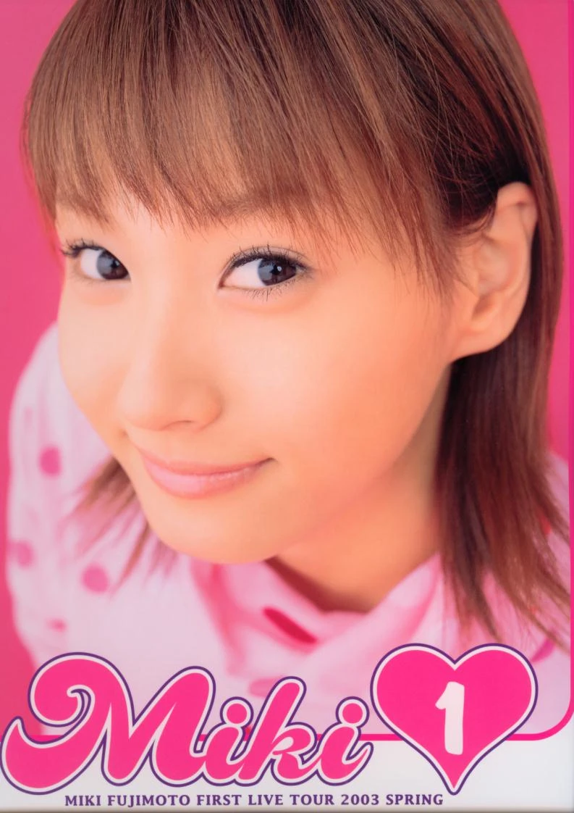
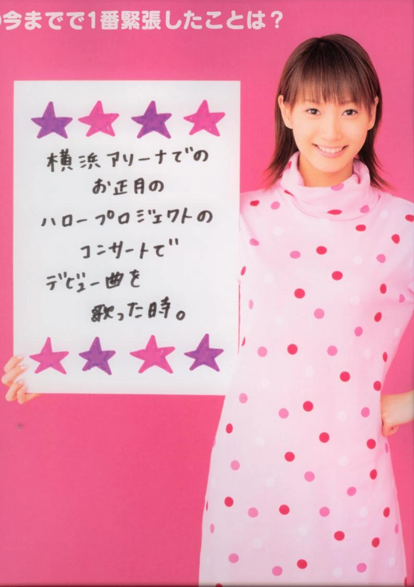
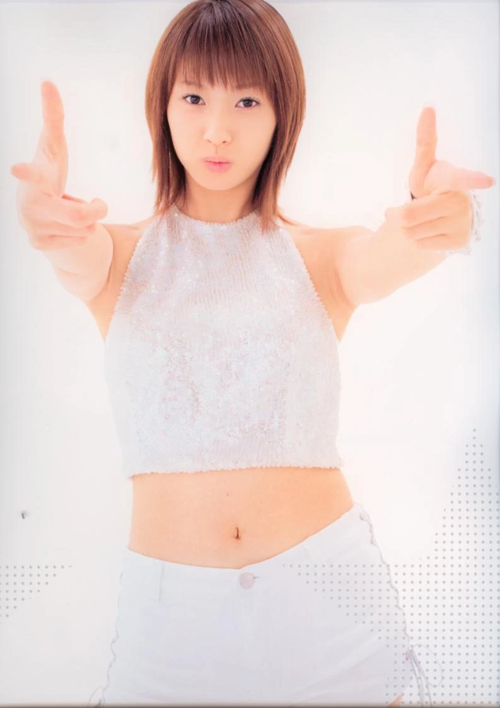
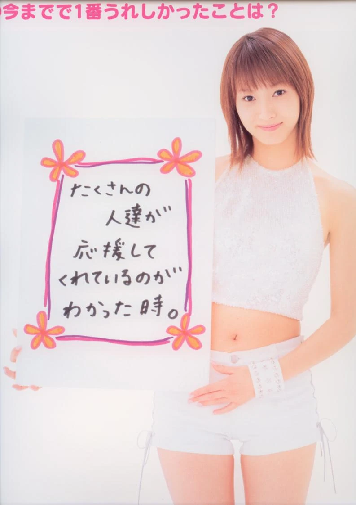

Fujimoto Miki FIRST LIVE TOUR 2003 SPRING ～MIKI①～
藤本美貴 FIRST LIVE TOUR 2003 SPRING ～MIKI①～
Fujimoto Miki

Official First Solo Tour Pamphlet

Hello! Project • 2003

Informations
Titre original : 藤本美貴 FIRST LIVE TOUR 2003 SPRING ～MIKI①～

Titre romanisé : Fujimoto Miki FIRST LIVE TOUR 2003 SPRING ～MIKI 1～

Artiste : Fujimoto Miki

Type : pamphlet officiel de concert • photobook de tournée

Événement : première tournée solo de Fujimoto Miki

Période de la tournée : 8 février – 29 avril 2003

Année : 2003

Diffusion : produit officiel associé à la tournée

Photographie : portraits studio et pages éditoriales consacrées à Fujimoto Miki

Impression : couleur

Langue : japonais

Identifiant commercial connu : aucun ISBN ou JAN solidement établi

Nature éditoriale : publication de concert plutôt que photobook distribué en librairie

Les catalogues d'occasion japonais identifient précisément l'objet comme le pamphlet de la première tournée solo, et non comme l'édition DVD portant ensuite pratiquement le même titre. Suruga-ya enregistre le pamphlet au 3 février 2003 et rattache explicitement l'objet à la tournée organisée du 8 février au 29 avril.

Cette distinction est importante : FIRST LIVE TOUR 2003 SPRING ～MIKI①～ existe également sous forme de vidéo de concert, publiée le 18 juin 2003 chez hachama sous la référence HKBN-50031. Le présent volume est le programme photographique commercialisé autour de la tournée, antérieur à cette édition vidéo.

La couverture fournie confirme cette identité. Elle utilise simplement le logo rose Miki ♥ 1, accompagné en partie basse de la mention « MIKI FUJIMOTO FIRST LIVE TOUR 2003 SPRING ». L'objet reprend donc graphiquement le titre de l'album et de la tournée sans se présenter comme un photobook autonome de librairie.

Contexte
Le pamphlet accompagne l'aboutissement de la courte première période solo de Fujimoto Miki. Après ses débuts avec Aenai Nagai Nichiyōbi en mars 2002, plusieurs singles suivent, jusqu'à Boogie Train '03, paru le 5 février 2003 juste avant le début de la tournée.

Son premier album, MIKI①, paraît le 26 février pendant cette tournée, organisée du 8 février au 29 avril 2003. Le programme s'inscrit donc dans une campagne cohérente : Boogie Train '03 → première tournée solo → album MIKI①.

Cette période possède une valeur historique particulière : l'intégration future de Fujimoto à Morning Musume avait été annoncée le 7 janvier 2003. Son premier concert avec le groupe intervient le 4 mai, quelques jours après la fin de la tournée. Le pamphlet documente ainsi l'apogée de son identité de soliste au moment même où cette première phase de sa carrière touche à sa fin.

Dossier principal
Une publication construite autour de « Miki »
La couverture résume le parti pris : aucun décor de concert ni photographie de scène, mais un très gros plan de Fujimoto sur fond rose saturé, dominé par le logo « Miki ♥ 1 ».

Ce rapprochement avec l'univers graphique de MIKI① fait du programme un prolongement visuel de cette période discographique. Dès la couverture, le sujet est moins le concert que Fujimoto elle-même.

Le rose comme identité éditoriale
Une première séquence pousse cette logique presque jusqu'au monochrome : tenue rose à pois, fond rose et éléments graphiques violets ou roses.

Les panneaux manuscrits deviennent le centre des pages. Plutôt qu'une légende éditoriale, les réponses écrites au marqueur donnent l'impression d'une communication directe entre Fujimoto et le lecteur, dans une esthétique très Hello! Project du début des années 2000.

Du personnage d'idol au portrait de mode
Une seconde séquence rompt avec cette saturation. Fujimoto apparaît en blanc et argenté sur un décor presque entièrement blanc, avec des poses plus dynamiques et une place accrue donnée à la silhouette.

Le programme alterne ainsi une image très « idol », colorée et souriante, avec une représentation plus épurée proche de la photographie promotionnelle ou de mode.

Une proximité fabriquée par l'écriture manuscrite
Les questionnaires fixent une parole très contemporaine de cette première tournée. Fujimoto y évoque notamment ses débuts et le moment où elle a compris que de nombreuses personnes la soutenaient.

Ces réponses courtes et manuscrites créent un lien direct avec le public auquel le pamphlet était destiné. Elles donnent aussi une valeur documentaire particulière à l'objet : Fujimoto y regarde encore son début de carrière comme un événement très récent.

Style
La direction artistique repose essentiellement sur deux univers : rose saturé et blanc lumineux. Le premier associe fond, vêtements et graphisme dans une esthétique très colorée ; le second efface presque le décor pour privilégier la silhouette.

La lumière diffuse, les ombres faibles et les carnations très éclaircies correspondent bien à la photographie d'idol japonaise du début des années 2000. Les cadrages alternent gros plans, portraits avec panneaux et poses plus dynamiques.

La mise en page reste volontairement simple : les photographies dominent, tandis que les questionnaires transforment l'écriture manuscrite en élément graphique. L'ensemble conserve ainsi une identité visuelle cohérente directement associée à MIKI①.

Ce qui distingue cette publication
La particularité de FIRST LIVE TOUR 2003 SPRING ～MIKI①～ tient à son statut hybride : officiellement tour pamphlet, il se rapproche visuellement d'un petit photobook de Fujimoto Miki grâce à ses séances studio et ses questionnaires personnels.

Cette autonomie photographique lui permet de conserver un intérêt au-delà du concert. Sa datation renforce encore sa valeur : il accompagne simultanément son premier album, sa première tournée et les derniers mois de sa première période exclusivement solo avant son intégration effective à Morning Musume.

Le ① suggère un commencement ; l'évolution immédiate de sa carrière en a finalement fait le témoignage d'une période beaucoup plus brève et singulière.

Intérêt pour ma collection
Appréciation personnelle :

16,5/20

★★★★☆

Pourquoi ce volume mérite sa place
FIRST LIVE TOUR 2003 SPRING ～MIKI①～ documente un moment très précis de la carrière de Fujimoto Miki : l'apogée de sa première période solo, avec sa première tournée, son premier album et un univers graphique entièrement construit autour d'elle.

Les séances studio, entre esthétique rose très « idol » et images blanches plus épurées, donnent au pamphlet l'autonomie d'un petit photobook. Les questionnaires manuscrits renforcent cette proximité en conservant une parole directement liée à ses débuts et au soutien de son public.

Sa valeur historique tient surtout à sa position chronologique : Boogie Train '03 vient de paraître, MIKI① sort pendant la tournée et son intégration à Morning Musume est déjà annoncée. Le volume conserve ainsi l'image d'une Fujimoto Miki encore entièrement présentée comme artiste solo, juste avant cette transition majeure.

Mon ressenti
16,5/20 • ★★★★☆
