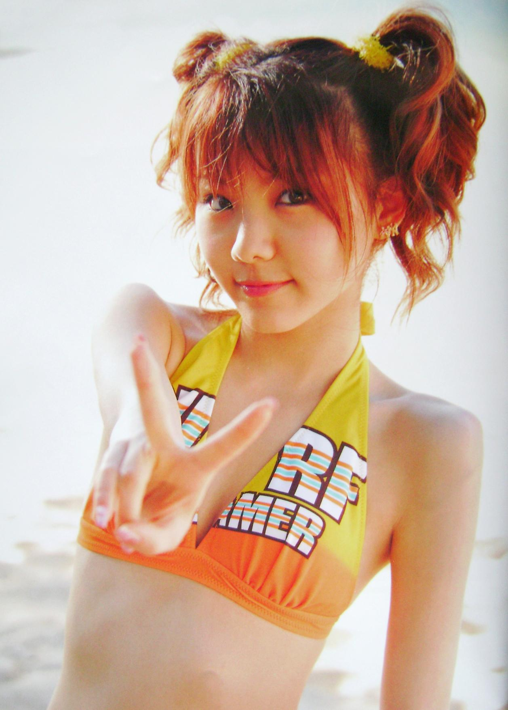
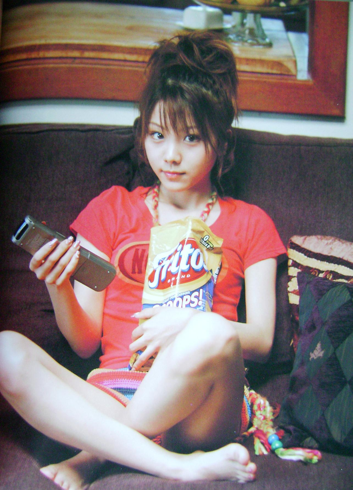
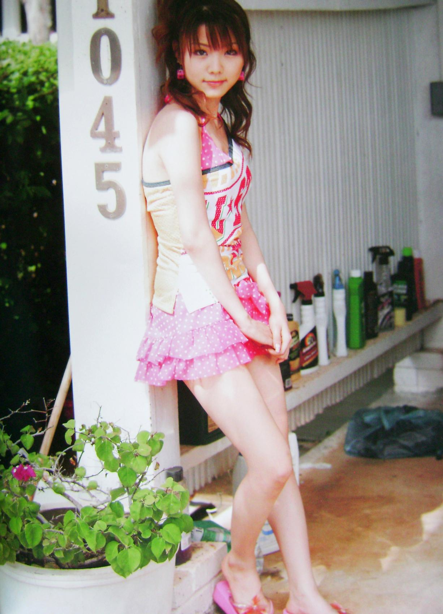
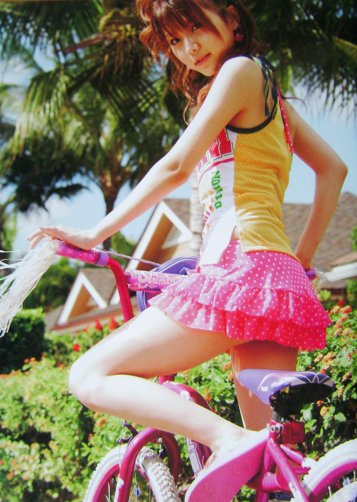

    # Alo-Hello! Tanaka Reina

## アロハロ！田中れいな写真集

**Tanaka Reina • Morning Musume。**

Hello! Project Hawaiian Style • 2007

---

---

## Informations

- **Titre original :** アロハロ！田中れいな写真集
- **Titre romanisé :** Alo-Hello! Tanaka Reina Shashinshū
- **Titre usuel :** Alo-Hello! Tanaka Reina
- **Artiste :** Tanaka Reina
- **Groupe :** Morning Musume。
- **Collection :** Alo-Hello! / Hello! Project Hawaiian Style
- **Type :** photobook solo
- **Éditeur :** Kids Net / Kadokawa
- **Date de sortie :** 1er février 2007
- **Prix d'origine :** 2 800 ¥ hors taxe • 2 934 ¥ TTC
- **Pagination :** 96 pages
- **Format :** A4
- **Hauteur :** environ 30 cm
- **Impression :** couleur
- **Photographe :** Wakahara Mizuaki
- **Lieu principal :** Hawaï
- **ISBN-10 :** 4-04-894483-5
- **ISBN-13 :** 978-4-04-894483-0
- **Code C :** C0072
- **Bonus :** DVD de making-of joint au photobook
- **Chronologie :** quatrième photobook solo de Tanaka Reina, entre *Shōjo R* et *GIRL*

Les données matérielles sont confirmées par le catalogue de Kinokuniya, qui enregistre l'ouvrage en **A4, 96 pages et 30 cm**, et par Suruga-ya pour la date, le prix d'origine et la présence du DVD bonus.

---

## Contexte

*Alo-Hello! Tanaka Reina* paraît au début de **2007**, alors que Tanaka Reina a 17 ans et appartient depuis près de quatre ans à la sixième génération de Morning Musume. Son parcours éditorial solo est déjà particulièrement soutenu : *Tanaka Reina* en 2004, *Reina* en 2005 puis *Shōjo R* en mai 2006 précèdent ce quatrième volume, tandis que *GIRL* suivra dès septembre 2007. Le photobook hawaïen s'inscrit donc dans une période où son image individuelle est développée presque parallèlement à son activité au sein du groupe.

La publication adopte le principe **Alo-Hello!**, étroitement associé dans le Hello! Project aux tournages et séances photographiques à Hawaï. Ici, le décor n'est pas réduit à quelques pages balnéaires : il structure l'ensemble du projet autour de plages, végétation tropicale, loisirs, espaces de détente et scènes donnant volontairement l'impression d'accompagner Reina pendant un séjour. Les photographies fournies montrent précisément cette alternance entre maillots, vélo, extérieur résidentiel et moments beaucoup plus quotidiens.

Le projet dépasse d'ailleurs le seul livre. Un **DVD Alo-Hello! Tanaka Reina** sort le **14 février 2007**, treize jours après le photobook. Il reprend le même séjour hawaïen sous une forme plus narrative : surf shop, déjeuner, plage, glace pilée, coucher de soleil, excursion consacrée aux requins, jet-ski, jeux en mer et séquences de repos. La présence d'un « Still Making » permet également de relier explicitement le programme vidéo à la production photographique.

Il faut distinguer ce DVD commercialisé séparément du **DVD de making-of fourni avec le photobook**. Les deux objets appartiennent à la même opération éditoriale mais n'ont pas la même fonction : le disque joint prolonge directement le livre, tandis que le DVD *Alo-Hello!* développe le voyage en un programme autonome d'environ une heure. Suruga-ya conserve d'ailleurs séparément la référence du DVD bonus provenant du photobook.

La sortie coïncide aussi avec une phase de transition pour Morning Musume. Le **14 février 2007**, le groupe publie *Egao YES Nude*, premier single avec la huitième génération Mitsui Aika. Deux semaines auparavant, le photobook place au contraire Reina seule au centre de l'image, sans logique promotionnelle collective apparente. Cette proximité souligne surtout l'intensité de son exposition à cette période : activité régulière de Morning Musume et développement simultané d'une identité éditoriale personnelle.

Enfin, le volume possède une place particulière dans sa production de 2007. Il ne constitue ni une compilation ni un simple prolongement de *Shōjo R* : le déplacement à Hawaï impose un cadre visuel homogène et transforme le photobook en **portrait de voyage**, formule renforcée par les produits vidéo associés. Cette identité suffisamment forte explique que l'ouvrage soit encore répertorié séparément dans les chronologies de publications de Tanaka Reina comme son quatrième photobook solo.

---

## Sommaire

*Alo-Hello! Tanaka Reina* repose sur un reportage photographique unique réalisé à Hawaï. Le livre ne cherche donc pas à juxtaposer plusieurs dossiers indépendants : il décline un même séjour à travers une succession de situations, de décors et de tenues.

La construction générale alterne principalement :

- **séquences balnéaires**, avec plusieurs maillots et décors tropicaux ;
- **portraits rapprochés**, où le décor devient secondaire ;
- **promenades et activités extérieures**, notamment la séquence avec le vélo ;
- **tenues estivales très colorées**, photographiées autour des zones résidentielles et touristiques ;
- **moments de détente**, dans des intérieurs plus ordinaires ;
- **images plus spontanées**, destinées à donner au reportage une dimension de carnet de vacances ;
- **making-of vidéo**, proposé sur le DVD accompagnant le livre.

Cette organisation correspond directement au principe *Alo-Hello!* : utiliser Hawaï non comme simple arrière-plan exotique mais comme terrain permettant de multiplier les situations autour d'une même artiste. L'existence du DVD commercialisé séparément confirme cette logique : son chapitrage passe successivement par un surf shop, un déjeuner, la plage, un coucher de soleil, une excursion en mer, du jet-ski et des moments de repos.

---

## Dossier principal

### Hawaï comme fil conducteur

Le cœur du photobook repose moins sur une narration explicite que sur une **progression de vacances**. Reina est photographiée successivement dans des environnements touristiques, résidentiels, balnéaires et intérieurs. Le changement fréquent de situation évite ainsi que les 96 pages prennent la forme d'une longue séance de plage.

Cette logique est importante pour comprendre le volume. *Alo-Hello!* appartient bien à la production de photobooks d'idoles du Hello! Project, mais son identité vient du déplacement : les vêtements, accessoires et activités sont intégrés à un environnement hawaïen identifiable. Les références bibliographiques décrivent d'ailleurs explicitement le livre comme un photobook photographié à Hawaï.

### Le registre balnéaire

Les séquences en maillot constituent l'un des axes visuels majeurs du volume. La couverture l'annonce immédiatement avec un bikini jaune et orange photographié dans un hamac, au milieu d'une végétation très lumineuse.

Le même ensemble donne lieu à des cadrages très différents. Certaines photographies utilisent largement le décor et le corps entier ; d'autres resserrent fortement le cadre sur le visage et le haut du corps. Cette variation permet de conserver une continuité vestimentaire tout en modifiant la nature de l'image.

La palette jaune-orange de cette première série est particulièrement cohérente avec l'environnement : soleil très présent, végétation verte et tons chauds dominent simultanément l'image. Le traitement recherche clairement une impression estivale plutôt qu'une représentation neutre du lieu.

### Une Reina mise en situation

Le livre ne repose cependant pas exclusivement sur les portraits posés. Plusieurs images installent de petites situations immédiatement compréhensibles.

La séquence du **vélo rose** en constitue un bon exemple. Reina porte une tenue très graphique, associant jaune, blanc et jupe rose à pois, tandis que le vélo reprend pratiquement la même palette. Le véhicule devient donc autant un accessoire photographique qu'un élément de la scène.

Une autre photographie reprend cette tenue devant un bâtiment, dans une pose beaucoup plus simple. La présence de végétation, d'objets ordinaires et d'éléments architecturaux peu contrôlés conserve volontairement quelque chose du lieu réel. Le décor n'est pas transformé en studio extérieur parfaitement nettoyé.

Cette approche donne à certaines pages un caractère plus proche du **snapshot de voyage soigneusement composé** que du portrait glamour classique.

### Les scènes quotidiennes

L'une des ruptures les plus intéressantes vient des images réalisées en intérieur. Reina apparaît par exemple assise dans un canapé, avec un paquet de Fritos et ce qui semble être une caméra vidéo à la main.

La photographie abandonne alors presque entièrement l'imagerie tropicale. Le canapé sombre, les coussins, les objets présents dans la pièce et la posture relâchée créent un environnement volontairement banal.

Ces images jouent un rôle documentaire dans l'équilibre du livre : elles introduisent une représentation plus quotidienne entre deux séries beaucoup plus construites. Elles renforcent surtout l'idée que le lecteur suit une personne pendant un séjour plutôt qu'une succession de séances indépendantes.

Cette dimension trouve un prolongement dans le DVD *Alo-Hello! Tanaka Reina*, dont le programme comporte précisément un segment intitulé **Move&Rest** ainsi qu'un long **Still Making**. Le dispositif photographique et son prolongement vidéo reposent donc tous deux sur l'alternance entre activités et moments intermédiaires.

### Portrait et proximité

À côté des scènes contextualisées apparaissent des portraits beaucoup plus dépouillés. Lorsque le cadrage se resserre, la photographie réduit volontairement la quantité d'informations périphériques : arrière-plan clair, lumière abondante et regard directement dirigé vers l'objectif.

Cette proximité constitue un contrepoint aux images en pied. Le décor hawaïen cesse momentanément d'être le sujet secondaire de la photographie et le visage devient presque l'unique point d'attention.

Le procédé est particulièrement efficace dans les images où Reina tend la main vers l'objectif. La profondeur créée par le bras et la main au premier plan rompt avec la frontalité traditionnelle du portrait et donne davantage de mouvement à une composition pourtant très simple.

### Une construction fondée sur les changements de registre

L'intérêt du dossier principal vient finalement de cette alternance. Le volume passe régulièrement :

**portrait → activité → maillot → tenue de ville → scène quotidienne → nouveau décor extérieur.**

La cohérence ne vient donc pas d'une tenue ou d'un décor unique, mais de la permanence de Hawaï comme cadre général.

Le photobook peut ainsi être lu comme un **portrait de Reina à travers un séjour**, avec une photographie d'idole très construite qui cherche néanmoins régulièrement à produire une impression de spontanéité.

Cette conception explique également la complémentarité avec le DVD autonome sorti le 14 février 2007. Son contenu transforme en véritables séquences ce que le photobook suggère par images fixes : plage, repas, boutiques, déplacements, activités nautiques et temps de repos.

---

## Style

La direction artistique privilégie une esthétique **très lumineuse, saturée et immédiatement estivale**. Les verts de la végétation, le bleu du ciel et surtout les jaunes, oranges et roses des vêtements structurent une grande partie des images.

Les tenues ne cherchent pas la discrétion. Bikini orange et jaune, vélo rose, jupe à pois et accessoires colorés participent directement à la composition. Certaines séries construisent presque toute leur harmonie autour de quelques couleurs répétées entre Reina, ses vêtements et les accessoires.

La lumière naturelle est souvent forte. Elle produit parfois des hautes lumières très claires sur la peau ou les arrière-plans, caractéristique assez reconnaissable de la photographie d'idoles japonaise de cette période. L'objectif n'est pas de conserver une restitution parfaitement neutre mais d'accentuer la sensation de soleil et de fraîcheur.

Les cadrages alternent entre **portraits serrés, plans américains et photographies en pied**. Les environnements hawaïens restent ainsi visibles sans devenir systématiquement dominants.

Le travail est signé **Wakahara Mizuaki**. Les crédits disponibles mentionnent également **Hayakawa Kazumi et Kato Eriko** au stylisme, **Sato Jun** pour la coiffure et le maquillage et **Matsuyama Norikazu** à la direction artistique.

L'ensemble conserve enfin une esthétique très caractéristique du Hello! Project des années 2000 : couleurs franches, accessoires volontairement ludiques, poses accessibles et mélange entre images travaillées et fausse spontanéité. Dans ce volume, Hawaï donne à cette formule une unité particulièrement nette.

---

## Ce qui distingue cette publication

*Alo-Hello! Tanaka Reina* se distingue des premiers photobooks solo de Reina par un **concept géographique unique**, Hawaï, qui assure une forte continuité tout en permettant de varier plages, végétation tropicale, espaces résidentiels, intérieurs et tenues colorées.

Le projet possède aussi une dimension multimédia : le **photobook avec DVD making-of** est complété par le DVD autonome *Alo-Hello! Tanaka Reina*, sorti le 14 février 2007. Le même séjour se découvre ainsi à travers photographies fixes et séquences filmées.

---

## Réception des lecteurs / Mémoire collective

La mémoire d'*Alo-Hello! Tanaka Reina* reste bien visible dans les archives de fans : l'ancienne page Hatena consacrée à Reina recensait **79 billets contenant directement le photobook**. Les témoignages contemporains convergent surtout sur une idée : le volume plaît parce qu'il montre une Reina plus simple, naturelle et immédiatement reconnaissable.

Trois jours après la sortie, un lecteur de **兵の地** résume son enthousiasme :

> 「内容は大・満・足の一言」

> *« Pour le contenu : une seule chose à dire, grande satisfaction. »*

Il apprécie précisément l'abandon des concepts plus artificiels de certains volumes précédents :

> 「今回のはもうド直球。」

> *« Cette fois, c'est vraiment du plein centre. »*

Les fans s'attachent aussi à de petits détails plutôt qu'à un unique cliché emblématique. Le même lecteur remarque les rares pages où Reina porte des couettes :

> 「僅か2ページというのがニクすぎる。」

> *« Qu'il n'y en ait que deux pages, c'est presque cruel. »*

Le **kawaii**, l'énergie et les variations de coiffure dominent ainsi les souvenirs. La couverture elle-même divise : son graphisme est critiqué par certains, mais le bikini orange et jaune et l'ambiance hawaïenne deviennent parmi les images les plus facilement associées au livre.

Cette mémoire se prolonge rapidement dans les publications suivantes. Lors de la sortie de *GIRL*, un lecteur de **まる放蕩記** reconnaît immédiatement une coiffure déjà remarquée dans *Alo-Hello!* :

> 「アロハロでも好評だった（？）デコ出しを再び披露。」

> *« Elle montre de nouveau son front dégagé, qui avait aussi été apprécié dans Alo-Hello! (?) »*

Le souvenir du photobook se confond également en partie avec celui du DVD hawaïen. Un billet Livedoor retient particulièrement le *Shark Tour*, où Reina dépasse sa peur :

> 「自らサメの群れに飛び込み」

> *« Elle se jette elle-même au milieu des requins. »*

Pour certains fans de 2007, obtenir son propre *Alo-Hello!* constitue en outre une **forme de reconnaissance éditoriale** : Reina rejoint une série jusque-là associée à des figures déjà très établies du Hello! Project.

Au fil des témoignages, ce n'est finalement pas la sophistication photographique qui domine la mémoire du volume, mais **la personnalité de Reina** : joyeuse, spontanée, très *kawaii*, parfois plus mûre mais encore fortement associée à son énergie adolescente. Le livre et son prolongement vidéo restent surtout le souvenir d'une **« Reina à Hawaï » particulièrement naturelle**.

---

## Intérêt pour ma collection

**Appréciation personnelle :**

**16 / 20**

**★★★★☆**

### Pourquoi ce volume mérite sa place

Ce photobook documente une période particulièrement active de la carrière solo de **Tanaka Reina**, alors membre de Morning Musume et déjà suffisamment mise en avant pour disposer d'une production photographique individuelle régulière.

Son principal intérêt vient de la formule *Alo-Hello!* : plutôt qu'une succession de studios ou de concepts sans rapport, les **96 pages** restent liées au séjour hawaïen tout en variant suffisamment les décors et les situations. Les passages entre plage, portraits, activités et scènes quotidiennes donnent au livre une identité immédiatement reconnaissable.

Le volume constitue également un bon témoignage de l'esthétique **Hello! Project du milieu des années 2000** : couleurs extrêmement franches, lumière généreuse, vêtements pop, photographie relativement directe et recherche d'une proximité avec l'idole. La présence du DVD making-of renforce enfin sa valeur comme objet éditorial complet.

Dans une collection consacrée à cette période du Hello! Project, il permet donc de conserver à la fois **un photobook solo important de Reina et un exemple représentatif de la formule Alo-Hello! à son apogée**.

### Mon ressenti

*(Espace réservé au collectionneur.)*

    
