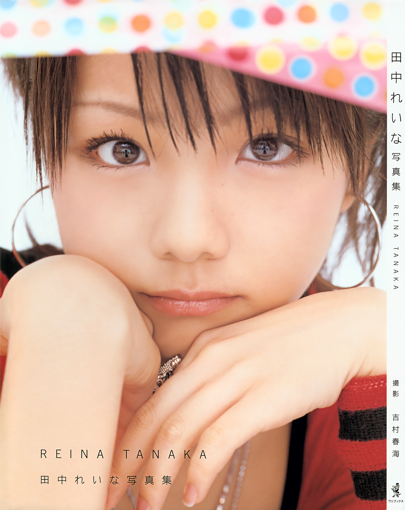
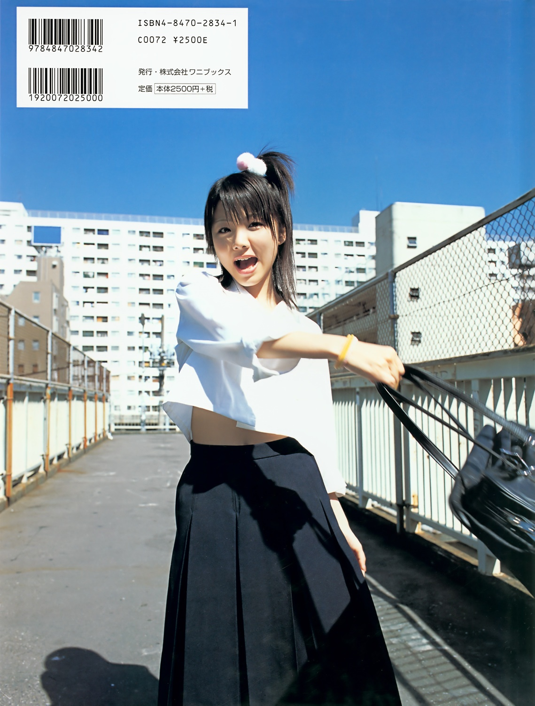

    # Tanaka Reina

## 田中れいな写真集「田中れいな」

**Tanaka Reina • Morning Musume。**

Premier photobook solo • Wani Books • 2004

------------------------------------------------------------------------

## Aperçu

------------------------------------------------------------------------

## Informations

-   **Titre original :** 田中れいな写真集「田中れいな」
-   **Titre usuel :** *Tanaka Reina*
-   **Artiste :** Tanaka Reina
-   **Groupe :** Morning Musume。
-   **Type :** photobook solo
-   **Éditeur :** Wani Books
-   **Date de sortie :** novembre 2004
-   **Date éditoriale portée par les catalogues :** 20 novembre 2004
-   **Prix d'origine :** 2 500 ¥ hors taxe • 2 625 ¥ TTC à l'époque
-   **Format :** grand format
-   **Dimensions :** environ 31 × 22 cm
-   **Photographe :** Yoshimura Harumi (吉村春海)
-   **ISBN-10 :** 4-8470-2834-1
-   **ISBN-13 :** 978-4-8470-2834-2
-   **Code C :** C0072
-   **Bonus :** poster dépliant
-   **Particularité :** premier photobook solo de Tanaka Reina

La chronologie de parution demande une petite précision. Wani Books et
Amazon enregistrent actuellement le titre au **10 novembre 2004**,
tandis que la communication contemporaine associait explicitement sa
sortie au **11 novembre**, jour du quinzième anniversaire de Reina ;
plusieurs catalogues bibliographiques donnent enfin le **20 novembre**
comme date d'édition. Il s'agit bien du même ouvrage et non de plusieurs
éditions distinctes.

La quatrième de couverture fournie confirme directement l'ISBN
**4-8470-2834-1**, le prix imprimé de **2 500 ¥ hors taxe** et l'édition
Wani Books. Les catalogues Yodobashi et les références d'occasion
confirment également le grand format d'environ **31 × 22 cm**, le poster
joint et l'attribution photographique à **吉村春海**.

------------------------------------------------------------------------

## Contexte

*Tanaka Reina* paraît en **novembre 2004**, alors que Reina, entrée dans Morning Musume avec la sixième génération en 2003, passe symboliquement de **14 à 15 ans**. Wani Books présente ce premier photobook solo comme un portrait de ses « derniers jours à 14 ans », construit autour de plusieurs facettes : **uniformes, maillots, tokko-fuku, studio**, avec des prises de vue à Tokyo et dans la préfecture de Chiba.

Cette diversité exploite déjà le contraste caractéristique de son image : adolescente et idol d'un côté, registre plus **yankee** de l'autre. Les scans confirment cette opposition entre uniforme scolaire, plage très colorée et compositions de studio rouge et noir plus agressives.

Le volume paraît entre *Namida ga Tomaranai Hōkago* et *Ai no Dai 6 Kan*, mais reste entièrement centré sur Reina et son quinzième anniversaire. Son deuxième photobook, *れいな — Reina*, suivra dès octobre 2005 ; les commentaires continueront alors à identifier ce premier volume par ses **uniformes et sa tenue yankee**.

------------------------------------------------------------------------

## Sommaire

Le volume fonctionne comme un **portrait à facettes** plutôt que comme
un reportage installé dans un lieu unique. Wani Books indique des prises
de vues réalisées en studio, à Tokyo et dans la préfecture de Chiba ;
les images disponibles confirment une alternance régulière entre
environnement urbain, extérieur lumineux, plage et compositions de
studio.

Les grandes séquences peuvent être regroupées autour de quelques
registres :

-   **Reina collégienne**, avec uniforme scolaire et scènes extérieures
    à l'allure volontairement quotidienne ;
-   **portrait urbain et contemporain**, utilisant rues, bâtiments et
    espaces résidentiels plutôt qu'un décor entièrement contrôlé ;
-   **séquences estivales et balnéaires**, aux maillots et accessoires
    très colorés ;
-   **registre yankee**, avec uniformes détournés et notamment la tenue
    de tokko-fuku signalée dès la communication de sortie ;
-   **studio mode**, où vêtements, coiffure et fonds graphiques
    produisent une image plus construite ;
-   **portraits rapprochés**, destinés à ramener régulièrement le volume
    au visage et aux expressions de Reina ;
-   **poster bonus**, qui prolonge matériellement le photobook.

La diversité des costumes constitue donc la véritable charpente du
livre. L'éditeur cherchait explicitement à condenser des facettes que le
public connaissait déjà tout en en montrant de nouvelles, plutôt qu'à
enfermer le premier solo dans une seule représentation de l'artiste.

------------------------------------------------------------------------

## Dossier principal

### Un premier solo construit comme un portrait multiple

Le livre confronte plusieurs images de Reina plutôt que d'imposer une unité de lieu ou de costume. Wani Books annonçait **uniformes, maillots et tokko-fuku**, en studio, à Tokyo et dans la préfecture de Chiba. Le volume fonctionne par changements de personnage apparent : collégienne, jeune fille en vacances, silhouette pop, figure yankee puis portraits plus simples.

### Le registre scolaire

Reina apparaît en **chemise blanche et longue jupe sombre**, photographiée dehors parmi façades, arbres et mobilier urbain. La même tenue passe d'une pose calme à une image beaucoup plus vive sur la quatrième de couverture. L'uniforme rappelle directement son âge, dimension revendiquée par Wani Books avec son **apparence de collégienne**.

### Une composante yankee assumée

À l'opposé, le livre exploite ouvertement l'image **yankee** de Reina. La **特攻服 — tokko-fuku** est même mise en avant dans la promotion et surprend immédiatement les fans :

> 「水着、制服、特攻服。特攻服！？」

> *« Maillot, uniforme, tokko-fuku. Tokko-fuku !? »*

Trois ans plus tard, une rétrospective cite encore spontanément **l'uniforme d'allure yankee et la tokko-fuku** parmi les souvenirs du volume.

### De la rue au studio

Devant un **fond rouge brillant quadrillé**, Reina porte un ensemble mêlant rayures rouges et noires, tartan jaune, résille, métal et fourrure. La pose devient frontale et le décor réel disparaît : **la silhouette devient une composition graphique**, annonçant une direction développée davantage dans *れいな*.

### Les séquences balnéaires

Les scènes de plage alternent portrait serré en maillot rayé, pose dans le sable et cadrage en plongée plus dynamique. Elles servent surtout à varier les manières de photographier Reina : **portrait, pose en pied, mouvement, plongée et accessoires**, avec une lumière très forte qui simplifie souvent l'arrière-plan.

### Le visage comme point de retour

Malgré les costumes, le livre revient régulièrement au visage. La couverture en est l'exemple le plus radical : cadrage serré, regard central, bras et mains structurant l'image. **Le véritable sujet est le visage**, conformément à la volonté annoncée de montrer différentes expressions de Reina à la fin de ses quatorze ans.

### Une énergie plus importante que la continuité narrative

Le volume ne raconte pas une journée continue : **uniforme → plage → vêtements pop → studio → imagerie yankee → portrait**. La cohérence vient de Reina plutôt que des lieux. Une rétrospective de 2007 retient son caractère **coloré**, ses expressions et même une photographie avec des enfants rencontrés sur place : ce premier solo cherche avant tout à faire cohabiter plusieurs versions de Reina.

------------------------------------------------------------------------

## Style

La photographie de **Yoshimura Harumi** oppose des extérieurs très lumineux à des compositions de studio contrôlées. La palette passe des tons sobres de l'uniforme aux couleurs vives de la plage, puis au **rouge, noir, jaune tartan et textures contrastées** du studio.

Coiffures et accessoires différencient fortement les séances, tandis que les cadrages vont du très gros portrait aux vues en pied ou en plongée. Certains extérieurs presque surexposés concentrent l'attention sur Reina et ses vêtements.

L'ensemble est typique des photobooks Hello! Project du milieu des années 2000, mais assume des **ruptures de ton importantes** : cette diversité devient précisément son identité graphique.

------------------------------------------------------------------------

## Réception des lecteurs / Mémoire collective

La mémoire du premier photobook ne se limite pas à son statut de **premier solo** : les fans ont surtout retenu ses couleurs, ses expressions, l'uniforme et l'inattendue **tokko-fuku**.

Avant même la sortie, ce choix provoque des réactions :

> 「特攻服に関して違和感を感じてる人は他にもいるようです」

> *« Je ne suis apparemment pas le seul à ressentir un décalage concernant la tokko-fuku. »*

Une autre réaction s'arrête avec surprise sur le contenu annoncé :

> 「水着、制服、特攻服。特攻服！？」

> *« Maillot, uniforme, tokko-fuku. Tokko-fuku !? »*

Ce qui semblait étrange en 2004 devient pourtant l'un des principaux marqueurs du livre : plusieurs années plus tard, des rétrospectives l'associent encore spontanément à son **uniforme yankee** et à la tokko-fuku.

Les lecteurs retiennent aussi son caractère **très coloré** et la variété des expressions de Reina. Uniformes, plage, studio et costumes donnent l'impression de parcourir plusieurs facettes de sa personnalité. Même des détails secondaires, comme une photographie avec des enfants rencontrés pendant les prises de vue, réapparaissent dans les souvenirs.

Wani Books réutilise encore en 2008 des images inédites de ce premier volume dans *Re: (Return)*. Ce qui survit finalement est son **foisonnement** : la tokko-fuku surprend, les uniformes rappellent son âge, et les couleurs comme les expressions donnent au livre son énergie.

------------------------------------------------------------------------

## Ce qui distingue cette publication

*Tanaka Reina* fait passer Reina du photobook collectif de la sixième génération à une publication qu'elle doit **soutenir seule**. Wani Books répond en multipliant les registres — scolaire, plage, pop, studio, yankee — avant que les volumes suivants ne structurent plus explicitement ces différentes facettes.

Le livre appartient aussi à une génération encore marquée par le **poster B3** comme bonus, avant la généralisation des DVD making-of. Son grand format d'environ **30 × 22 cm** renforce enfin la présence des portraits et photographies en pied.

------------------------------------------------------------------------

## Intérêt pour ma collection

**Appréciation personnelle :**

**17 / 20**

**★★★★☆**

### Pourquoi ce volume mérite sa place

Ce volume est un repère essentiel : **le premier photobook solo de Tanaka Reina**, réalisé à la fin de ses quatorze ans. Uniforme scolaire, plage, couleurs pop, studio et références yankee montrent une identité encore en construction, avant les concepts plus structurés des volumes suivants.

Son intérêt tient aussi à son esthétique Hello! Project très 2000 et à une réception durable : la **tokko-fuku**, l'imagerie yankee, les couleurs et les expressions restent parmi les souvenirs caractéristiques du livre.

### Mon ressenti

*(Espace réservé au collectionneur.)*

------------------------------------------------------------------------

## Repères bibliographiques

**田中れいな写真集「田中れいな」**\
Tanaka Reina\
Photographie : **吉村春海 --- Yoshimura Harumi**\
Wani Books • 2004\
ISBN-10 : **4-8470-2834-1**\
ISBN-13 : **978-4-8470-2834-2**

------------------------------------------------------------------------

*Premier photobook solo de Tanaka Reina --- un portrait de la fin de ses
quatorze ans construit autour de l'uniforme, de la couleur, de la plage
et d'une imagerie yankee déjà fortement associée à sa personnalité.*

    
