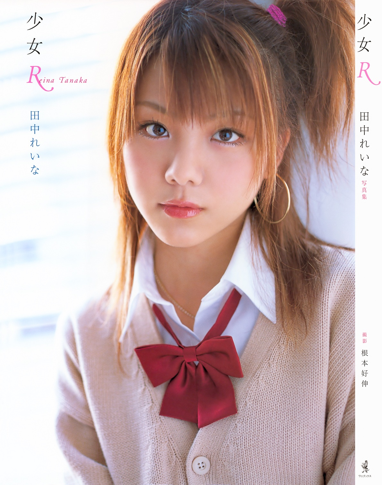
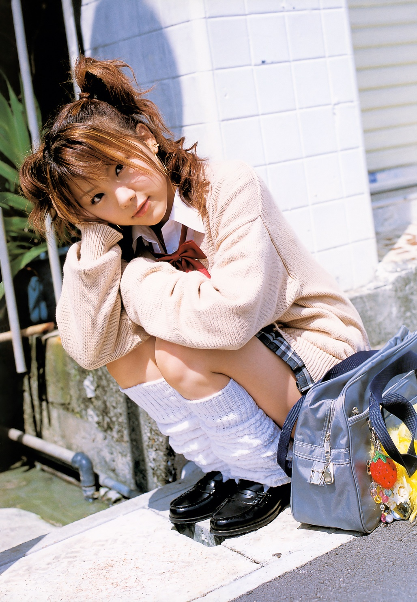
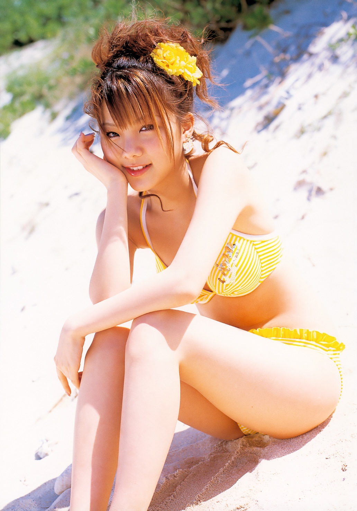
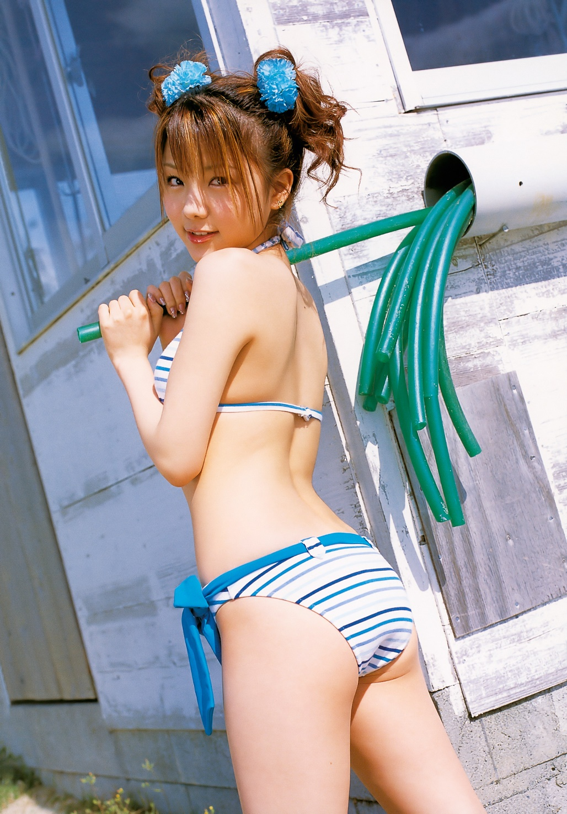
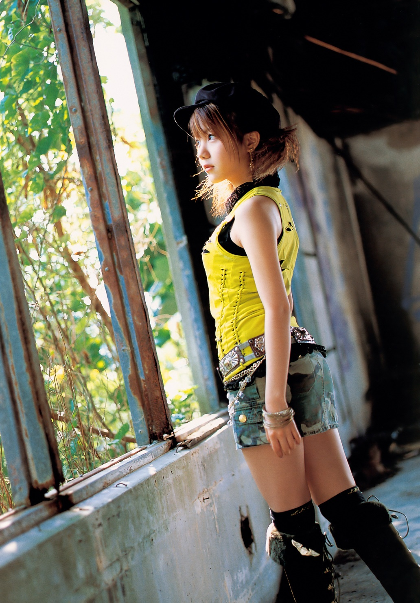
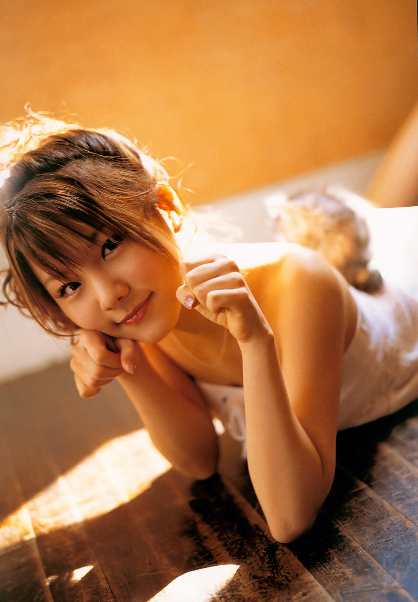
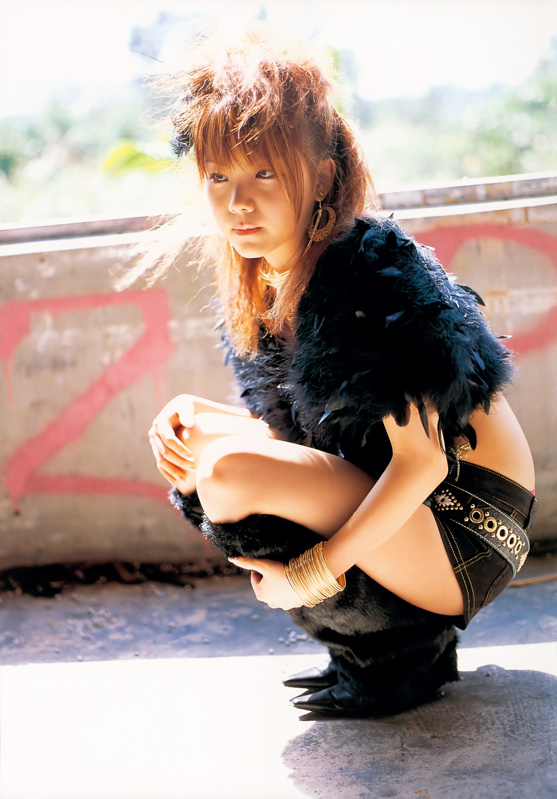
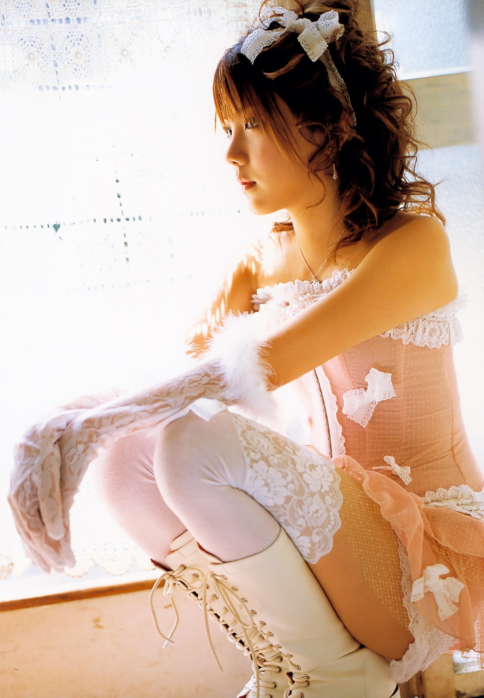
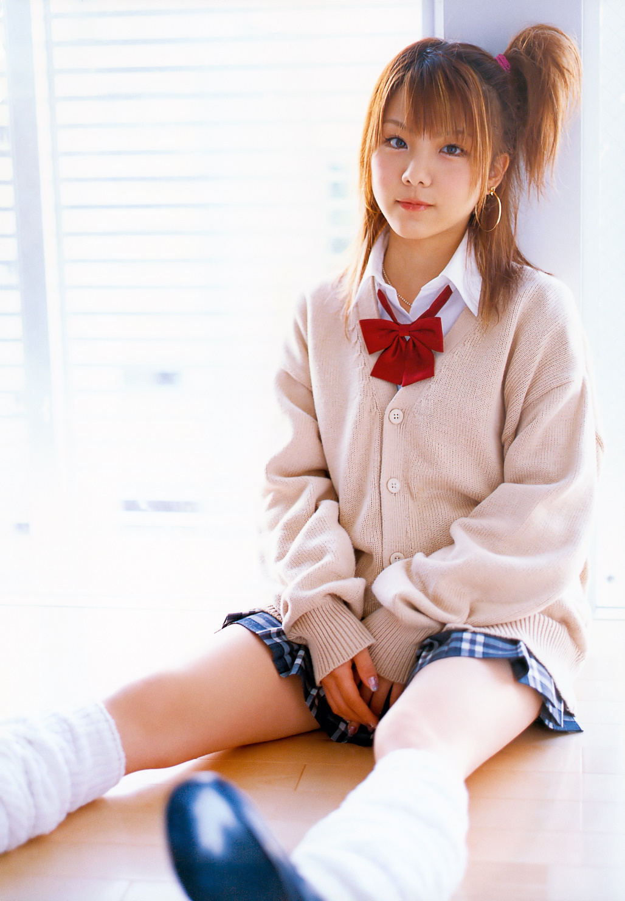
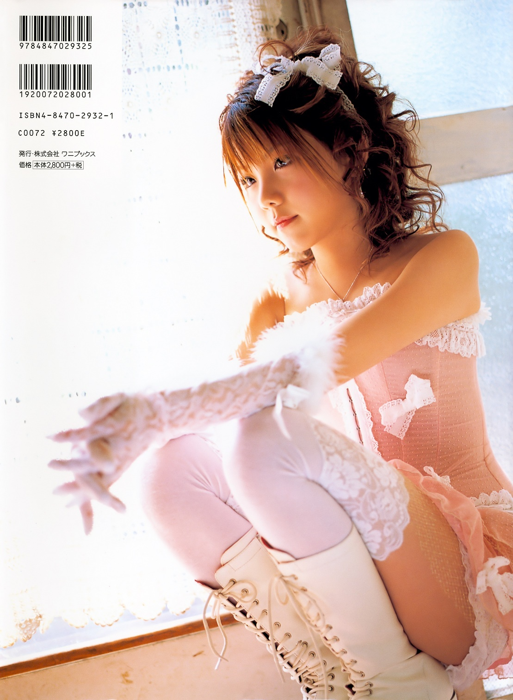

    # Shōjo R *(少女R)*

## 少女R

**Tanaka Reina • Morning Musume。**

Wani Books • 2006

---

## Aperçu

---

---

## Informations

- **Titre original :** 少女R
- **Titre romanisé :** Shōjo R / Shoujo R
- **Titre usuel :** Shōjo R
- **Artiste :** Tanaka Reina
- **Groupe :** Morning Musume。
- **Type :** photobook solo
- **Éditeur :** Wani Books
- **Année :** 2006
- **Date de sortie officielle :** 9 mai 2006
- **Prix d'origine :** 2 800 ¥ hors taxe
- **Format :** grand format, environ 30 × 22 cm
- **Impression :** couleur
- **Photographe :** Nemoto Yoshinobu (根本好伸)
- **Lieux de prise de vue :** Okinawa • Yokohama • Tokyo
- **ISBN-10 :** 4-8470-2932-1
- **ISBN-13 :** 978-4-8470-2932-5
- **Code C :** C0072
- **Bonus :** DVD de making-of
- **Chronologie :** troisième photobook solo de Tanaka Reina, après *Tanaka Reina* (2004) et *Reina* (2005), avant *Alo-Hello! Tanaka Reina* (2007)

La notice officielle de Wani Books identifie explicitement *Shōjo R* comme le **troisième photobook** de Reina et donne l'ISBN 4-8470-2932-1 ainsi qu'une sortie le 9 mai 2006. Le crédit photographique à **Nemoto Yoshinobu** est confirmé indépendamment par plusieurs catalogues, tandis que HMV précise les trois zones de tournage : **Okinawa, Yokohama et Tokyo**.

Certaines bases commerciales donnent le **25 mai 2006** comme date bibliographique ou de mise en circulation ; la date du **9 mai** est retenue ici parce qu'elle provient directement de l'éditeur.

La quatrième de couverture fournie confirme directement le prix original de **2 800 ¥ hors taxe**, l'ISBN et l'édition Wani Books.

---

---

## Contexte

*Shōjo R* paraît au printemps **2006**, alors que Tanaka Reina a 16 ans et que sa production solo s'accélère : après *Tanaka Reina* (2004) et *Reina* (2005), ce troisième photobook sera suivi dès 2007 par *Alo-Hello! Tanaka Reina*.

Wani Books construit le volume autour de son **« charme individuel »** en multipliant les registres — uniforme, mode urbaine, stylisme kawaii et maillots — et les décors entre **Tokyo, Yokohama et Okinawa**. Le principe du livre est ainsi moins le voyage que la succession de facettes visuelles de Reina.

---

## Sommaire

*Shōjo R* ne repose pas sur un lieu unique ou sur un récit de voyage. Sa construction procède plutôt par **séquences visuelles contrastées**, chacune proposant une variation différente autour de Reina.

Les photographies disponibles, croisées avec la description contemporaine de Wani Books, permettent d'identifier plusieurs ensembles majeurs :

- **registre scolaire**, avec cardigan beige, chemise blanche, nœud rouge, jupe à carreaux et loose socks ;
- **séquences mode et glamour**, utilisant des coiffures beaucoup plus élaborées, dentelle, corset rose, bottes et accessoires ;
- **univers urbain / industriel**, où les bâtiments dégradés et les structures métalliques servent de décor à des tenues plus agressives ;
- **portraits intérieurs**, construits autour d'une lumière chaude et de cadrages rapprochés ;
- **séquences balnéaires à Okinawa**, avec plusieurs maillots très colorés ;
- **variations pop et kawaii**, dans lesquelles coiffure, accessoires et vêtements deviennent presque aussi importants que le décor ;
- **DVD making-of**, conçu comme prolongement de la séance photographique.

Le livre fonctionne donc moins comme une histoire continue que comme une **collection de facettes**. L'unité vient de Reina elle-même : chaque nouvelle tenue ou localisation construit momentanément une autre version du personnage.

Cette logique explique particulièrement bien le titre **少女R — « Shōjo R »**, littéralement la « jeune fille R » : plutôt que de définir Reina par une seule identité, le photobook semble constamment déplacer la réponse d'une séquence à l'autre.

---

---

## Dossier principal

### Une construction fondée sur les contrastes

*Shōjo R* fait varier fortement l'image de Reina : chaque tenue s'accompagne généralement d'un changement de décor, de lumière et de posture. Des pages claires et douces répondent ainsi à des compositions plus sombres ou agressives, Reina restant **le seul véritable fil conducteur**.

### Le motif de l'uniforme scolaire

L'uniforme — chemise blanche, cardigan beige, nœud rouge, jupe à carreaux et longues chaussettes — sert de point d'ancrage au volume. Présent dès la couverture puis dans plusieurs situations plus quotidiennes, il renforce le registre adolescent du titre. Une critique japonaise de l'époque remarque d'ailleurs son retour vers la fin du livre après des séries plus audacieuses.

### Du « cute » au registre construit

La séquence au **corset rose**, saturée de lumière, accumule dentelles, nœuds, mitaines, bottes et coiffure élaborée. Ce stylisme presque irréel tranche radicalement avec l'uniforme et illustre la volonté du photobook de créer, d'une série à l'autre, de véritables **personnages photographiques temporaires**.

### Le versant plus sombre

Dans les décors industriels, Reina apparaît successivement en noir — fourrure, plumes et accessoires métalliques — puis en jaune vif avec casquette, chaînes et ceintures. Les surfaces délabrées et la lumière dure installent une esthétique plus urbaine et rebelle, très éloignée des séquences scolaires ou balnéaires.

### Okinawa et les séquences balnéaires

À **Okinawa**, la lumière solaire et les couleurs franches dominent. Un maillot bleu et blanc dialogue avec une façade claire et des éléments verts, tandis qu'une autre série sur la plage associe maillot jaune, fleur assortie et sable presque blanc. Ces images prolongent le goût du livre pour les contrastes chromatiques.

### Portraits et proximité

Des portraits plus dépouillés interrompent les séries très stylisées. Reina y est cadrée de près, notamment allongée dans une lumière chaude, ce qui recentre momentanément le livre sur son visage et ses expressions plutôt que sur les costumes.

### Une adolescente entre deux représentations

Le volume juxtapose les codes adolescents — uniforme, accessoires colorés, coiffures ludiques — et des registres plus adultes ou affirmés. Des lecteurs avaient déjà remarqué cette tension à la sortie : sans constituer un récit explicite de passage à l'âge adulte, elle devient l'une des caractéristiques les plus fortes de *Shōjo R*.

---

## Style

Le travail de **Nemoto Yoshinobu** privilégie les contrastes de lumière : blancs presque surexposés et atmosphère douce dans les séquences scolaires ou roses, éclairage beaucoup plus dur dans les décors industriels.

La palette change constamment — beige et rouge, rose et blanc, noir et or, jaune, bleu — tandis que coiffures, bijoux, fleurs, plumes et accessoires donnent à chaque série une identité immédiatement reconnaissable. Les cadrages alternent portraits serrés et corps entiers, souvent appuyés sur les lignes architecturales.

L'ensemble est moins homogène que *Alo-Hello! Tanaka Reina*, mais **plus changeant et expérimental dans son stylisme**.

---

## Réception des lecteurs / Mémoire collective

Les réactions conservées montrent que *Shōjo R* a surtout marqué par **la coexistence d'une Reina encore adolescente et d'une image plus adulte**, ainsi que par la variété de ses looks.

> **「少女Ｒといいつつも、オトナへとメタモールフォーゼしつつある眩しいれいなが見れます。」**  
> *« Bien qu’il s’intitule Shōjo R, on y voit une Reina éclatante en train de se métamorphoser en adulte. »*

Un autre acheteur formule la même impression plus simplement :

> **「れいながちょっとオトナになったかな？って感じのショット多数。」**  
> *« Beaucoup de photos donnent l’impression que Reina est devenue un peu plus adulte. »*

La diversité du volume est également relevée :

> **「この写真集では、そんな田中さんの様々な面を感じられる」**  
> *« Dans ce photobook, on peut ressentir les différentes facettes de Tanaka. »*

L'enthousiasme est parfois beaucoup plus direct :

> **「れいなちゃんが最強にかわいすぎる！！」**  
> *« Reina-chan est beaucoup trop mignonne, c’est imbattable !! »*

Le bouche-à-oreille semble avoir joué rapidement : un lecteur explique **「あまりにも評判がいいので買ってしまいました。」** — *« Sa réputation était tellement bonne que j’ai fini par l’acheter. »* Plusieurs années plus tard, *Shōjo R* reste encore un point de référence pour certains fans :

> **“It has always been Shoujo R for me.”**  
> *« Pour moi, ça a toujours été Shoujo R. »*

La mémoire du livre se concentre ainsi sur trois éléments : **la transition entre adolescente et jeune femme, la variété du stylisme et la capacité du photobook à montrer plusieurs facettes reconnaissables de Reina**.

---

## Ce qui distingue cette publication

*Shōjo R* se distingue par la **multiplication des identités visuelles** : uniforme scolaire, mode urbaine, kawaii, décors industriels, portraits lumineux et plages d'Okinawa se succèdent sans imposer une ambiance unique.

Troisième photobook solo de Reina, il occupe aussi une position charnière entre *Reina* et le concept de voyage plus homogène d'*Alo-Hello!*. Les prises de vue à **Tokyo, Yokohama et Okinawa** servent avant tout à renouveler constamment son image.

---

## Intérêt pour ma collection

**Appréciation personnelle :**

**16.5 / 20**

**★★★★☆**

### Pourquoi ce volume mérite sa place

*Shōjo R* documente l'une des périodes où **Tanaka Reina bénéficie déjà d'une véritable identité éditoriale individuelle au sein de Morning Musume**. Troisième photobook solo en moins de deux ans, il témoigne de la rapidité avec laquelle sa production personnelle s'est développée.

Son principal intérêt vient toutefois de sa conception visuelle. Le livre ne se contente pas de multiplier les tenues : il utilise chaque environnement pour créer une nouvelle facette de Reina. **Uniforme, intérieur pastel, stylisme noir, bâtiment industriel, couleurs fluorescentes et Okinawa** donnent au volume une diversité rarement réunie dans un seul reportage.

Il constitue également un bon point de comparaison avec les publications qui l'encadrent. *Reina* travaillait déjà sur plusieurs aspects de sa personnalité, tandis que *Alo-Hello!* choisira ensuite l'unité du voyage hawaïen. *Shōjo R* pousse au contraire très loin le principe de la **variation permanente**.

La réception très favorable conservée sur les plateformes japonaises et les nombreuses traces laissées dans les blogs de l'époque renforcent enfin son intérêt documentaire : ce n'est pas seulement un photobook aujourd'hui identifiable dans une chronologie, mais un volume qui semble avoir réellement marqué une partie du public de Reina lors de sa sortie.

### Mon ressenti

*(Espace réservé au collectionneur.)*

---

AKB48/Photobook/

    
