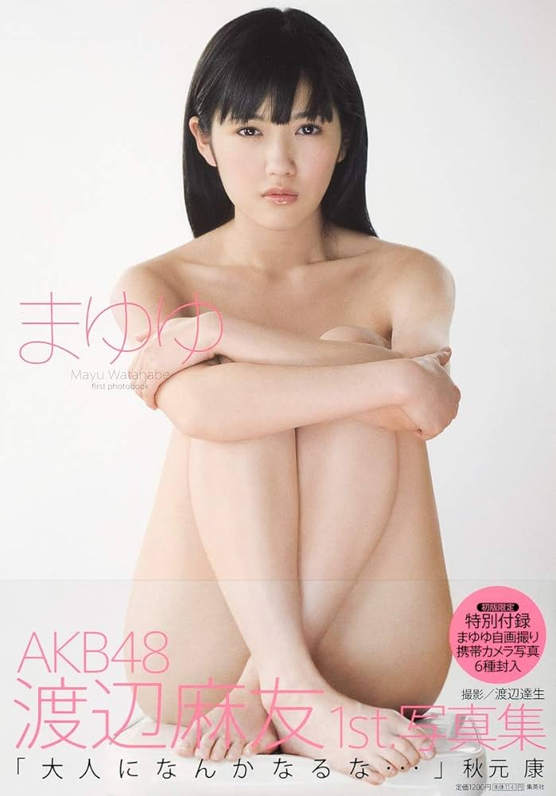
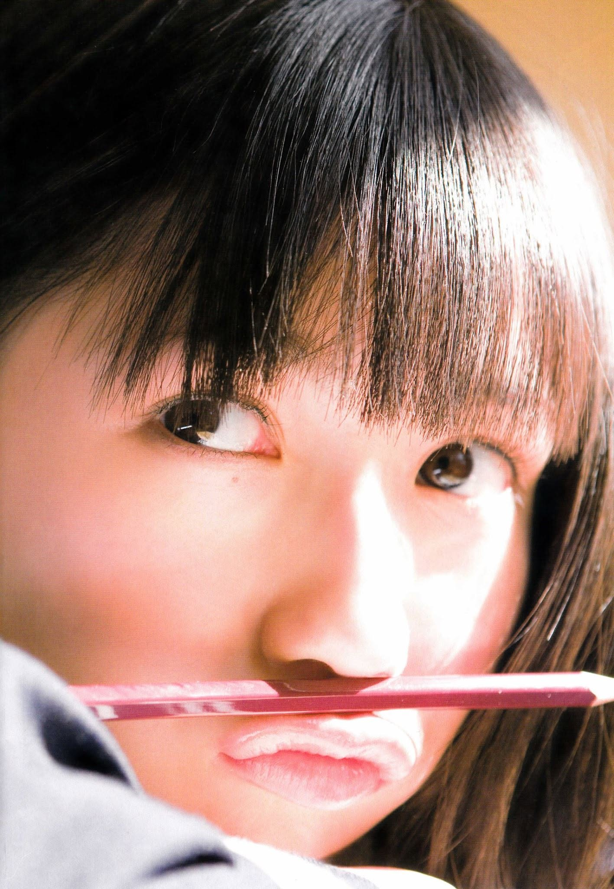
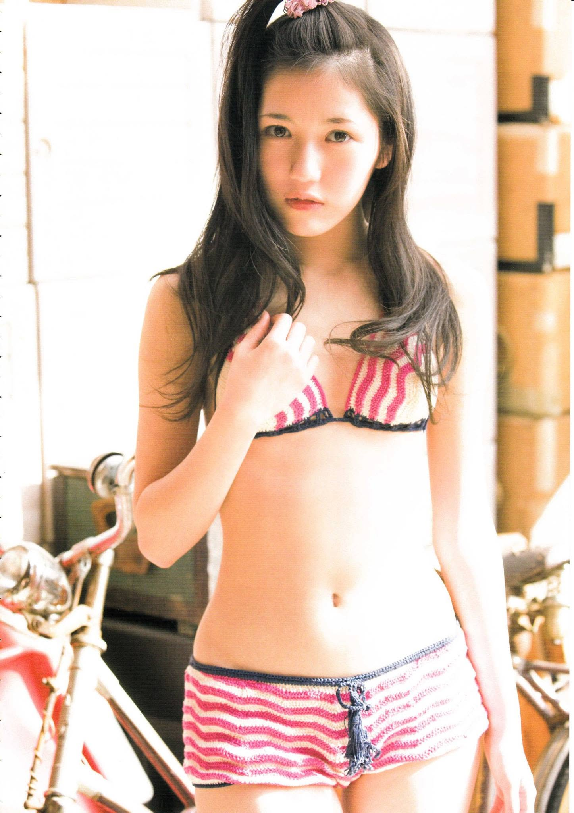
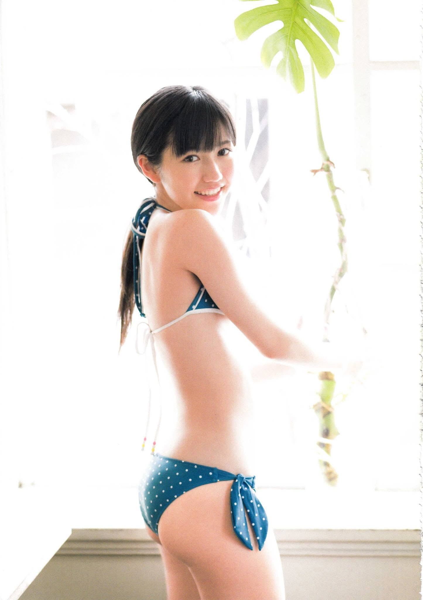
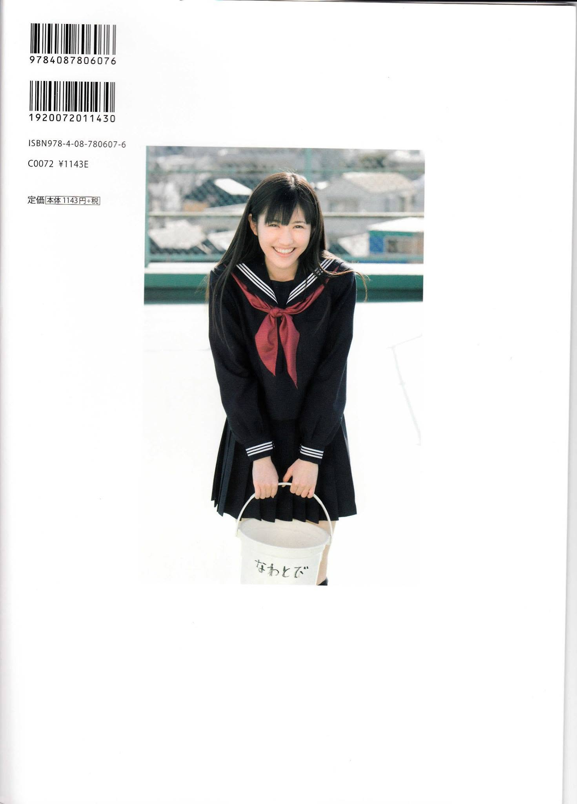

# Mayuyu *(Mayuyu)*

## まゆゆ

**渡辺麻友 (Watanabe Mayu)**

Shueisha • 2011

## Aperçu

## Informations

- **Année :** 2011
- **Type :** Photobook
- **Date de sortie :** 13 mai 2011
- **Éditeur :** Shueisha (集英社)
- **Photographe :** Tatsuo Watanabe (渡辺達生)
- **ISBN :** 978-4-08-780607-6
- **Format :** 300 mm
- **Pages :** Non paginé
- **Langue :** Japonais

## Contexte

Publié en mai 2011, *Mayuyu* est le premier photobook solo de Mayu Watanabe. À seulement 17 ans,
elle est déjà l'une des membres les plus populaires d'AKB48 et une figure emblématique de Team B.
L'ouvrage accompagne son ascension au sein du groupe, quelques mois avant ses débuts en solo comme chanteuse.
Il révèle également une image plus mature de l'idole, tout en conservant la douceur et l'innocence qui ont largement contribué à sa popularité.

## Style

Le photobook alterne portraits en studio, scènes du quotidien et séances en extérieur.
Son esthétique lumineuse et raffinée met en valeur le charme naturel de Mayu, entre fraîcheur adolescente et féminité naissante.
Plusieurs séances en maillot de bain apportent une touche plus glamour, sans jamais rompre avec l'image élégante et délicate qui caractérise l'artiste.

## Intérêt

Premier photobook de Mayu Watanabe, *Mayuyu* constitue un témoignage essentiel de ses débuts avant qu'elle ne devienne l'une des figures majeures d'AKB48.
Véritable succès commercial à sa sortie, il marque une étape importante dans la construction de son image publique.
