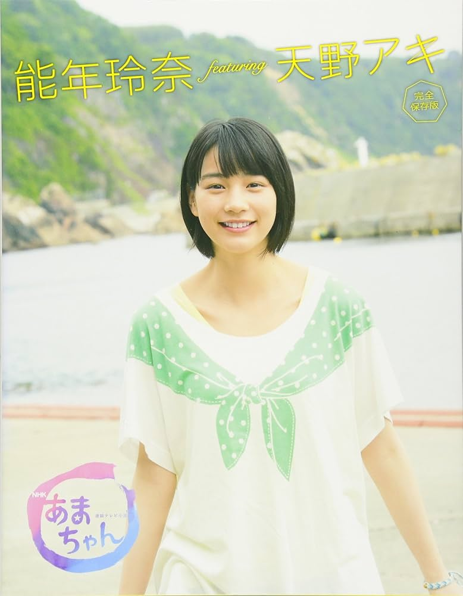
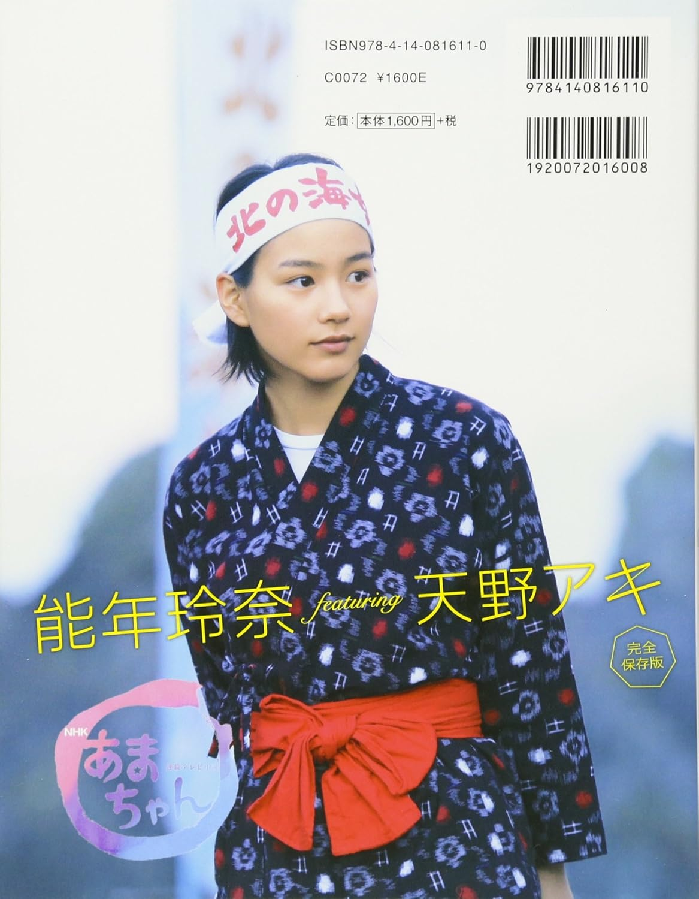

# Nōnen Rena featuring Amano Aki – Amachan

PhotoBook (NHK Publishing, 2013)

## Photo 1

## Photo 1

## Informations

- Année : 2013
- Magazine : Photobook
- Thème : Un livre commémoratif qui capture le charme et la personnalité authentiques et sans artifice de l'héroïne, Rena Nounen/Aki Amano, du début du tournage en octobre 2012 jusqu'au tournage en extérieur à Kuji en juillet 2013, soit pendant neuf mois au total, visite du plateau du feuilleton matinal de la NHK  Amachan 
