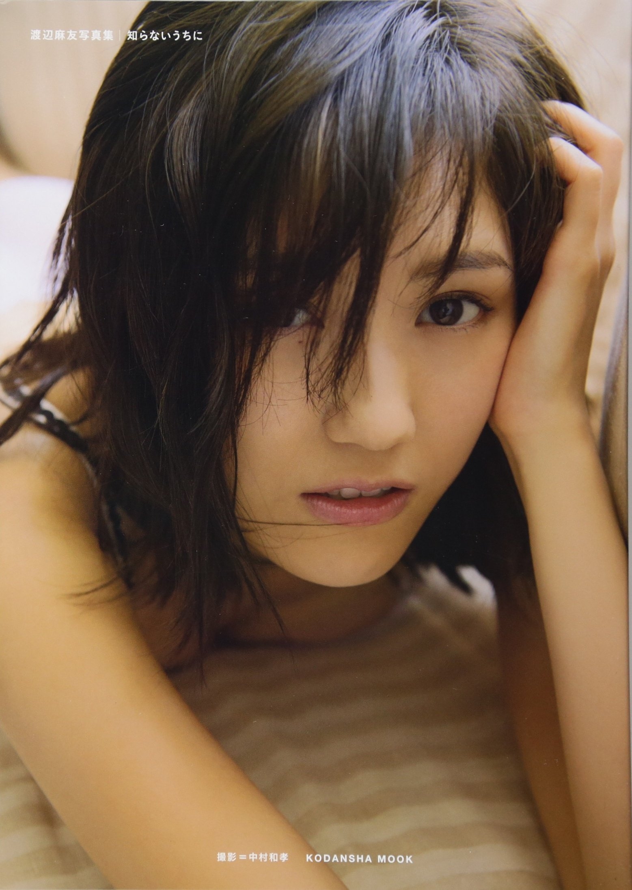
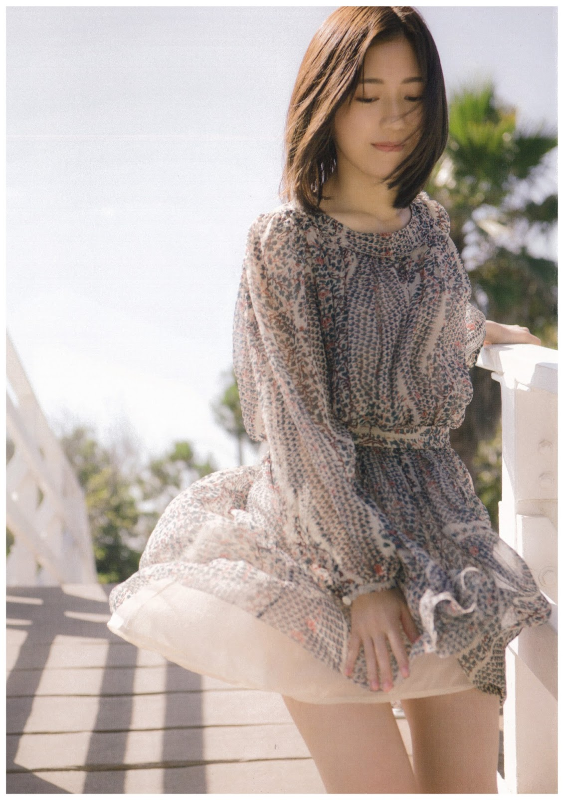
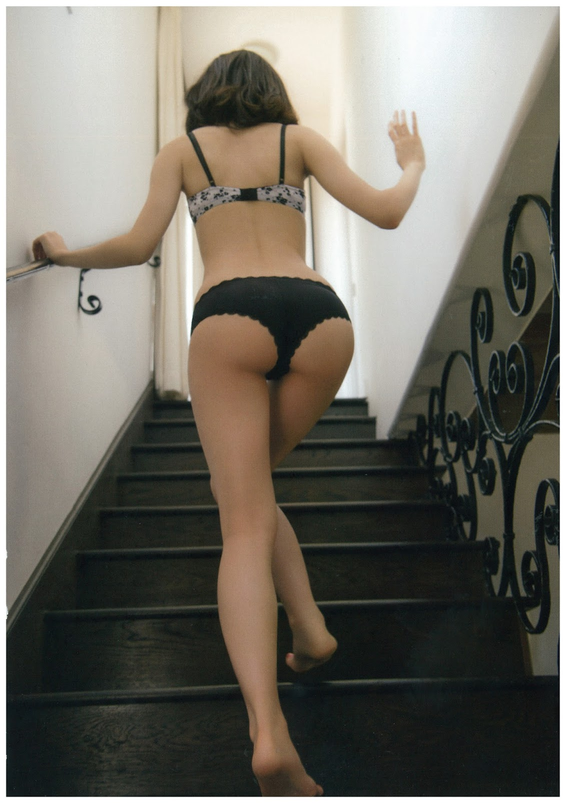
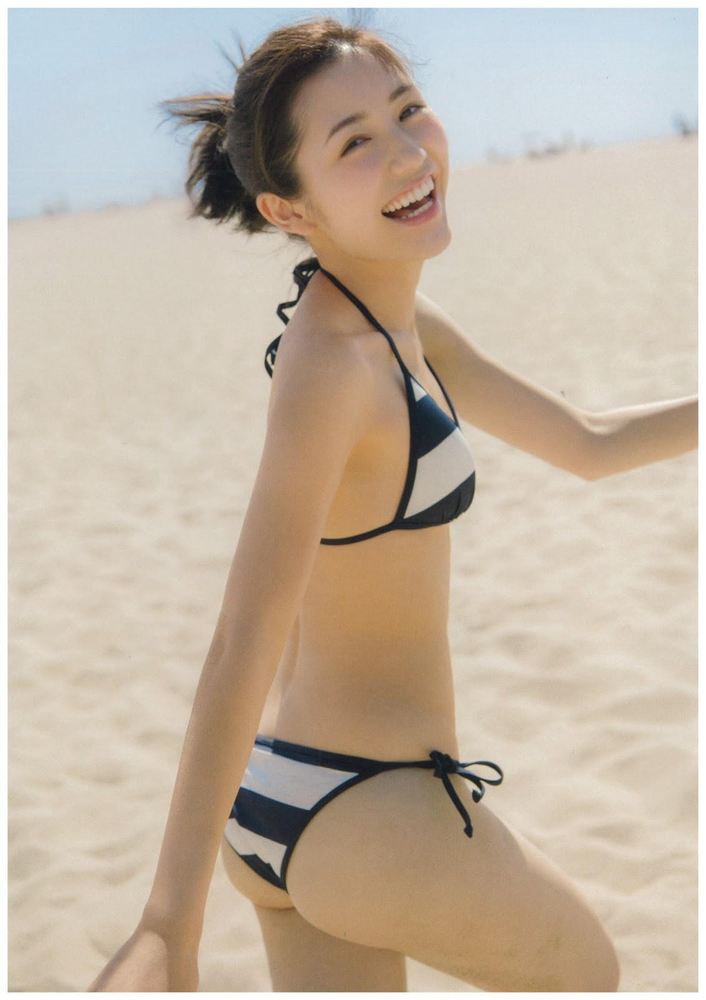
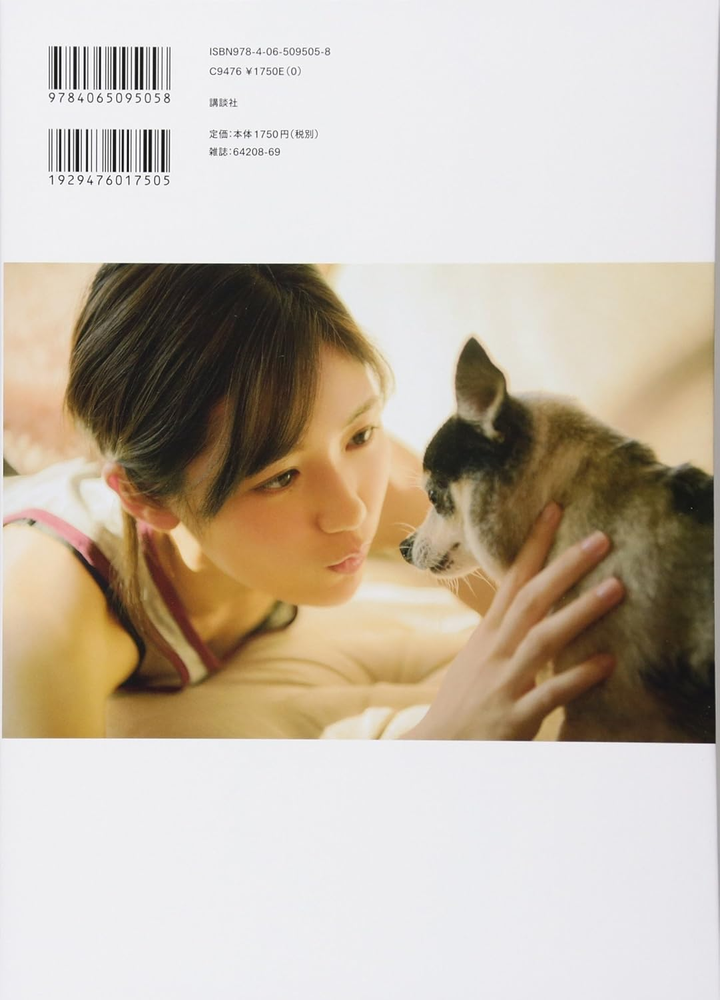

# Shiranai Uchi ni (Sans m'en rendre compte)
## 知らないうちに

渡辺麻友 (Watanabe Mayu)
Kodansha • 2014

## Aperçu

#Informations
- Année : 2014
- Type : Photobook
- Date de sortie : 21 février 2014
- Éditeur : Kodansha
- Photographe : Nakamura Kazutaka (中村和孝)

## Contexte
Publié en février 2014, quelques mois avant les élections générales qu'elle remportera,
Shiranai Uchi ni accompagne l'évolution de l'image de Mayu Watanabe.
 Déjà l'une des principales figures d'AKB48, elle y dévoile une facette plus mature,
 tout en conservant l'élégance et la douceur qui ont fait sa popularité.

## Style
Le photobook alterne portraits intimistes, scènes du quotidien,
tenues élégantes et séances en maillot de bain ou en lingerie.
Son esthétique douce et raffinée joue sur le contraste entre l'image innocente de Mayu et une féminité plus affirmée.
sans tomber dans la provocation.

## Intérêt
L'un des photobooks les plus représentatifs de la carrière de Mayu Watanabe.
 Il marque une étape importante de son évolution, quelques mois avant son sacre aux élections générales d'AKB48 en 2014.

