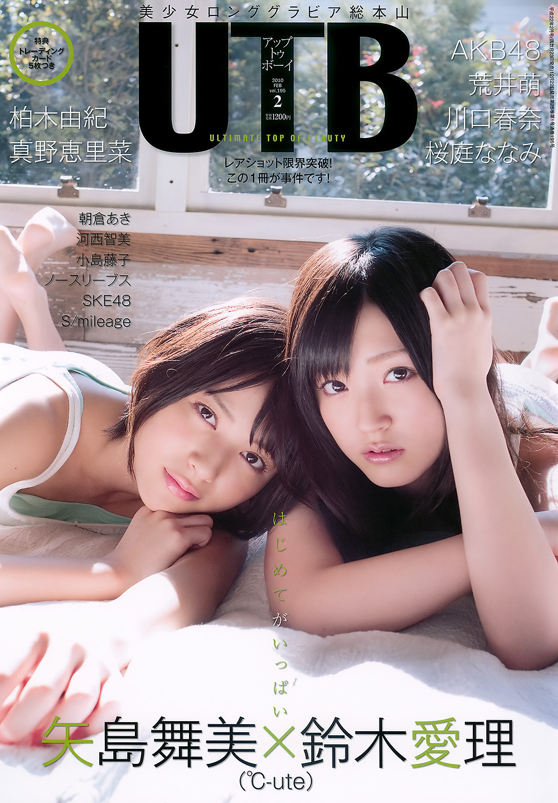
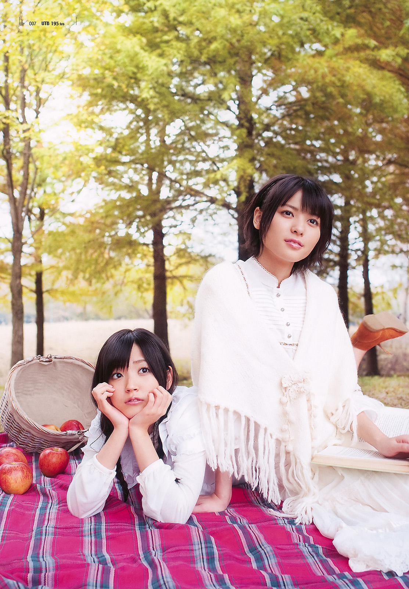
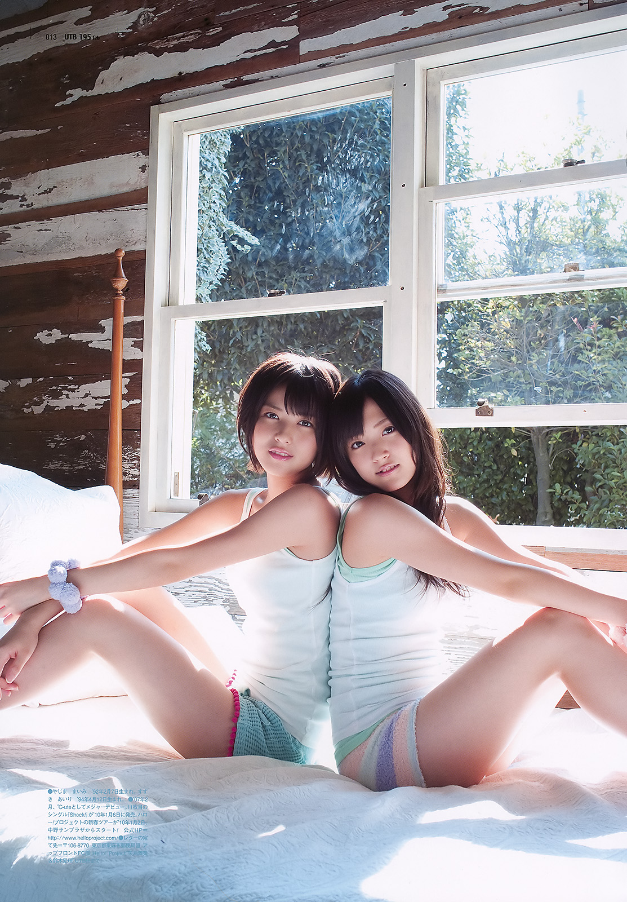
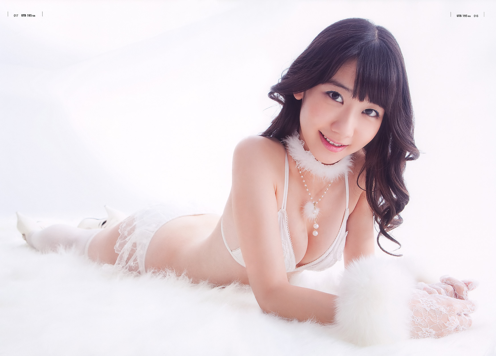
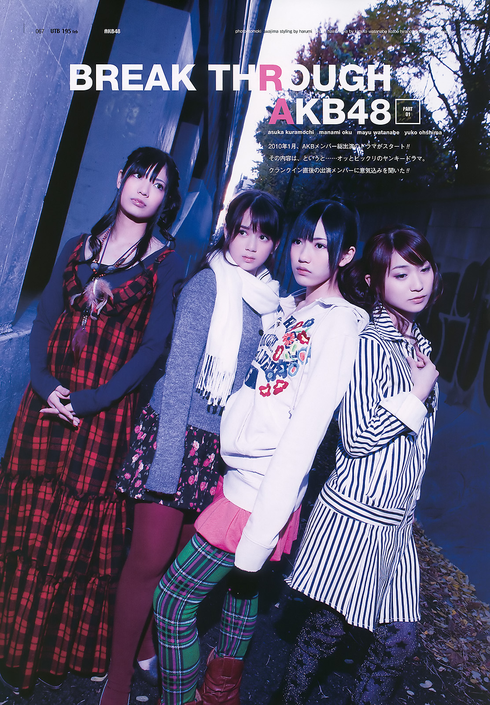
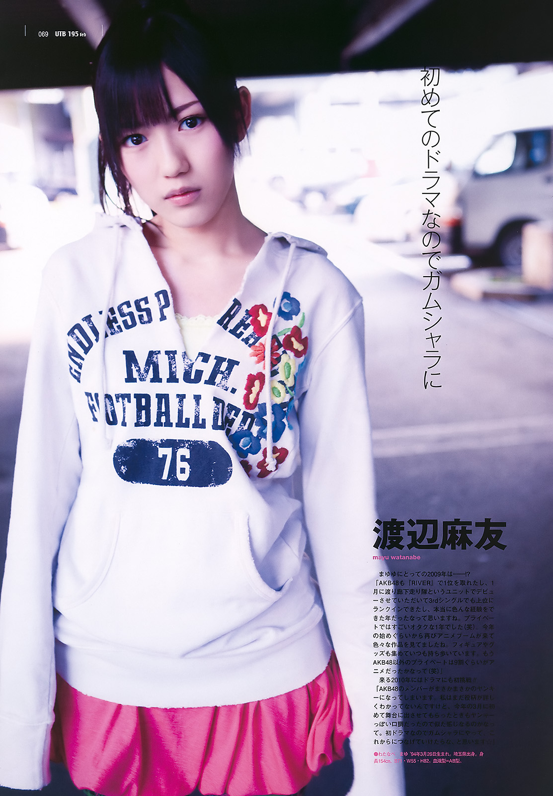
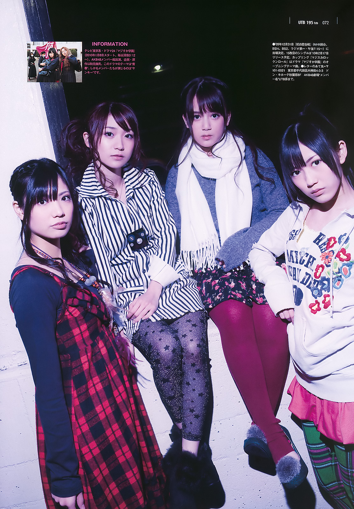
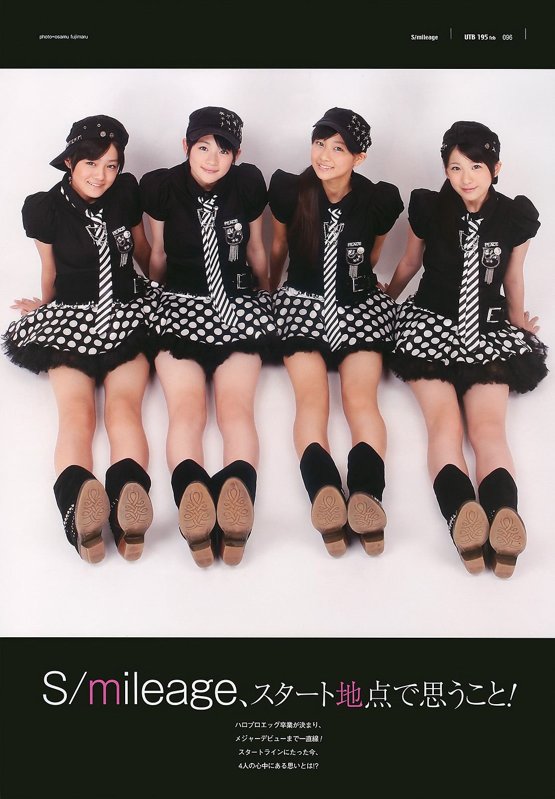
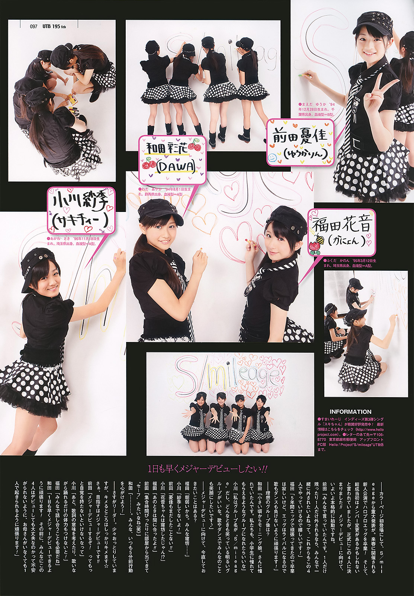

# UTB vol.195 — 2010 FEB

## アップトゥボーイ 2010年2月号 Vol.195

**Yajima Maimi & Suzuki Airi (℃-ute) • AKB48 • S/mileage • autres artistes**

**Artistes particulièrement représentées dans ma collection :**  
Yajima Maimi • Suzuki Airi • Watanabe Mayu • Maeda Yuuka

**Groupes particulièrement représentés :**  
℃-ute • AKB48 • S/mileage

## Aperçu

**UTB vol.195** est un numéro de transition particulièrement représentatif de la scène idol de la fin de 2009. La couverture et le long gravure d'ouverture réunissent **Yajima Maimi et Suzuki Airi (℃-ute)** dans *daydream*, tandis que la seconde moitié du magazine accorde une place importante à **AKB48**, alors en pleine expansion, ainsi qu'à **SKE48** et **S/mileage**.

Pour cette collection, l'intérêt du volume repose surtout sur **Suzuki Airi**, présente dans le dossier majeur et en couverture, sur **Watanabe Mayu**, intégrée au dossier *BREAK THROUGH AKB48*, et sur **Maeda Yuuka**, visible avec S/mileage peu avant les débuts major du groupe.

---

## Informations

- **Titre :** UTB / Up To Boy
- **Volume :** 195
- **Numéro :** 2010 FEB
- **Éditeur :** Wani Books
- **Date d'édition imprimée :** 22 décembre 2009
- **Prix :** 1 200 ¥
- **Couverture :** Yajima Maimi × Suzuki Airi (℃-ute)
- **Dossier d'ouverture :** *daydream — 矢島舞美×鈴木愛理*
- **Photographe du dossier de couverture :** Hiroyuki Sato
- **Bonus annoncé :** 5 trading cards
- **Bonus Wani Books Online Store :** DVD making-of Yajima Maimi × Suzuki Airi

---

## Artistes suivies dans cette collection

> Les étoiles indiquent l'importance de l'artiste dans cette publication, et non une appréciation de l'artiste.  
> Les nombres et types d'apparitions correspondent au relevé personnel fourni pour cet exemplaire.

★★★★★ Dossier majeur  
★★★★☆ Présence importante  
★★★☆☆ Bon dossier secondaire  
★★☆☆☆ Présence limitée  
★☆☆☆☆ Apparition

| Artiste | Présence | Solo | Autres apparitions |
| --- | :---: | :---: | --- |
| **Suzuki Airi** | ★★★★★ | **1 page** | Couverture • 7 duo |
| **Watanabe Mayu** | ★★★★☆ | **1 page** | 3 groupe |
| **Maeda Yuuka** | ★★☆☆☆ | --- | 2 groupe |

---

## Contexte

Le Vol.195 paraît au moment où **UTB élargit fortement son paysage idol**. Le Hello! Project reste très visible : ℃-ute obtient la couverture avec Yajima Maimi et Suzuki Airi, S/mileage dispose d'un dossier en fin de volume et Mano Erina figure également au sommaire. Mais AKB48 occupe désormais une place considérable, avec Kashiwagi Yuki, Kasai Tomomi et deux dossiers collectifs.

Cette coexistence est particulièrement intéressante à quelques mois du Vol.200 : le magazine conserve ses liens historiques avec le Hello! Project tout en donnant une place croissante à la nouvelle génération AKB/SKE. Le Vol.195 constitue ainsi un bon instantané de ce basculement éditorial autour de 2010.

Pour **S/mileage**, les pages 96–97 ont également une valeur chronologique nette : le groupe apparaît encore dans sa formation originelle à quatre — **Wada Ayaka, Maeda Yuuka, Fukuda Kanon et Ogawa Saki** — au moment où son passage vers les débuts major constitue l'un des sujets centraux de l'interview.

---

## Sommaire

### Ouverture — ℃-ute

- **p. 4 — Yajima Maimi × Suzuki Airi (℃-ute)** — *daydream*
- long gravure commun et entretien ;
- couverture du numéro.

### Gravures et jeunes actrices

- **p. 14 — Kashiwagi Yuki** (AKB48)
- **p. 23 — Arai Moe**
- **p. 31 — Asakura Aki**
- **p. 36 — Kojima Fujiko**
- **p. 41 — Kasai Tomomi** (AKB48)
- **p. 46 — No Sleeves**

### Regular & Topics

- **p. 49 — 次世代型アイドルユニット大研究!!**
- **p. 54 — Otani Mio**
- **p. 55 — Kojima Ruriko**
- **p. 56 — Morita Mikiko**
- **p. 57 — Komatsu Ayaka**
- **p. 58 — ℃-ute**
- **p. 60 — Fukuda Moe**
- **p. 61 — Kobayashi Kana** (AKB48)
- **p. 62 — Kobayashi Ryoko × Tokunaga Eri**

### Seconde moitié

- **p. 67 — AKB48 (Drama Member)** — *BREAK THROUGH AKB48*
- **p. 73 — AKB48 (Fresh Member)**
- **p. 78 — SKE48 Team KII**
- **p. 82 — Sakuraba Nanami**
- **p. 85 — Kawaguchi Haruna**
- **p. 88 — Kudo Ayano**
- **p. 90 — Mizca**
- **p. 92 — W∞ ANNA**
- **p. 94 — Murakami Yuri**
- **p. 96 — S/mileage**
- **p. 98 — Mano Erina**

---

## Dossier principal

### *daydream* — Yajima Maimi × Suzuki Airi

Le dossier d'ouverture occupe les premières pages couleur et construit une petite parenthèse à deux autour de **Yajima Maimi et Suzuki Airi**. La double page introductive les montre avançant main dans la main dans un bois, habillées presque entièrement de blanc. Le titre *daydream* résume bien l'intention : lumière diffuse, végétation automnale, vêtements clairs et atmosphère volontairement douce.

La séance passe ensuite à une scène de **pique-nique**, avec couverture écossaise, panier, pommes et livre. Les poses alternent entre images très composées et moments plus mobiles : course dans l'herbe, sourires, gestes partagés. UTB photographie moins deux membres de ℃-ute séparément qu'un **duo**, avec une attention constante portée à leur proximité.

### Séquence intérieure

Le reportage change ensuite de ton. Les vêtements blancs sont remplacés par des ensembles coordonnés autour d'une **jupe écossaise rouge**, d'un haut noir et d'accessoires différents. Les portraits individuels s'insèrent dans une mise en page d'interview, avant une photographie commune sur un banc.

La dernière partie, beaucoup plus lumineuse, utilise débardeurs blancs et détails vert pâle dans une chambre fortement éclairée par les fenêtres. Les cadrages se rapprochent progressivement des visages et des gestes. Cette séquence fournit aussi les images utilisées pour la couverture.

### Suzuki Airi

Pour la collection, Airi bénéficie donc d'une présence particulièrement solide : **couverture, sept apparitions en duo et une page solo** dans le relevé personnel. Son intérêt vient moins d'un long gravure individuel que de sa place au centre du concept Maimi × Airi.

---

## *BREAK THROUGH AKB48*

Le dossier commençant page 67 accompagne le lancement d'un **drama réunissant des membres d'AKB48**. La photographie tranche nettement avec *daydream* : dominante bleue et violette, extérieur sombre, flash frontal et vêtements d'hiver fortement individualisés.

Le groupe photographié comprend notamment **Kuramochi Asuka, Oku Manami, Watanabe Mayu et Oshima Yuko**. UTB ne cherche plus la douceur lumineuse du dossier de couverture ; les quatre filles sont mises en scène dans une ambiance urbaine plus froide, presque dramatique.

### Watanabe Mayu

Mayu reçoit également un **portrait individuel pleine page**. Elle apparaît dans un sweat blanc à motifs floraux et une jupe rose, photographiée sous une structure extérieure. Le texte insiste sur son premier drama et sur son envie de progresser comme actrice.

Dans le relevé de collection, elle totalise **une page solo et trois apparitions en groupe**. Sa présence est donc moins étendue que celle d'Airi, mais suffisamment identifiable pour constituer l'un des intérêts principaux du volume.

---

## S/mileage

Les pages 96–97 présentent **Wada Ayaka, Maeda Yuuka, Fukuda Kanon et Ogawa Saki** dans une esthétique graphique très différente du reste du numéro : fond blanc, tenues noires, jupes à pois, cravates rayées et casquettes coordonnées.

La première page fonctionne comme un véritable portrait de groupe. La seconde prend la forme d'un collage plus vivant : photographies individuelles, dessins au feutre, pancartes manuscrites avec les noms et surnoms, puis entretien collectif.

Le titre **「S/mileage、スタート地点で思うこと！」** place explicitement le groupe à un « point de départ ». La page conserve ainsi une image très nette du **S/mileage originel à quatre** juste avant son installation comme groupe major.

### Maeda Yuuka

Maeda Yuuka n'obtient pas ici de gravure solo autonome dans le relevé personnel, mais apparaît **deux fois en groupe**. Son portrait avec pancarte « 前田憂佳（ゆうかりん） » lui donne néanmoins une identification claire au sein du dossier.

---

## Style

Le Vol.195 repose sur de forts contrastes visuels. *daydream* privilégie la lumière naturelle, les blancs et les verts, avec une imagerie douce de promenade et de proximité ; la partie intérieure introduit ensuite tartan rouge et noir avant de revenir à une chambre presque surexposée.

À l'inverse, *BREAK THROUGH AKB48* adopte des bleus froids, un éclairage frontal et une atmosphère nocturne. S/mileage termine sur une présentation graphique noir et blanc, très pop, ponctuée de dessins et de textes manuscrits. Cette diversité donne au numéro davantage l'allure d'un **panorama de la scène idol** que d'une publication visuellement uniforme.

---

## Autres contenus remarquables

Le sommaire montre l'ampleur du casting : **Kashiwagi Yuki**, **Kasai Tomomi**, **No Sleeves**, deux ensembles AKB48, **SKE48 Team KII**, **Sakuraba Nanami**, **Kawaguchi Haruna** et **Mano Erina** côtoient les artistes du Hello! Project.

Le numéro est donc intéressant au-delà des seules artistes suivies : il rassemble dans une même publication plusieurs trajectoires qui prendront une importance considérable durant les années suivantes.

---

## Réception des lecteurs / Mémoire collective

Les traces communautaires retrouvées autour du Vol.195 sont nettement moins abondantes que pour certains numéros anniversaire d'UTB. La mémoire du volume se concentre surtout sur **Yajima Maimi × Suzuki Airi**, leur duo de couverture et le making-of associé.

Le fait que Wani Books ait proposé un **DVD de making-of exclusif à sa boutique en ligne** a contribué à prolonger l'existence du shooting au-delà du magazine lui-même. Ce bonus continue d'être référencé séparément sur le marché japonais de l'occasion.

Les réactions retrouvées autour du tandem insistent surtout sur la complicité des deux membres de ℃-ute pendant la séance. Il est toutefois difficile d'établir, à partir des témoignages encore accessibles, une mémoire collective aussi structurée que pour les numéros UTB les plus célèbres. Le Vol.195 semble davantage avoir survécu comme **bon numéro de période**, apprécié pour son casting et pour le duo Maimi–Airi, que comme publication devenue mythique en elle-même.

---

## Ce qui distingue cette publication

Le principal caractère du Vol.195 vient de sa position entre deux univers : **le Hello! Project reste assez fort pour occuper la couverture**, tandis qu'AKB48 se déploie déjà sur plusieurs dossiers et rubriques.

Le numéro possède également trois documents intéressants pour la collection : le long **Maimi × Airi**, une présence clairement identifiable de **Watanabe Mayu** au sein de *BREAK THROUGH AKB48*, et les deux pages du **S/mileage originel** avec Maeda Yuuka.

---

## Intérêt pour ma collection

Le volume correspond bien à la période recherchée et réunit trois artistes suivies, mais leur présence est inégale. **Suzuki Airi** constitue clairement le point fort grâce à la couverture et au long duo avec Maimi. **Watanabe Mayu** dispose d'une présence intéressante mais secondaire, tandis que **Maeda Yuuka** reste limitée aux pages S/mileage.

L'ensemble reste un bon document de transition entre Hello! Project et AKB48, sans atteindre pour cette collection le niveau d'un numéro centré plus fortement sur une ou plusieurs artistes prioritaires.

**Appréciation personnelle :**

**12 / 20**

**★★★☆☆**

---

## Sources documentaires

### Exemplaire étudié

- **UTB vol.195 — 2010 FEB**, Wani Books.
- Première de couverture, sommaire, pages intérieures et colophon fournis par le collectionneur.
- Les scans permettent notamment de vérifier directement la **couverture Yajima Maimi × Suzuki Airi**, le reportage *daydream* p. 4–13, *BREAK THROUGH AKB48* p. 67–72, S/mileage p. 96–97, le prix de **1 200 ¥**, ainsi que la date d'édition imprimée du **22 décembre 2009**.
- Les observations concernant les cadrages, les tenues, la progression des reportages, les interviews et la mise en page proviennent prioritairement de cet exemplaire.

### Sources éditoriales et bibliographiques

- **Wani Books — fiche officielle UTB vol.195** : source principale pour la présentation contemporaine du numéro. Elle confirme le duo de couverture **Yajima Maimi × Suzuki Airi**, présenté comme leur premier duo gravure de ce type, ainsi que la présence de Kashiwagi Yuki, Kasai Tomomi, No Sleeves, AKB48, SKE48, S/mileage, Mano Erina et des jeunes actrices du numéro.
- La même notice constitue également la source la plus solide pour la logique éditoriale donnée à **S/mileage**, présenté alors dans sa nouvelle formation à quatre, et pour le dossier AKB48 réunissant notamment **Oshima Yuko, Watanabe Mayu, Oku Manami et Kuramochi Asuka** autour d'une interview liée au drama.
- **Suruga-ya** — notice du DVD promotionnel : confirme l'existence d'un **making-of Yajima Maimi × Suzuki Airi** intitulé comme bonus de l'**UTB vol.195**, daté du 22 décembre 2009 et distribué comme **avantage exclusif du Wani Books Online Store**.
- **Archive de la série Up To Boy** : permet de replacer le vol.195 dans la succession éditoriale du magazine et confirme Yajima Maimi et Suzuki Airi comme figures associées à ce numéro de février 2010.

### Sources communautaires et mémoire de sortie

Les sources communautaires ont été utilisées uniquement pour documenter la **réception contemporaine**, jamais pour établir seules les données bibliographiques.

- Des billets japonais contemporains consacrés au numéro et au DVD de making-of témoignent de l'attention portée au tandem **« Yaji-Suzu »** et à la complicité Maimi–Airi développée pendant la séance.
- Leur utilisation dans la fiche reste limitée aux souvenirs de réception pouvant être reliés directement à l'UTB vol.195 ; les réactions isolées n'ont pas été transformées en opinion générale.
- L'existence et la circulation ultérieure du making-of sont également corroborées par son référencement comme bonus indépendant sur le marché japonais de l'occasion.

### Documents visuels utilisés

Les visuels sélectionnés pour cette fiche proviennent des scans fournis :

- `UTB-Vol-195-1.jpg` — première de couverture ;
- `UTB-Vol-195-02.jpg` — sommaire ;
- `UTB-Vol-195-05-06.jpg` à `UTB-Vol-195-13.jpg` — Yajima Maimi × Suzuki Airi, *daydream* ;
- `UTB-Vol-195-17-18.jpg` — Kashiwagi Yuki ;
- `UTB-Vol-195-52.jpg`, `UTB-Vol-195-54.jpg`, `UTB-Vol-195-57.jpg` — *BREAK THROUGH AKB48* avec Watanabe Mayu ;
- `UTB-Vol-195-81.jpg` et `UTB-Vol-195-82.jpg` — S/mileage ;
- `UTB-Vol-195-96.jpg` — colophon et annonce du numéro suivant.

Les scans constituent la **source primaire de référence** pour l'analyse visuelle et la reconstitution du contenu ; les sources extérieures n'ont été utilisées que pour confirmer ou contextualiser ce qui n'était pas directement établi par les pages fournies.

    
