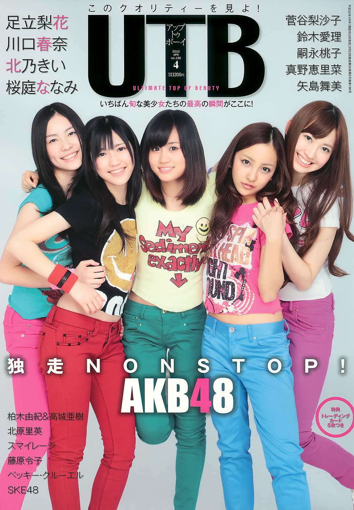
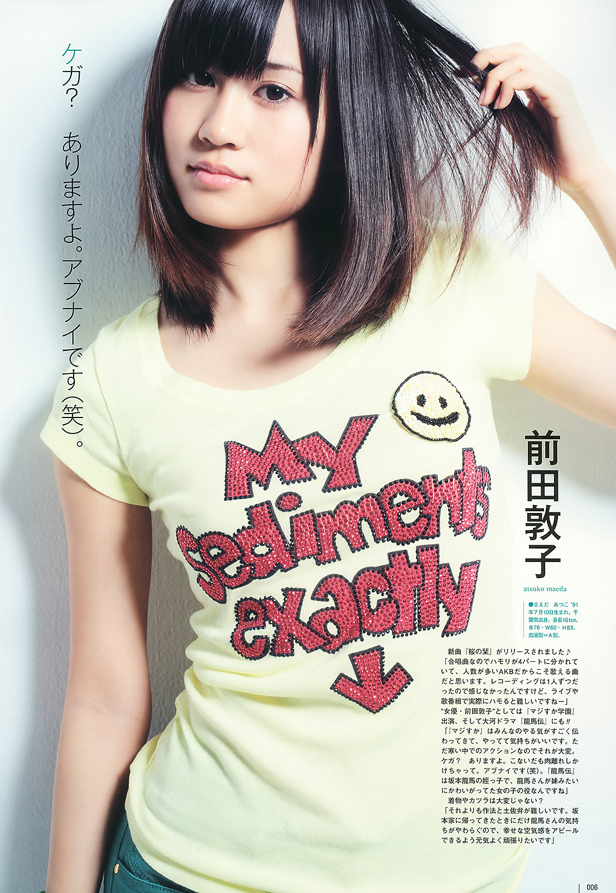
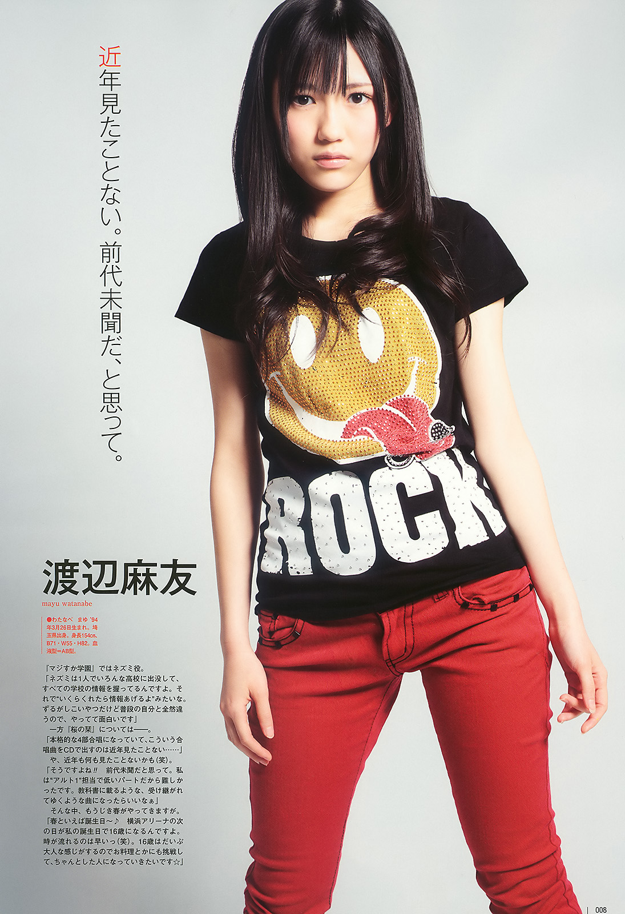
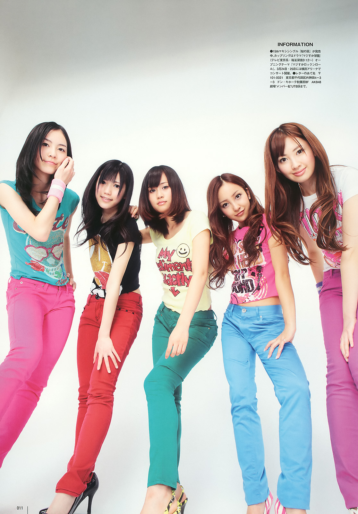
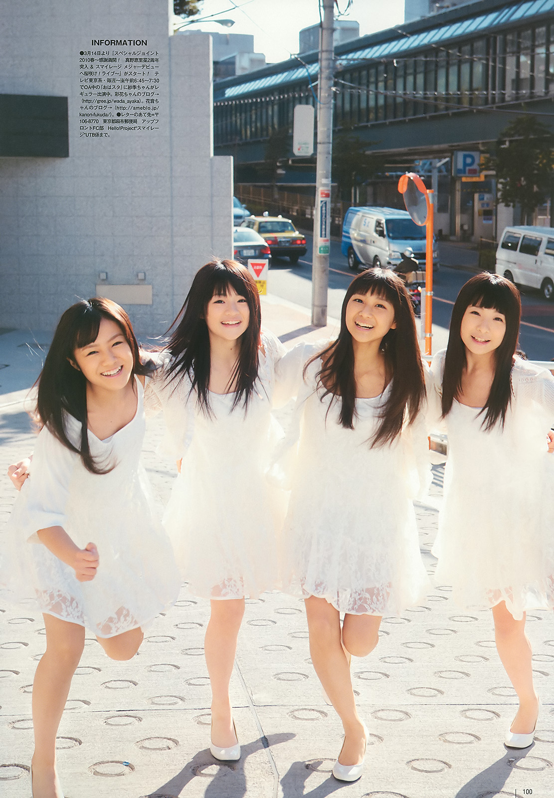

# Up to Boy Vol.196 *(Avril 2010)*

## アップトゥボーイ Vol.196

**Matsui Jurina • Watanabe Mayu • Maeda Atsuko • Itano Tomomi • Kojima Haruna**

Wani Books • 2010

---

## Aperçu

---

## Informations

- **Année :** 2010
- **Type :** Magazine
- **Titre :** Up to Boy
- **Volume :** 196
- **Date de sortie :** 23 février 2010
- **Éditeur :** Wani Books
- **Prix d'origine :** 1 257 ¥
- **Format :** A4
- **Langue :** Japonais
- **Bonus :** Carte collector AKB48 (selon les exemplaires)

---

## Contexte

Publié le 23 février 2010,

Quelques semaines plus tard paraîtront *Ponytail to Shushu*
puis l'album *Kamikyokutachi*, deux sorties qui installeront
définitivement AKB48 parmi les groupes majeurs du pays.

La couverture réunit **Maeda Atsuko**, **Itano Tomomi**,
**Kojima Haruna**, **Watanabe Mayu** et **Matsui Jurina**.

---

## Dossier principal

Le dossier de couverture est consacré aux cinq membres
présentes en première page du magazine. Il alterne portraits
individuels, photographies de groupe et interviews consacrées
à leurs activités du moment.

L'ensemble met en avant une image fraîche et dynamique,

---

## Style

La direction artistique adopte une esthétique résolument pop,
très représentative de l'année 2010.

Les couleurs sont lumineuses, les vêtements restent
décontractés et les décors volontairement simples afin de
laisser toute la place aux personnalités des membres.

Le reportage cherche avant tout à transmettre une impression
de fraîcheur, d'énergie et de complicité. Les portraits
restent naturels et évitent les mises en scène trop
élaborées, un choix fréquent dans les grands magazines idol
de cette période.

L'ensemble dégage une impression de fraîcheur et de proximité,
fidèle à l'image qu'AKB48 souhaite alors transmettre au grand
public.

---

## Autres contenus

En plus du dossier consacré à AKB48, ce numéro propose des
reportages sur de nombreuses personnalités de la scène idol
et du divertissement japonais.

Parmi les principaux contenus figurent :

- Matsui Jurina (reportage individuel)
- Kashiwagi Yuki & Takajo Aki
- Kitahara Rie
- SKE48
- Mano Erina
- Yajima Maimi
- Suzuki Airi
- Tsugunaga Momoko
- Hagiwara Mai
- S/mileage
- Kawaguchi Haruna
- Sakuraba Nanami
- Adachi Rika
- Kitano Kii
- Becky Cruel
- Fujiwara Reiko

Selon les exemplaires, le magazine était accompagné d'une
carte collector AKB48.

---

## Intérêt

Le dossier consacré à AKB48 capture le groupe juste avant son
ascension vers une popularité nationale sans précédent. La
présence de Jurina Matsui aux côtés des principales membres
d'AKB48 témoigne également de l'importance grandissante prise
par SKE48 au sein du projet.

