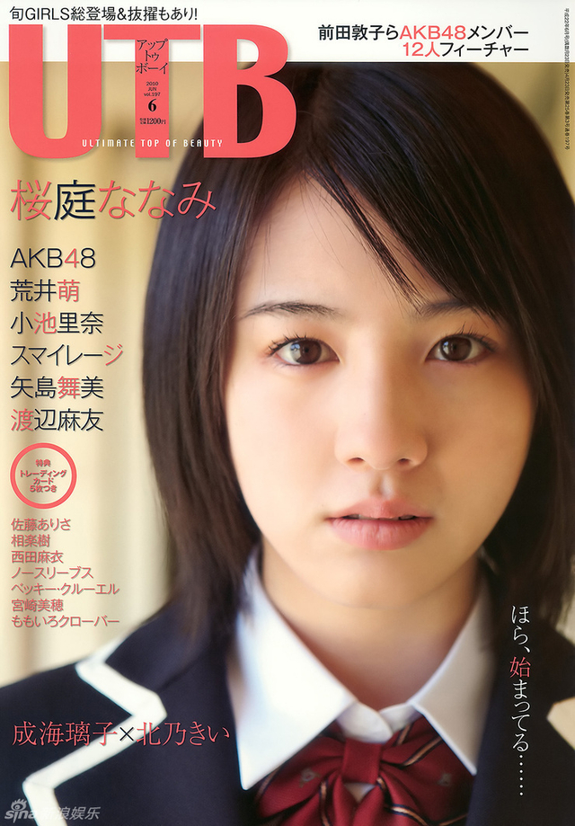

# UTB Vol. 197

– Sakuraba Nanami / S/mileage / Yajima Maimi / Watanabe Mayu (Wani Books, juin 2010)

## Photo 1

## Informations

- Année : 2010
- Magazine : UTB
- Thème : Gravure fraîche
          Nanami Sakuraba en couverture et dans la gravure d'ouverture. 
          Mayu Watanabe, l'arme ultime d'AKB48, est absolument adorable dans des clichés aux allures de 2D ! 
          S/mileage
          AKB48, le quatuor phare composé d'Atsuko Maeda, Yuko Oshima, Tomomi Itano, Yuki Kashiwagi et Rie Kitahara
          Maimi Yajima

