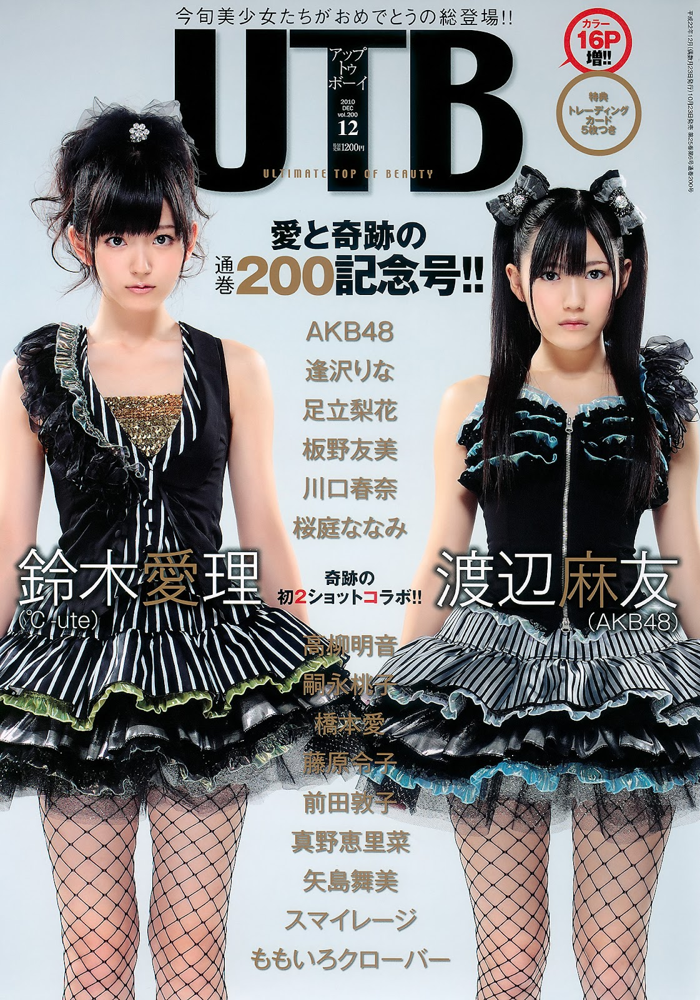
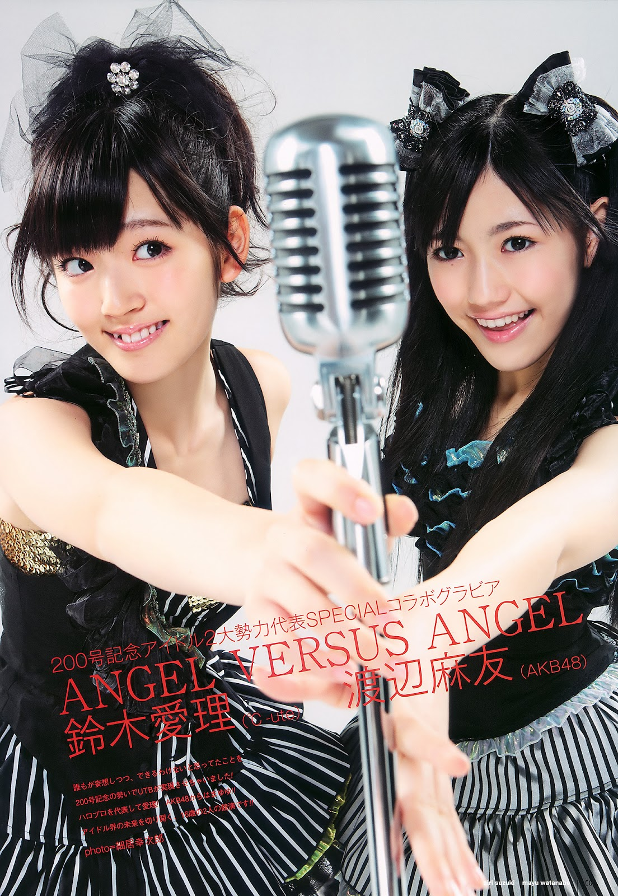
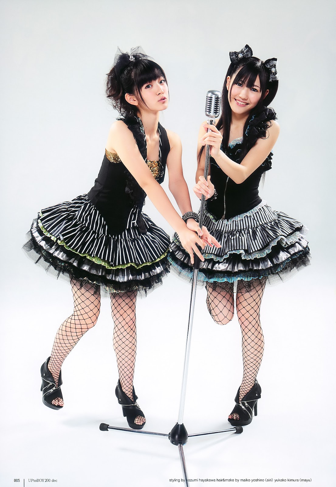
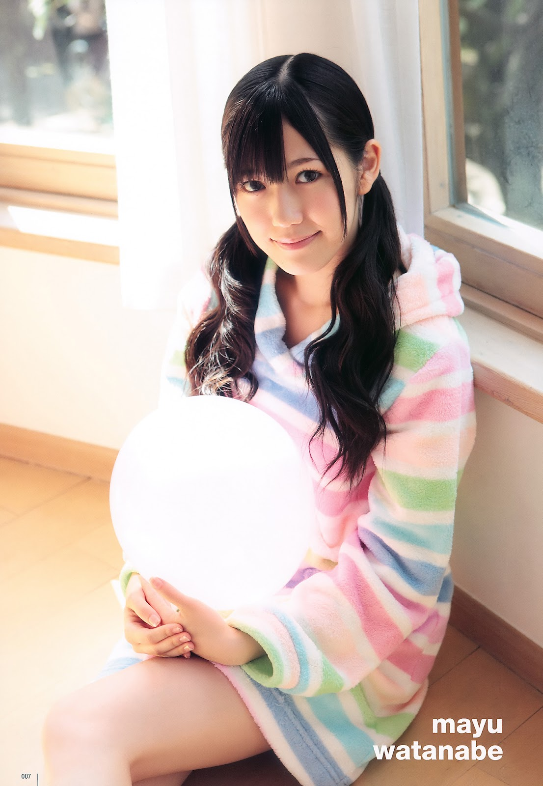
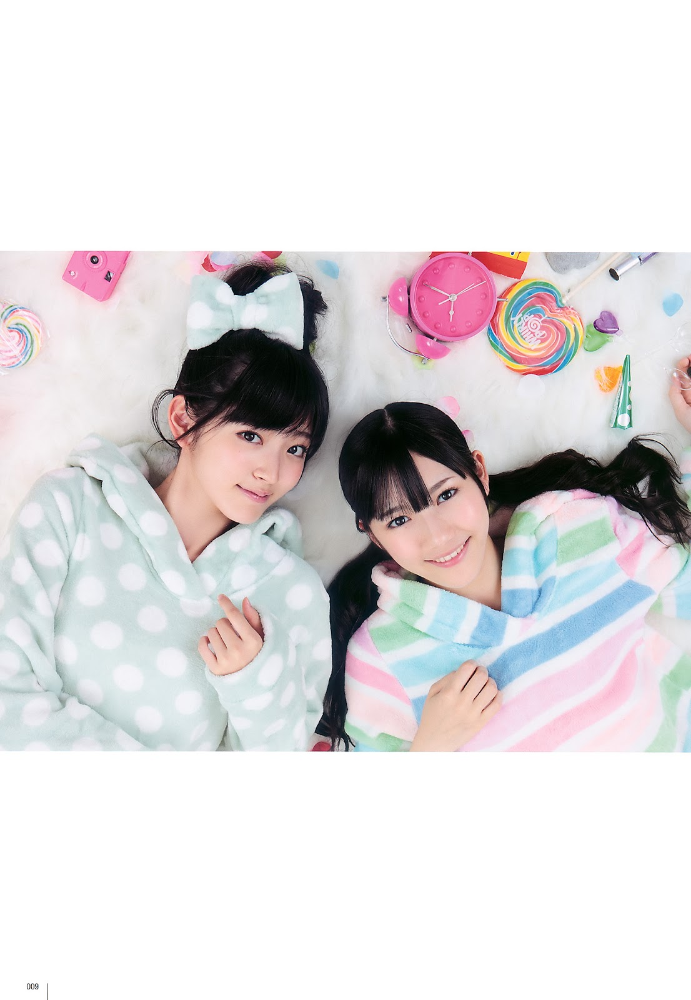
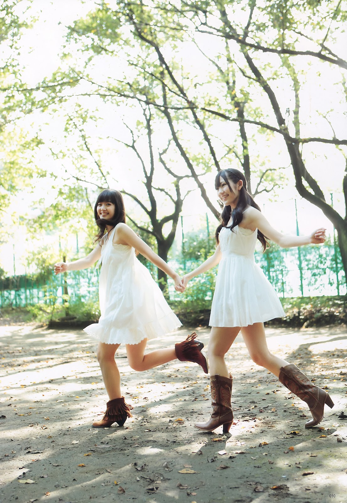
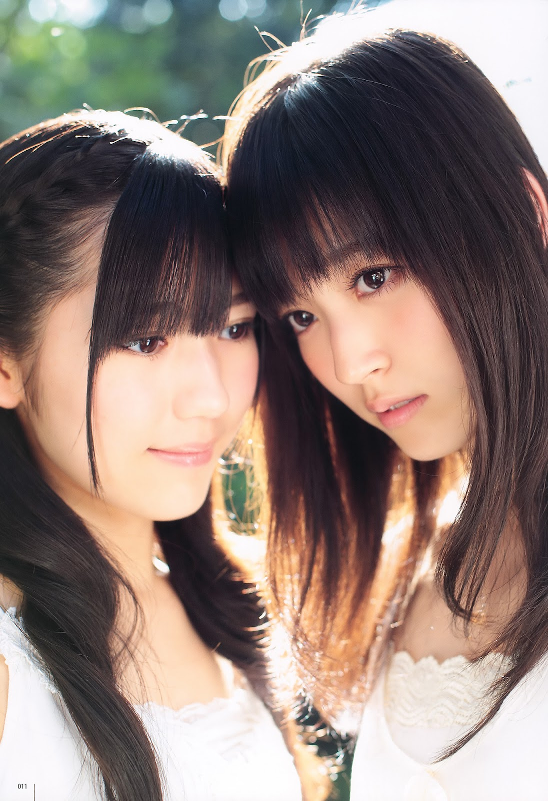

 # UTB Vol.200 --- 2010年12月号

## アップトゥボーイ Vol.200 2010年12月号

**Suzuki Airi • Watanabe Mayu**

UTB / UP to BOY --- numéro commémoratif 200\
Wani Books • 2010

------------------------------------------------------------------------

## Aperçu

------------------------------------------------------------------------

## Informations

-   **Titre original :** UTB Vol.200 2010年12月号
-   **Titre japonais :** アップトゥボーイ Vol.200 2010年12月号
-   **Titre usuel :** UTB Vol.200
-   **Série :** UTB / UP to BOY / アップトゥボーイ
-   **Type :** magazine spécialisé idol / gravure
-   **Numéro :** volume 200
-   **Éditeur :** Wani Books
-   **Date de sortie :** 23 octobre 2010
-   **Mois de couverture :** décembre 2010
-   **Couverture :** Suzuki Airi (℃-ute) × Watanabe Mayu (AKB48)
-   **Format :** A4
-   **Dimensions indicatives :** environ 29,7 × 20,7 cm
-   **Impression :** principalement couleur, avec sections éditoriales
    en noir et blanc
-   **Prix imprimé :** 1 200 ¥
-   **Particularité :** numéro commémoratif marquant la **200e
    parution**
-   **Supplément éditorial :** 16 pages couleur supplémentaires pour ce
    numéro anniversaire
-   **Bonus standard :** 5 trading cards
-   **Bonus commercial connu :** DVD spécial making-of Suzuki Airi ×
    Watanabe Mayu proposé avec certains exemplaires achetés sur la
    boutique en ligne Wani Books
-   **Référence CDJapan :** NEOBK-859531

La date du **23 octobre 2010**, la couverture Airi/Mayu et la liste
générale des participantes sont confirmées par les archives officielles
d'UTB et par les notices contemporaines de distribution. L'éditeur
présentait explicitement le volume comme une édition spéciale de son
200e numéro, enrichie de **16 pages couleur**.

La couverture fournie apporte deux précisions matérielles
supplémentaires : elle annonce directement **« カラー16P増!! »** ainsi
que **cinq trading cards**. Music Natalie confirme également l'insertion
de cinq cartes dans le numéro.

Un bonus distinct existe pour la vente directe Wani Books : un **«
Special Making DVD »** consacré à Suzuki Airi et Watanabe Mayu. Il ne
doit donc pas être confondu avec les cinq trading cards distribuées avec
le magazine lui-même.

------------------------------------------------------------------------

## Artistes suivies dans cette collection

> Les étoiles indiquent l'importance de l'artiste dans cette
> publication, et non une appréciation de l'artiste.\
> Les nombres de pages correspondent au relevé personnel fourni pour cet
> exemplaire. Pour Suzuki Airi et Watanabe Mayu, la couverture est
> incluse dans le nombre indiqué en « Solo ».

★★★★★ Dossier majeur\★★★★☆ Présence importante\★★★☆☆ Bon dossier secondaire\★★☆☆☆ Présence limitée\★☆☆☆☆ Apparition

  Artiste              Présence      Solo      Autres apparitions
  ------------------- ---------- ------------- --------------------
  **Suzuki Airi**       ★★★★★     **3 pages**  Couverture • 2 duo
  **Watanabe Mayu**     ★★★★★     **2 pages**  Couverture • 2 duo
  **Yagami Kumi**       ★★☆☆☆         ---      3 duo
  **Maeda Atsuko**      ★★★☆☆     **2 pages**  ---
  **Maeda Yuuka**       ★★☆☆☆     **1 page**   2 ensembles

------------------------------------------------------------------------

## Contexte

Le Vol.200 paraît à un moment charnière pour *Up to Boy*. Le magazine
célèbre sa **200e parution** et près de vingt-cinq ans de photographie
idol, avec notamment le dossier
**「アップトゥボーイ×アイドル25年戦記!!」**.

Pour incarner cette étape, la rédaction réunit **Suzuki Airi (℃-ute) et
Watanabe Mayu (AKB48)**, deux idols de 16 ans issues de structures alors
très différentes. UTB expliquera rétrospectivement avoir voulu
rapprocher le Hello! Project, historiquement essentiel au magazine, et
AKB48, nouvelle force majeure de 2010, en présentant Airi et Mayu comme
de **« bonnes rivales »**.

Le titre **« ANGEL VERSUS ANGEL »** traduit cette idée, mais le
reportage évolue rapidement vers la complicité : costumes noirs
coordonnés, tenues d'intérieur pastel, puis robes blanches et images
main dans la main. L'entretien **« TWO ♥ TOP ♥ TALK »** prolonge cette
rencontre au centre du magazine.

Autour d'elles, le numéro rassemble fortement les univers **AKB48 et
Hello! Project**, avec notamment Maeda Atsuko et Maeda Yuuka parmi les
artistes suivies, tout en intégrant SKE48, Momoiro Clover et de jeunes
actrices. Le Vol.200 constitue ainsi un instantané particulièrement
dense de la scène idol de 2010.

## Sommaire

### Ouverture --- Suzuki Airi × Watanabe Mayu

-   **p. 4 --- Suzuki Airi × Watanabe Mayu : « ANGEL VERSUS ANGEL »**
-   couverture et gravure d'ouverture ;
-   première collaboration photographique entre une représentante
    majeure du Hello! Project et une membre d'AKB48 ;
-   alternance entre costumes noirs coordonnés, séquence d'intérieur
    pastel et robes blanches en extérieur ;
-   portraits individuels intégrés au reportage commun.

### Première moitié --- gravures et jeunes talents

-   **p. 13 --- Itano Tomomi** (AKB48)
-   **p. 19 --- Sakuraba Nanami**
-   **p. 25 --- Adachi Rika**
-   **p. 31 --- Kawaguchi Haruna**
-   **p. 35 --- Hashimoto Ai**
-   **p. 39 --- Momoiro Clover**
-   **p. 49 --- Suzuki Airi × Watanabe Mayu : « TWO ♥ TOP ♥ TALK »**

### Dossier anniversaire et rubriques régulières

-   **p. 52 --- « UP to BOY × Idol 25年戦記!! »**
-   **p. 57 --- Komatsu Ayaka**
-   **p. 58 --- Sato Sumire**
-   **p. 59 --- Momoiro Clover**
-   **p. 60 --- bump.y**
-   **p. 61 --- ℃-ute**
-   **p. 62 --- Tsugunaga Momoko**

### Seconde moitié --- AKB48, H!P et nouveaux visages

-   **p. 65 --- Nakagawa Haruka × Kikuchi Ayaka** (AKB48)
-   **p. 68 --- Kuramochi Asuka × Nito Moeno** (AKB48)
-   **p. 71 --- Sashihara Rino × Komori Mika** (AKB48)
-   **p. 74 --- Maeda Atsuko** (AKB48)
-   **p. 79 --- Takayanagi Akane** (SKE48)
-   **p. 83 --- Sato Sumire** (AKB48)
-   **p. 84 --- Akanuma Yura**
-   **p. 86 --- Seifuku Kojo Iinkai**
-   **p. 88 --- Fujiwara Reiko**
-   **p. 92 --- Aizawa Rina**
-   **p. 99 --- S/mileage**
-   **p. 106 --- Tsugunaga Momoko**
-   **p. 111 --- Yajima Maimi**
-   **p. 117 --- Mano Erina**

------------------------------------------------------------------------

## Dossier principal

### « ANGEL VERSUS ANGEL » --- Suzuki Airi × Watanabe Mayu

Le cœur du numéro repose sur **Suzuki Airi et Watanabe Mayu**, réunies
dans des costumes noirs coordonnés spécialement pour cette couverture.
Sur fond blanc, le microphone rétro placé entre elles renforce d'abord
le principe de confrontation annoncé par **« ANGEL VERSUS ANGEL »**.

Le reportage abandonne ensuite cette rivalité symbolique : Airi et Mayu
passent à des **tenues d'intérieur pastel**, partagent gâteau, boissons
et jeux, avant une dernière séquence en **robes blanches en extérieur**
où elles apparaissent notamment main dans la main. La progression est
claire :

**rivalité symbolique → rencontre → complicité.**

Une page individuelle de **Watanabe Mayu** s'insère dans la séquence
pastel, tandis que les dernières photographies rapprochent fortement les
deux visages.

### « TWO ♥ TOP ♥ TALK »

Aux pages 49--51, UTB prolonge le gravure avec l'entretien **« TWO ♥ TOP
♥ TALK --- 鈴木愛理 × 渡辺麻友 »**. L'accroche souligne que les deux
filles en sont venues naturellement à **se tenir la main pendant la
séance**, confirmant que leur rapprochement constitue le véritable fil
conducteur du dossier. Elles réalisent également des portraits dessinés
l'une de l'autre.

### Autres artistes suivies

**Maeda Atsuko** bénéficie d'un dossier à partir de la page 74, lié au
tournage du drama *Q10*. **Maeda Yuuka** apparaît avec S/mileage à
partir de la page 99. **Yagami Kumi** est présente sur trois pages en
duo selon le relevé personnel de l'exemplaire.

Dix ans plus tard, UTB retiendra encore la couverture **Airi × Mayu**
parmi les images représentatives de son histoire éditoriale.

## Style

Le dossier Airi/Mayu repose sur des **contrastes visuels simples et
efficaces** : costumes noirs sur fond blanc, tenues pastel dans un
intérieur lumineux, puis robes blanches en extérieur.

La première séquence privilégie la symétrie et le microphone comme
unique accessoire central. La partie pastel adopte au contraire une mise
en page plus fragmentée, proche d'un album de moments partagés, afin de
mettre en valeur la complicité du duo. Les dernières images utilisent
une lumière naturelle très forte et un cadrage rapproché, donnant au
reportage une conclusion plus douce et intime.

## Réception des lecteurs / Mémoire collective

La mémoire du **Vol.200** se concentre surtout sur la rencontre **Suzuki
Airi × Watanabe Mayu**. Dès l'époque, voir réunies une figure du Hello!
Project et une jeune vedette d'AKB48 paraît suffisamment inhabituel pour
provoquer des réactions très spontanées :

> **「改めてツーショット見ると豪華すぎるだろこれ！！」**\
> « En revoyant vraiment le two-shot, c'est beaucoup trop prestigieux
> comme association !! »

Après la sortie, un lecteur de *墨田ペトリ堂* souligne immédiatement le
soin accordé à l'édition :

> **「200号記念とあって気合の入った造り。」**\
> « Pour le 200e numéro, on sent qu'ils ont vraiment mis les moyens. »

Il remarque surtout une Mayu moins figée qu'à l'habitude :

> **「渡辺麻友の表情に人間らしい感情が乗っているのが珍しい。」**\
> « Il est rare de voir les expressions de Watanabe Mayu chargées
> d'émotions aussi humaines. »

La complicité du duo, renforcée par le making-of et les scènes en
vêtements pastel, devient ainsi l'un des principaux souvenirs du numéro.
Le rapprochement fonctionne au point qu'un autre commentaire note :

> **「非現実的な渡辺麻友と並ぶとしっくりくる。」**\
> « Placée à côté de l'irréelle Watanabe Mayu, \[Airi\] paraît
> parfaitement à sa place. »

Cette mémoire survit longtemps après 2010. UTB lui-même revient sur
cette couverture lors du Vol.300, et un amateur redécouvrant le duo en
2025 s'exclame encore :

> **「奇跡の初2ショットコラボ！！これは運命？」**\
> « Le premier two-shot miraculeux !! C'était le destin ? »

Ce que les lecteurs semblent avoir surtout retenu est donc
**l'improbable rencontre H!P × AKB48, le soin du gravure et la
complicité inattendue entre Airi et Mayu**.

## Ce qui distingue cette publication

Le Vol.200 est un véritable **numéro-charnière** : seize pages couleur
supplémentaires, une rétrospective des vingt-cinq années d'UTB et
surtout la rencontre **Suzuki Airi × Watanabe Mayu**, développée bien
au-delà de la couverture avec gravure et entretien commun.

Son casting en fait également un excellent instantané de **2010**,
réunissant AKB48, ℃-ute, S/mileage, Berryz Kobo, Mano Erina, Momoiro
Clover et SKE48. Dix ans plus tard, UTB retiendra encore la couverture
Airi/Mayu comme l'un des repères de son histoire.

## Intérêt pour ma collection

**Appréciation personnelle :**

**15 / 20**

**★★★★☆**

### Pourquoi ce volume mérite sa place

Le Vol.200 réunit dans un même objet **Watanabe Mayu, Suzuki Airi,
Yagami Kumi, Maeda Atsuko et Maeda Yuuka**. Son intérêt principal reste
le dossier **Airi × Mayu**, véritable rencontre entre Hello! Project et
AKB48, avec couverture, gravure et entretien commun.

Il constitue aussi un instantané très dense de **2010**, au moment où
AKB48 monte en puissance tandis que le Hello! Project reste fortement
associé à l'identité d'UTB. Pour la collection, il forme donc un **point
de rencontre particulièrement représentatif entre plusieurs artistes et
branches suivies**.

### Mon ressenti### Mon ressenti

*(Espace réservé au collectionneur.)*

------------------------------------------------------------------------

    
