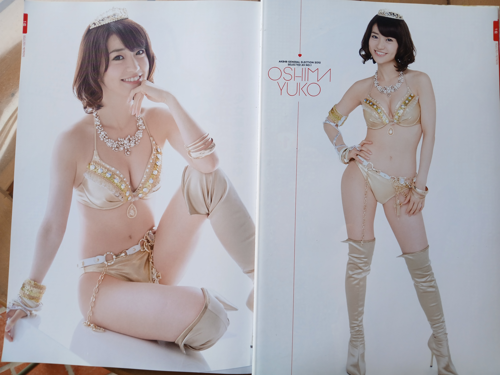
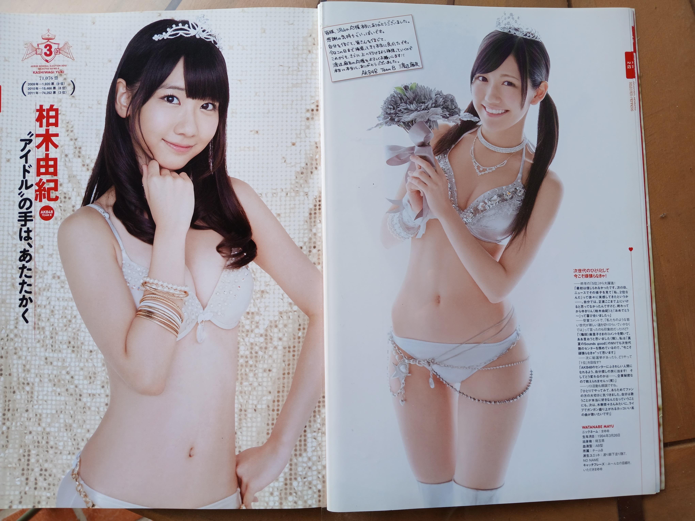

AKB48 General Election! Mizugi Surprise Announcement 2012

AKB48総選挙！水着サプライズ発表2012

AKB48 • SKE48 • NMB48 • HKT48

AKB48 Special Mook

Shueisha • 2012

Aperçu

# Informations

| Élément | Détail |
|----------|--------|
| Titre japonais | AKB48総選挙！水着サプライズ発表2012 |
| Titre romanisé | AKB48 Sōsenkyo! Mizugi Surprise Happyō 2012 |
| Éditeur | Shueisha |
| Rédaction | Weekly Playboy |
| Collection | AKB48 Special Mook |
| Date de parution | 1 août 2012 |
| Prix d'origine | 1 200 ¥ (1 143 ¥ HT) |
| Pagination | 176 pages |
| Format | A4 (210 × 297 mm) |
| ISBN | 978-4-08-102147-5 |
| Code magazine | 64345-50 |
| Impression | Couleur |

---

# Aperçu

---

# Artistes suivies dans cette collection

> Les étoiles indiquent l'importance de l'artiste dans cette publication, et non une appréciation de l'artiste.

| Artiste | Présence | Solo | Autres apparitions |
|---------|:--------:|:----:|--------------------|
| **Oshima Yuko** | ★★★★★ | 6 pages | Couverture • 1 duo • 4 ensembles |
| **Watanabe Mayu** | ★★★★☆ | 4 pages | Couverture • 1 duo • 3 ensembles |
| **Yagami Kumi** | ★★☆☆☆ | 2 pages | 2 ensembles |

---

# Contexte

Publié moins de deux mois après le quatrième **AKB48 Senbatsu Sousenkyo**, *AKB48総選挙！水着サプライズ発表2012* constitue l'archive officielle de l'un des tournants majeurs de l'histoire du groupe.

L'élection du 6 juin 2012 marque plusieurs évolutions importantes. Pour la première fois, le classement est étendu à **64 membres**, réparties entre les **Selected Members**, **Under Girls**, **Next Girls** et **Future Girls**. Les groupes sœurs occupent désormais une place essentielle dans la compétition, tandis que l'annonce de la future graduation de **Maeda Atsuko** ouvre une nouvelle période pour AKB48.

L'ensemble du volume est construit autour de cette évolution. Les résultats du Sousenkyo déterminent l'ordre de présentation des membres, la structure des différents chapitres et les nombreux portraits réalisés spécialement pour cette publication. Plus qu'un simple recueil de photographies en maillot de bain, l'ouvrage cherche à conserver une trace durable de l'événement en réunissant les classements, les interviews, les reportages et les réactions des participantes.

---

# Les suppléments

Comme les précédents volumes de la série *Mizugi Surprise*, cette édition était accompagnée de plusieurs bonus destinés aux collectionneurs.

L'ouvrage comprend un **poster A1 recto-verso**, une **planche de 48 autocollants** ainsi qu'un **tapis de souris consacré au Kami 7**.

Les dernières pages reproduisent chacun de ces suppléments. Elles permettent aujourd'hui d'identifier rapidement un exemplaire complet, les bonus ayant souvent été séparés du livre au fil des années.

# Sommaire

Le volume suit fidèlement la hiérarchie du quatrième Senbatsu Sousenkyo. La progression des chapitres accompagne le classement officiel, des seize **Selected Members** jusqu'aux **Future Girls**, avant de laisser place aux reportages, interviews et documents consacrés à l'élection.

La structure générale est la suivante :

- **Selected Members** (1re à 16e place)
- **Under Girls** (17e à 32e place)
- **Reportage complet du quatrième Senbatsu Sousenkyo**
- **Next Girls** (33e à 48e place)
- **Future Girls** (49e à 64e place)
- **Manga :** *TKM48 徳さん川柳危機一髪*
- **Une journée avec Maeda Atsuko**
- **Reportages des théâtres AKB48, SKE48, NMB48 et HKT48**
- **Regards croisés de quatre commentateurs sur l'élection**
- **172 messages manuscrits des Waiting Girls**
- **AKB48 Offshot Paradise 2012**

Cette organisation alterne constamment photographies, documents d'archives et reportages. Le lecteur revit ainsi l'élection dans le même ordre que sa révélation publique : les résultats, les réactions des membres, puis les conséquences de ce nouveau classement sur l'organisation du groupe.

---

# Contenu

Contrairement à de nombreux ouvrages consacrés aux AKB48, *Mizugi Surprise 2012* ne se limite pas à une succession de séances photographiques. Les portraits en maillot de bain servent avant tout à mettre en scène le classement du Sousenkyo, chaque membre bénéficiant d'une présentation proportionnelle à son résultat.

Les **Selected Members** ouvrent naturellement le volume. Les seize premières disposent des dossiers les plus développés, mêlant portraits en studio, photographies en pied, messages et courtes présentations. Les trois premières — **Oshima Yuko**, **Watanabe Mayu** et **Kashiwagi Yuki** — bénéficient d'une mise en scène particulière qui souligne leur place au sommet de la hiérarchie.

Les **Under Girls**, **Next Girls** et **Future Girls** reprennent la même logique avec une pagination plus resserrée. Chaque membre conserve néanmoins son portrait, son rang, son nombre de voix ainsi qu'un court message adressé aux lecteurs. Cette présentation homogène transforme progressivement le livre en véritable album du classement 2012.

Au-delà des portraits individuels, plusieurs séries de photographies réunissent les membres par catégorie ou par affinité. Ces pages collectives apportent du rythme à la lecture et témoignent de la volonté de présenter le Sousenkyo comme une aventure commune plutôt qu'une simple compétition entre idols.

L'ouvrage accorde également une place importante à la dimension documentaire. Les reportages consacrés au scrutin, les entretiens avec les responsables des différents théâtres, l'interview de Maeda Atsuko et les nombreux messages manuscrits permettent de replacer les résultats dans le contexte plus large de l'évolution d'AKB48 en 2012.

# Direction artistique

Dès la couverture, *Mizugi Surprise 2012* affirme une identité visuelle forte. Le rouge domine l'ensemble de la composition, couleur traditionnellement associée à la victoire, à la célébration et à l'énergie. Les seize premières du classement sont réunies devant un fond uniforme qui concentre immédiatement l'attention sur les membres plutôt que sur le décor.

L'ouvrage abandonne volontairement toute ambiance balnéaire. Malgré son titre, les séances photographiques ne cherchent presque jamais à évoquer la plage ou les vacances. Les maillots de bain deviennent avant tout des costumes de scène destinés à représenter les différents rangs du Sousenkyo.

Les trois premières bénéficient d'un traitement particulier. Les fonds argentés, les couronnes, les bijoux et les costumes aux finitions métalliques rappellent davantage une cérémonie de remise de prix qu'une séance estivale. La mise en scène souligne leur nouveau statut au sein du groupe sans recourir à une iconographie trop solennelle.

À partir des Under Girls, l'atmosphère évolue progressivement. Les tenues deviennent plus colorées, les accessoires plus variés et les poses plus détendues, tout en conservant une présentation homogène d'une membre à l'autre. Ce choix facilite la comparaison des différents classements et renforce l'impression de parcourir un album officiel du Sousenkyo.

L'utilisation régulière des doubles pages participe également à cette mise en scène. Les portraits en très grand format alternent avec des vues en pied, des photographies de groupe et des messages manuscrits, évitant toute monotonie malgré l'importante pagination du volume.

Enfin, plusieurs détails de mise en page rappellent constamment le contexte de l'élection. Les onglets colorés placés en bord de page permettent de retrouver rapidement chaque catégorie, tandis que les numéros de classement, les résultats et les textes de présentation accompagnent presque systématiquement les portraits. Cette organisation transforme le livre en un document de consultation aussi bien qu'en un recueil photographique.

---

# Ce qui distingue cette édition

*Mizugi Surprise 2012* marque une étape importante dans l'évolution de la série. Alors que les premiers volumes étaient principalement centrés sur les membres d'AKB48, cette édition reflète pleinement l'expansion du groupe en intégrant naturellement les représentantes de SKE48, NMB48 et HKT48 au sein d'un classement unique.

L'extension du Sousenkyo à **64 membres** modifie profondément la structure du livre. Chaque catégorie bénéficie désormais de sa propre identité tout en conservant une présentation cohérente, offrant une vision beaucoup plus complète de la scène idol en 2012.

Cette édition est également publiée dans un contexte particulier. Quelques semaines auparavant, Maeda Atsuko a annoncé sa graduation. Bien qu'elle ne participe plus au classement, sa présence à travers un reportage exclusif rappelle qu'elle demeure une figure centrale d'AKB48 au moment de la publication. Le livre capture ainsi une période de transition où une génération quitte progressivement le devant de la scène tandis qu'une autre s'impose.

Pour les collectionneurs, cette édition possède enfin un intérêt matériel important. Les suppléments, les posters exclusifs distribués selon les enseignes et les nombreuses variantes promotionnelles expliquent pourquoi deux exemplaires peuvent aujourd'hui présenter des contenus différents malgré une édition identique. Ces éléments font désormais partie intégrante de l'histoire éditoriale du volume.

# Réception des lecteurs / Mémoire collective

Parmi les différents volumes de la série *Mizugi Surprise*, l'édition **2012** est surtout restée dans les mémoires comme **le livre du quatrième Senbatsu Sousenkyo**. Les discussions retrouvées sur les blogs japonais, les sites marchands et les forums montrent que beaucoup de lecteurs ne l'achetaient pas uniquement pour ses photographies en maillot de bain, mais comme le prolongement naturel de l'élection.

> 「総選挙の後はこれを見なきゃ始まらないです。」
>
> *« Après le Sousenkyo, rien ne commence vraiment avant d'avoir regardé ce livre. »*

Cette idée revient régulièrement. Plusieurs collectionneurs expliquent conserver chaque édition annuelle afin de figer le classement d'une génération d'AKB48. Avec le recul, ces ouvrages sont devenus de véritables repères chronologiques permettant de retrouver l'ambiance propre à chaque Sousenkyo.

> 「毎年買って並べています。」
>
> *« Je les achète chaque année et je les aligne dans ma bibliothèque. »*

L'élargissement du classement à **64 membres** est lui aussi souvent évoqué. De nombreux lecteurs racontent avoir utilisé cette édition pour découvrir les nouvelles venues des groupes sœurs, en particulier SKE48, NMB48 et la toute jeune HKT48. Le livre devient alors un véritable guide illustré permettant d'associer progressivement un visage à un nom.

> 「今年も顔と名前が一致しない子を覚えるために購入しました。」
>
> *« Cette année encore, je l'ai acheté pour apprendre les noms des filles dont je ne reconnaissais pas encore le visage. »*

Cette fonction documentaire est souvent citée comme l'une des qualités du volume. Là où un simple résultat d'élection ne donne qu'un classement, *Mizugi Surprise* offre un portrait, un message et plusieurs photographies de chacune des membres classées.

Les bonus font également partie des souvenirs les plus fréquemment évoqués. Le grand poster, la planche d'autocollants et le tapis de souris consacré au **Kami 7** étaient suffisamment recherchés pour influencer le lieu d'achat. Plusieurs blogueurs racontent avoir choisi leur enseigne uniquement pour obtenir le poster exclusif correspondant à leur **oshimen**.

> 「ローソン版が欲しかった。」
>
> *« Je voulais absolument la version Lawson. »*

Pour les admirateurs de **Watanabe Mayu**, cette édition possède une valeur particulière. Bien avant sa victoire de 2014, beaucoup y voient le moment où elle s'impose définitivement comme l'une des figures centrales du groupe. Les discussions évoquent moins les photographies elles-mêmes que la symbolique de cette deuxième place, perçue comme l'annonce d'un changement de génération.

> 「まゆゆ、本当にここまで来たね。」
>
> *« Mayuyu est vraiment arrivée jusque-là. »*

À l'inverse, plusieurs lecteurs disent ressentir une certaine nostalgie en feuilletant le volume. L'annonce de la graduation de **Maeda Atsuko** plane sur toute cette période et son entretien rappelle qu'une page importante de l'histoire d'AKB48 est déjà en train de se tourner.

> 「あっちゃんがいない寂しさもあります。」
>
> *« Il y a tout de même la tristesse de ne plus avoir Acchan. »*

Quelques critiques apparaissent également dans les discussions. Certains lecteurs jugent les poses un peu répétitives ou regrettent que les séances photographiques privilégient davantage la mise en scène du classement que des décors plus variés.

> 「内容は、良かったです。」
>
> *« Le contenu était bon. »*

Même les avis les plus nuancés reviennent cependant vers la même conclusion : ce volume est avant tout conservé pour ce qu'il représente.

Avec le recul, les lecteurs ne semblent pas avoir retenu une séance photo particulière, mais le souvenir d'un moment charnière de l'histoire d'AKB48. En réunissant les portraits des soixante-quatre membres classées, les réactions d'après-scrutin, les nombreux documents d'archives et plusieurs bonus devenus recherchés, *Mizugi Surprise 2012* s'est progressivement imposé comme l'une des archives les plus emblématiques du quatrième Senbatsu Sousenkyo.

# Sources documentaires

### Exemplaire étudié

- Exemplaire complet photographié par le collectionneur.
- Couverture, quatrième de couverture, sommaire, pages intérieures et pages de suppléments observés directement.
- Vérification visuelle des bonus annoncés dans le volume.

### Sources bibliographiques

- Notice ISBN (Hanmoto)
- Shueisha
- AKB48 Official
- HKT48 Official
- SKE48 Official
- Rakuten Books
- Amazon Japan

### Sources communautaires

- Ameblo
- FC2 Blog
- Hatena Blog
- Livedoor Blog
- Bookmeter
- Hello! Online
- Forums internationaux consacrés aux AKB48
- Archives de blogs de collectionneurs

## Supports associés au shooting

### Weekly Playboy n°34-35 (27 août 2012)

Même séance photographique (« Legend16 in Summer »).

Plusieurs clichés alternatifs de Watanabe Mayu, Oshima Yuko et Kashiwagi Yuki y sont publiés, notamment une grande double page consacrée au Top 3, absente du présent ouvrage.

Les deux publications sont complémentaires.

### Poster Lawson (bonus de précommande)

Poster A2 recto-verso.

- Recto : Watanabe Mayu
- Verso : Matsui Jurina

Ce bonus exclusif, distribué par Lawson, est distinct du poster fourni avec le mook. Les discussions de collectionneurs montrent qu'il figurait parmi les versions les plus recherchées et que certains acheteurs choisissaient leur enseigne uniquement pour obtenir ce poster. :contentReference[oaicite:0]{index=0}

---

# Intérêt pour ma collection

## Ma note

**15 / 20**

**★★★★☆**

**Watanabe Mayu** occupe déjà une place centrale avec quatre pages individuelles, plusieurs ensembles et une présence en couverture. Cette deuxième place marque une étape importante de son parcours, deux ans avant sa victoire au Sousenkyo 2014.

La présence de **Yagami Kumi** apporte également un intérêt supplémentaire pour une collection consacrée aux groupes 48, son départ de SKE48 quelques mois après cette publication donnant aujourd'hui à ses pages une dimension rétrospective particulière.

Enfin, cette édition illustre parfaitement l'évolution de la série *Mizugi Surprise*. L'élargissement du classement à 64 membres, l'intégration des groupes sœurs et les nombreux suppléments en font l'un des volumes les plus représentatifs de la période de plus forte expansion des AKB48.

## Mon ressenti

ma note de 15/20 se justifie par ma presence assez marquée de Mayu et Yagami, les photos de Mayu sont un peu trop sage mais reste sympas, pareil pour Yagami, Yuko présente des photo plus sexy qui corresponde a son image et qui formera un duo assez  vite aprés l'élection avec Mayu autour du gimmick "oshiri sister" portant mayu vers des visuel plus audacieux.

