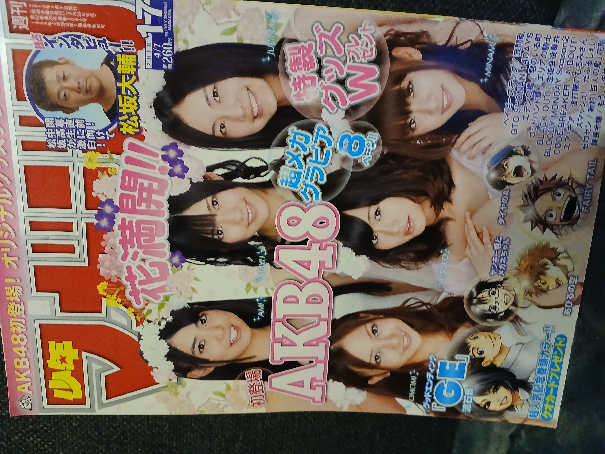
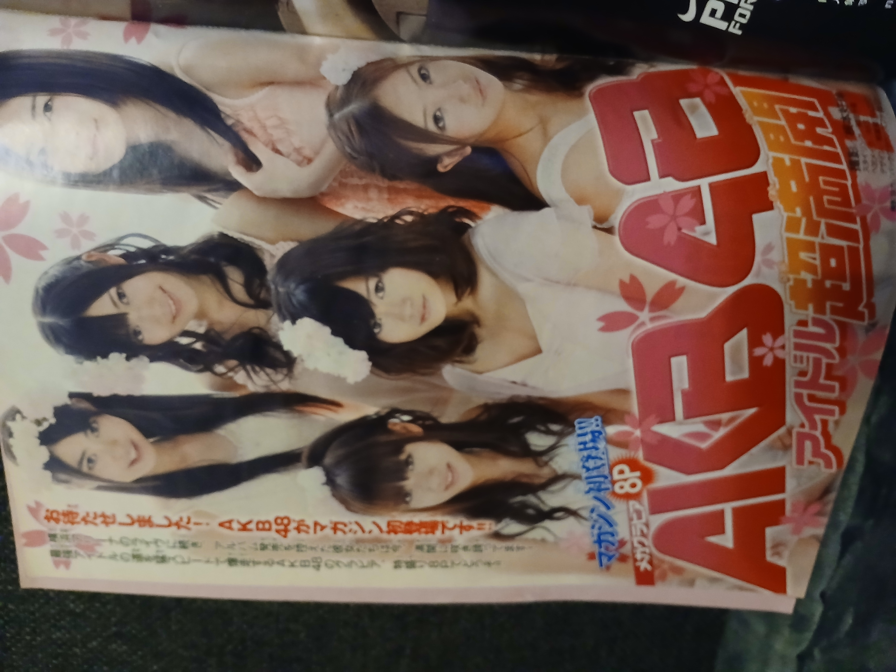
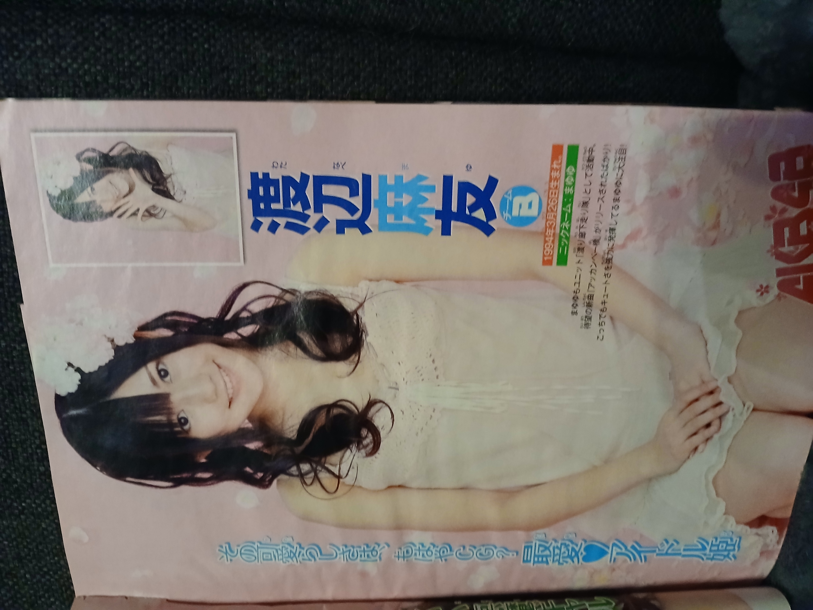

# Weekly Shōnen Magazine  n°17  2010

## Photo 1

## Photo 2

## Photo 3

## Informations

- Année : 2010
- Magazine : Magazine
- Thème :

Première couverture d'AKB48 dans Weekly Shōnen Magazine
📸 8 pages de gravure exclusives, ce qui est conséquent pour un magazine de prépublication de manga.
🌸 Un shooting printanier avec couronnes de fleurs, assez différent des shootings en uniforme ou en bikini de l'époque.
👥 Il réunit des membres emblématiques de 2010 : Atsuko Maeda, Tomomi Itano, Mayu Watanabe,
Minami Takahashi, ainsi que Jurina Matsui, qui représentait déjà la nouvelle génération.
