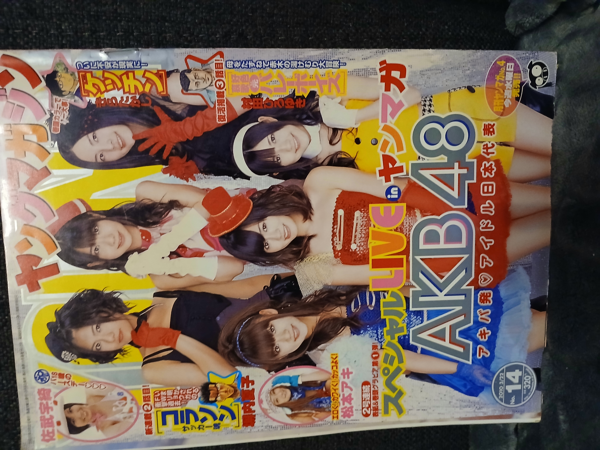
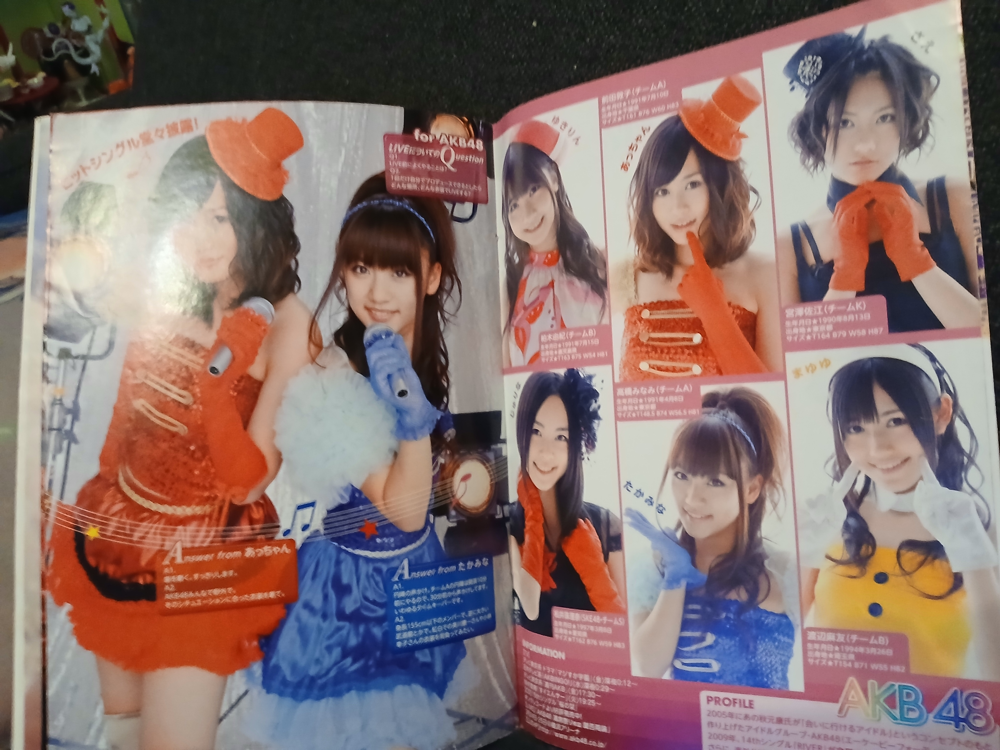
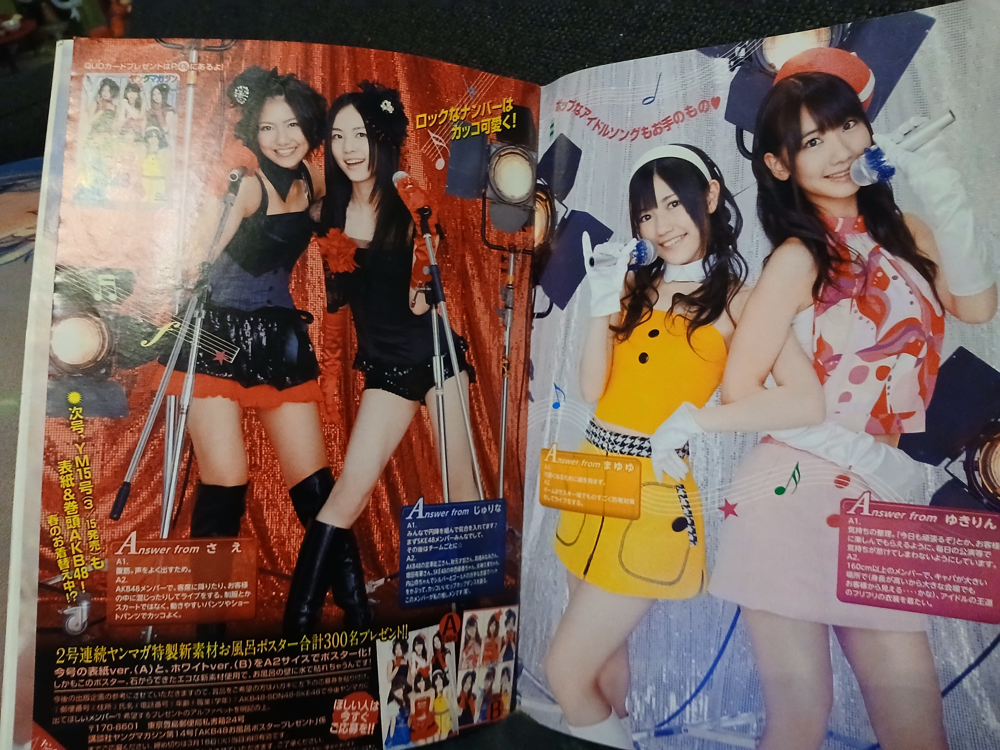

# Weekly Young Magazine n°14 de 2010.

## Photo 1

## Photo 2

## Photo 3

## Photo 4

## Informations

- Année : 2010
- Magazine : Magazine
- Thème :
AKB48 est présentée comme un véritable groupe de scène, costumes colorés (bleu, rouge, jaune, noir, blanc),
gants, accessoires de spectacle, le mot LIVE très visible.
Ces six membres apparaissent très fréquemment sur les couvertures de magazines de cette période
et constituent l'image emblématique d'AKB48 au moment où le groupe passe du statut de phénomène populaire à celui de véritable phénomène national.
