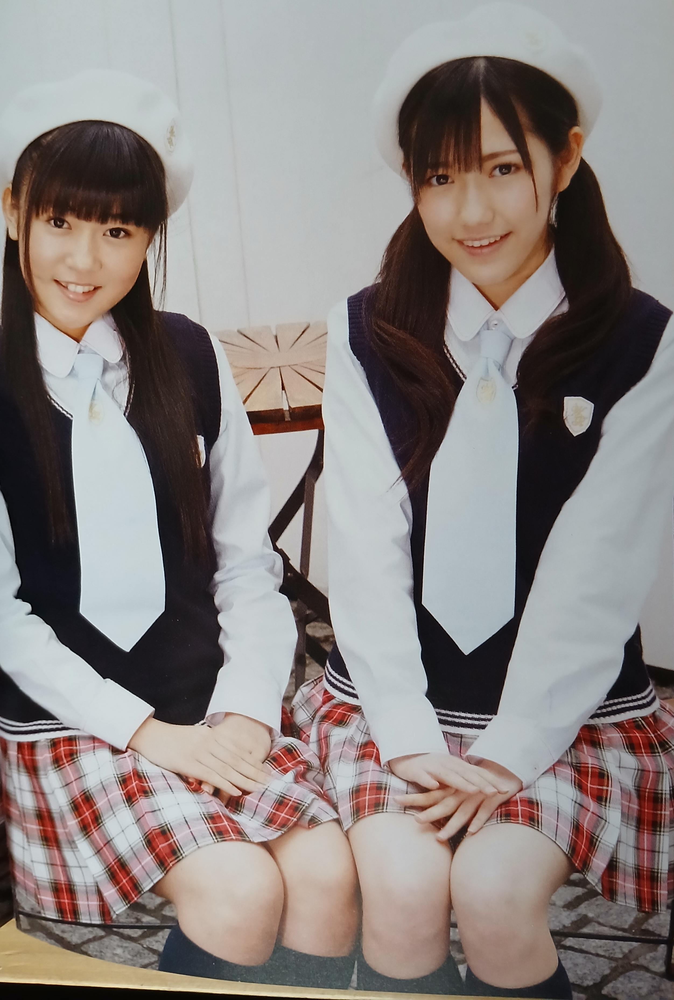

# YanYan Vol.11 *(Avril 2010)*

## ヤンヤン Vol.11

**Watarirouka Hashiritai • Mayu Watanabe • Aika Ota • Haruka Nakagawa • Haruka Kikuchi • Natsumi Hirajima**

Roman Album

Tokuma Shoten • 2010

---

## Aperçu

---

## Informations

- **Année :** 2010
- **Type :** Magazine
- **Collection :** Roman Album
- **Titre :** YanYan
- **Volume :** 11
- **Date de sortie :** mars 2010
- **Éditeur :** Tokuma Shoten
- **Prix d'origine :** 1 000 ¥
- **Format :** A4
- **Langue :** Japonais

---

## Contexte

Publié au printemps 2010,
ce numéro accompagne la sortie du quatrième single
de Watarirouka Hashiritai,
*Akkanbe Bashi*.

À cette période,
le groupe est encore composé des cinq membres
originelles et bénéficie d'une visibilité croissante
au sein du projet AKB48.

YanYan leur consacre son dossier principal,
tout en réunissant plusieurs groupes majeurs
de la scène idol japonaise du moment.

---

## Sommaire

Principaux contenus du magazine :

- Watarirouka Hashiritai (21 pages)
- Mayu Watanabe (portrait et interview)
- S/mileage
- Berryz Koubou
- ℃-ute
- Idoling!!!
- Mano Erina
- Miyazaki Miho (AKB48)
- Tomomi Itano & Tomomi Kasai
- Noto Arisa
- Erika Sotooka
- Interviews
- Actualités musicales

---

## Dossier principal

Le reportage d'ouverture est consacré
à Watarirouka Hashiritai.

Les membres portent principalement
des uniformes scolaires et bénéficie ensuite
de plusieurs portraits individuels
accompagnés d'un entretien personnel.

Une seconde partie présente
les costumes de scène du groupe
utilisés pour la promotion
du quatrième single.

---

## Autres contenus remarquables

### S/mileage

Le magazine consacre plusieurs pages
à la promotion du quatrième single
du groupe.

Les quatre membres apparaissent
dans leurs costumes officiels
noir, blanc et rose.

Le reportage alterne
photographies de groupe,
portraits individuels
et interview croisée.

Maeda Yuuka bénéficie également
d'un portrait pleine page
accompagné d'un entretien personnel
où elle évoque ses goûts,
son quotidien
et les activités du groupe.

---

## Réception

Les archives japonaises retrouvées
montrent que ce numéro est principalement
recherché pour son important dossier
consacré à Watarirouka Hashiritai.

Les scans les plus souvent partagés
concernent les portraits individuels
de Mayu Watanabe
ainsi que les photographies de groupe
en uniforme scolaire.

Plusieurs blogs japonais saluent
la douceur des photographies
et l'image encore très juvénile
du groupe.

Sur les forums anglophones,
les collectionneurs apprécient
la présence de nombreux groupes idols
dans un même numéro,
ce qui en fait un magazine
représentatif du printemps 2010.

Les photographies de Mayu Watanabe
sont régulièrement citées
comme le point fort du reportage,
tandis que le dossier S/mileage
est souvent mentionné
par les amateurs de Hello! Project.

---

## Intérêt

YanYan Vol.11 constitue
un excellent témoignage
de la scène idol japonaise
au printemps 2010.

Son dossier de vingt-et-une pages
capture Watarirouka Hashiritai
à l'un des moments les plus populaires
de son histoire,
quelques semaines après
la sortie d'Akkanbe Bashi.

La présence simultanée
de Watarirouka Hashiritai,
S/mileage,
Berryz Koubou,
℃-ute,
Idoling!!!
et plusieurs membres d'AKB48
offre également un aperçu représentatif
des principaux groupes idols
de cette période.

Pour les collectionneurs,
ce numéro est autant intéressant
pour son dossier consacré à Mayu Watanabe
que pour la diversité
de son contenu éditorial.
